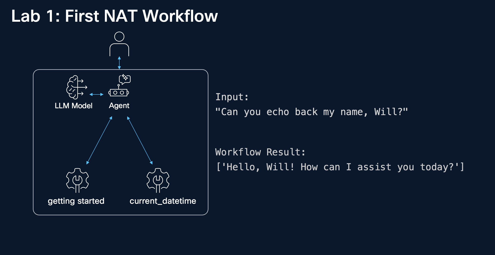

# 1. First NAT Workflow



In this first lab, we walk through the basics of using NVIDIA NeMo Agent toolkit (NAT), from installation all the way to creating and running a simple workflow. The intention of this lab is to get new NAT users up and running with a high level understanding of our YAML-first approach, while gaining some intuition towards how NAT workflows can quickly be embedded into your projects.

## 1.1 Install NeMo Agent Toolkit

```bash
cd ~/nemo-agent-toolkit/
uv sync
```

```bash
source .venv/bin/activate
```

It is also possible to install sub packages with pip: `uv pip install "nvidia-nat[langchain]"`

## 1.2 Creating Your First Workflow

A [workflow](https://docs.nvidia.com/nemo/agent-toolkit/latest/workflows/about/index.html) in NeMo Agent Toolkit is a structured specification of how agents, models, tools (called functions), embedders, and other components are composed together to carry out a specific task. It defines which components are used, how they are connected, and how they behave when executing the task.

NAT provides a convenient command-line interface called `nat` which is accessible in your active Python environment. It serves at the entrypoint to most toolkit functions.

The `nat workflow create` command allows us to create a new workflow.

```bash
nat workflow create getting_started
```

## 1.3 Interpret your first workflow

We can inspect the structure of the created **workflow directory**, which we've named `getting_started`, and contains the configuration files, source code, and data needed to define and run the workflow.

```bash
tree getting_started/
```

You should have a similar output:

```console
getting_started/
├── configs -> /home/ubuntu/work/nemo-agent-toolkit-clone/getting_started/src/getting_started/configs
├── data -> /home/ubuntu/work/nemo-agent-toolkit-clone/getting_started/src/getting_started/data
├── pyproject.toml
└── src
    ├── getting_started
    │   ├── __init__.py
    │   ├── configs
    │   │   └── config.yml
    │   ├── data
    │   ├── getting_started.py
    │   └── register.py
    └── getting_started.egg-info
        ├── PKG-INFO
        ├── SOURCES.txt
        ├── dependency_links.txt
        ├── entry_points.txt
        ├── requires.txt
        └── top_level.txt
```

The nat workflow create command generates a valid pyproject.toml file with a plugin section that points to a register.py file that has been pre-populated with NeMo Agent toolkit programming model boiler plate code (`getting_started.py`). This boiler plate code should be further customized to implement the desired custom workflow (`register.py`) and necessary NeMo Agent toolkit components. 

A summary of the high-level components are outlined below.

* `pyproject.toml` Python project configuration file that declaratively defines build tooling , project metadata and dependencies, entry points and tool configuration
* `config.yml` Workflow configuration file is a YAML file that specifies the tools and models to use in a workflow, along with general configuration settings.
* `getting_started.py` This file defines a custom NAT function (tool) and makes it discoverable and usable by NeMo Agent Toolkit–based agents.
* `register.py` This file acts as a registration trigger module for NeMo Agent Toolkit.

###  1.3.1 Interpreting Configuration File

The workflow configuration file, `getting_started/configs/config.yml`, describes the operational characteristics of the entire workflow. Let's load its contents in the next cell and understand what this first workflow can do out of the box.

```bash
cat getting_started/configs/config.yml; echo
```

You should have the following output:

```yaml
functions:
  current_datetime:
    _type: current_datetime
  getting_started:
    _type: getting_started
    prefix: "Hello:"

llms:
  nim_llm:
    _type: nim
    model_name: meta/llama-3.1-70b-instruct
    temperature: 0.0

workflow:
  _type: react_agent
  llm_name: nim_llm
  tool_names: [current_datetime, getting_started]
```

The above workflow configuration has the following components:   
- a [built-in `current_datetime`](https://docs.nvidia.com/nemo/agent-toolkit/latest/api/nat/tool/datetime_tools/index.html#nat.tool.datetime_tools.current_datetime) function.  
- a workflow-defined `getting_started` function.  
- an LLM.  
- an entrypoint workflow of a [built-in ReAct agent](https://docs.nvidia.com/nemo/agent-toolkit/latest/workflows/about/react-agent.html).  

By default, we create a [ReAct agent](https://docs.nvidia.com/nemo/agent-toolkit/latest/workflows/about/react-agent.html) equipped with both of the functions above. When called, the Agent decides which functions to call (if any) based on the intent of user input. The agent uses the LLM to help make reasoning decisions and then performs a subsequent action.  

This workflow configuration file is a YAML-serialized version of the [`Config`](https://docs.nvidia.com/nemo/agent-toolkit/latest/api/nat/data_models/config/index.html#nat.data_models.config.Config) class. Each category within the high-level configuration specifies runtime configuration settings for their corresponding components. For instance, the `workflow` category contains all configuration settings for the workflow entrypoint. This configuration file is validated as typed Pydantic models and fields. All configuration classes have validation rules, default values, and [documentation](https://docs.nvidia.com/nemo/agent-toolkit/latest/workflows/workflow-configuration.html#workflow-configuration-file) which enable type-safe configuration management, automatic schema generation, and validation across the entire plugin ecosystem.  

* `general` - General configuration section. Contains high-level configurations for front-end definitions.   
* `authentication` - Authentication provides an interface for defining and interacting with various authentication providers.   
* `llms` - LLMs provide an interface for interacting with LLM providers.   
* `embedders` - Embedders provide an interface for interacting with embedding model providers.   
* `retrievers` - Retrievers provide an interface for searching and retrieving documents.   
* `memory` - Configurations for Memory. Memories provide an interface for storing and retrieving.   
* `object_stores` - Object Stores provide a CRUD interface for objects and data.   
* `eval` - The evaluation section provides configuration options related to the profiling and evaluation of NAT workflows.   
* `tcc_strategies` (experimental) - Test Time Compute (TTC) strategy definitions.   

### 1.3.2 Type Safety and Validation

Many components within the workflow configuration specify `_type`. This YAML key is used to indicate the type of the component so NAT can properly validate and instantiate a component within the workflow. For example, [`NIMModelConfig`](https://docs.nvidia.com/nemo/agent-toolkit/latest/api/nat/llm/nim_llm/index.html#nat.llm.nim_llm.NIMModelConfig) is a subclass of [`LLMBaseConfig`](https://docs.nvidia.com/nemo/agent-toolkit/latest/api/nat/data_models/llm/index.html#nat.data_models.llm.LLMBaseConfig) so when we specify: `_type: nim` in the configuration the toolkit knows to validate the configuration with `NIMModelConfig`.

### 1.3.3 Let's adjust the llm provider

For that lab session, we don't use NVIDIA NGC service but Azure AI, so we need to modify the `llms:` section in the `config.yml` file.

```bash
cat > getting_started/configs/config.yml <<'EOF'
functions:
  current_datetime:
    _type: current_datetime
  getting_started:
    _type: getting_started
    prefix: 'Welcome to Ciscolive:'

llms:
  azure_llm:
    _type: azure_openai
    azure_endpoint: ${AZURE_OPENAI_ENDPOINT}
    azure_deployment: ${AZURE_OPENAI_DEPLOYMENT}
    api_key: ${AZURE_OPENAI_API_KEY}
    api_version: ${AZURE_OPENAI_API_VERSION}

workflow:
  _type: react_agent
  llm_name: azure_llm
  tool_names:
    - current_datetime
    - getting_started
EOF
```

## 1.4 Interpreting Workflow Functions

Next, let's inspect the contents of the generated workflow function:

```bash
cat getting_started/src/getting_started/getting_started.py ; echo
```

You should have the following output:

```python
import logging

from pydantic import Field

from nat.builder.builder import Builder
from nat.builder.framework_enum import LLMFrameworkEnum
from nat.builder.function_info import FunctionInfo
from nat.cli.register_workflow import register_function
from nat.data_models.function import FunctionBaseConfig

logger = logging.getLogger(__name__)


class GettingStartedFunctionConfig(FunctionBaseConfig, name="getting_started"):
    """
    NAT function template. Please update the description.
    """
    prefix: str = Field(default="Echo:", description="Prefix to add before the echoed text.")


@register_function(config_type=GettingStartedFunctionConfig, framework_wrappers=[LLMFrameworkEnum.LANGCHAIN])
async def getting_started_function(config: GettingStartedFunctionConfig, builder: Builder):
    """
    Registers a function (addressable via `getting_started` in the configuration).
    This registration ensures a static mapping of the function type, `getting_started`, to the `GettingStartedFunctionConfig` configuration object.

    Args:
        config (GettingStartedFunctionConfig): The configuration for the function.
        builder (Builder): The builder object.

    Returns:
        FunctionInfo: The function info object for the function.
    """

    # Define the function that will be registered.
    async def _echo(text: str) -> str:
        """
        Takes a text input and echoes back with a pre-defined prefix.

        Args:
            text (str): The text to echo back.

        Returns:
            str: The text with the prefix.
        """
        return f"{config.prefix} {text}"

    # The callable is wrapped in a FunctionInfo object.
    # The description parameter is used to describe the function.
    yield FunctionInfo.from_fn(_echo, description=_echo.__doc__)`
```

### 1.4.1 Function Configuration


Every tool starts with a configuration class. This is the class that takes information in our YAML file and makes it available to the tool.  

The `GettingStartedFunctionConfig` specifies `FunctionBaseConfig` as a base class. 

The `name` variable is used by the toolkit to create a static mapping when `_type` is specified anywhere where a `FunctionBaseConfig` is expected, such as `workflow` or under `functions`.

### 1.4.2 Function Registration

NeMo Agent toolkit relies on a configuration with builder pattern to define most components. For functions, `@register_function` is a decorator that must be specified to inform the toolkit that a function should be accessible automatically by name when referenced. The decorator requires that a `config_type` is specified. This is done to ensure type safety and validation.

The parameters to the decorated function are always:

1. the configuration type of the function component (FunctionBaseConfig).  
2. a Builder which can be used to dynamically query and get other workflow components (Builder).  

### 1.4.3 Function Implementation

The core logic of the `getting_started` function is embedded as a function within the outer function registration. This is done for a few reasons:   

* Enables dynamic importing of libraries and modules on an as-needed basis.   
* Enables context manager-like resources within to support automatic closing of resources.   
* Provides the most flexibility to users when defining their own functions.   

Near the end of the function registration implementation, we `yield` a `FunctionInfo` object. `FunctionInfo` is a wrapper around any type of function. It is also possible to specify additional information such as schema and converters if your function relies on transformations.

NAT relies on `yield` rather `return` so resources can stay alive during the lifetime of the function or workflow.

### 1.4.3 Tying It Together

Looking back at the configuration file, the `workflow`'s `_type` is `getting_started`. This means that the configuration of `workflow` will be validated based on the `GettingStartedFunctionConfig` implementation.

The `register.py` file tells NAT what should automatically be imported so it is available when the toolkit is loaded.

```bash
cat getting_started/src/getting_started/register.py ; echo
```

You should have the following output:

```python
# flake8: noqa

# Import the generated workflow function to trigger registration
from .getting_started import getting_started_function
```

## 1.5 Running Your First Workflow

### 1.5.1 Run with the CLI

You can run a workflow by using `nat run` CLI command:

```bash
nat run --config_file getting_started/configs/config.yml \
         --input "Can you echo back my name, Will?"
```

You should have the following output:

```console
2026-01-04 17:29:23 - INFO     - nat.cli.commands.start:192 - Starting NAT from config file: 'getting_started/configs/config.yml'

Configuration Summary:
--------------------
Workflow Type: react_agent
Number of Functions: 2
Number of Function Groups: 0
Number of LLMs: 1
Number of Embedders: 0
Number of Memory: 0
Number of Object Stores: 0
Number of Retrievers: 0
Number of TTC Strategies: 0
Number of Authentication Providers: 0

2026-01-04 17:29:28 - INFO     - nat.front_ends.console.console_front_end_plugin:102 - --------------------------------------------------
Workflow Result:
['Hello, Will! How can I assist you today?']
--------------------------------------------------
```