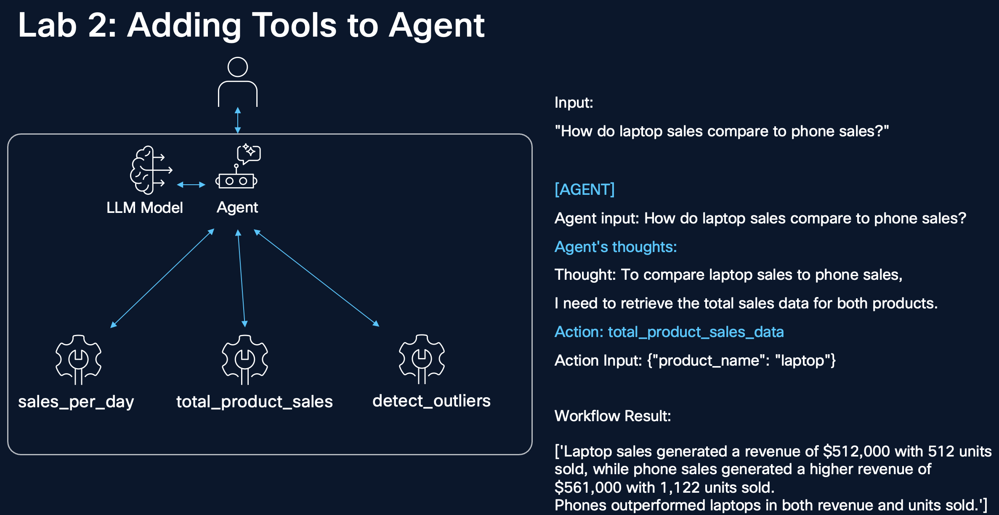

# 2. Adding Tools To Agents



In this lab, we showcase how the NVIDIA NeMo Agent Toolkit (NAT) allows developers to easily add tool-calling capabilities to agents that integrate with the library. Tool calling allows chain-of-thought planners to augment the pretrained capabilities of LLMs with predefined methods and access to context retrieval services. This is a powerful paradigm in agentic AI development that has enabled revolutionary technologies like deep research and API-integrated AI systems.

## 2.1 Data Sources

Several data files are required for this example. To keep this as a stand-alone example, the files are included here as cells which can be run to create them.

The following commands creates the `data` directory as well as a `rag` subdirectory.

```bash
cd ~/nemo-agent-toolkit/
mkdir -p data/rag
```

The following cell writes the `data/retail_sales_data.csv` file.

```bash
cd ~/nemo-agent-toolkit/
cp ~/retail_sales_data.csv data/retail_sales_data.csv
head -n 10 data/retail_sales_data.csv
```

You should have the following output:

```yaml
Date,StoreID,Product,UnitsSold,Revenue,Promotion
2024-01-01,S001,Laptop,1,1000,No
2024-01-01,S001,Phone,9,4500,No
2024-01-01,S001,Tablet,2,600,No
2024-01-01,S002,Laptop,9,9000,No
2024-01-01,S002,Phone,10,5000,No
2024-01-01,S002,Tablet,5,1500,No
2024-01-02,S001,Laptop,4,4000,No
2024-01-02,S001,Phone,11,5500,No
2024-01-02,S001,Tablet,7,2100,No
2024-01-02,S002,Laptop,7,7000,No
```

## 2.2 Creating a New Workflow

As explained in detail in previous lab, we can use the `nat workflow create` sub-command to create the necessary directory structure for a new agent.

Within this directory we can define all of the functions that we want to be available to the agent at runtime. In this notebook specifically we are going to demonstrate the integration of new tools to the workflow. We will make them available or 'discoverable' by the agent by defining these tool calls within the `register.py` function.

```bash
cd ~/nemo-agent-toolkit/
nat workflow create retail_sales_agent
```

## 2.3 Defining New Tools

Next we will show you how to add new tools to the agent.

### 2.3.1 Total Product Sales Data Tool

This tool gets total sales for a specific product from `data/product_catalog.md`

```bash
cd ~/nemo-agent-toolkit/
cat > retail_sales_agent/src/retail_sales_agent/total_product_sales_data_tool.py <<'EOF'
from pydantic import Field

from nat.builder.builder import Builder
from nat.builder.framework_enum import LLMFrameworkEnum
from nat.builder.function_info import FunctionInfo
from nat.cli.register_workflow import register_function
from nat.data_models.function import FunctionBaseConfig


class GetTotalProductSalesDataConfig(FunctionBaseConfig, name="get_total_product_sales_data"):
    """Get total sales data by product."""
    data_path: str = Field(description="Path to the data file")


@register_function(config_type=GetTotalProductSalesDataConfig, framework_wrappers=[LLMFrameworkEnum.LANGCHAIN])
async def get_total_product_sales_data_function(config: GetTotalProductSalesDataConfig, _builder: Builder):
    """Get total sales data for a specific product."""
    import pandas as pd

    df = pd.read_csv(config.data_path)

    async def _get_total_product_sales_data(product_name: str) -> str:
        """
        Retrieve total sales data for a specific product.

        Args:
            product_name: Name of the product

        Returns:
            String message containing total sales data
        """
        df['Product'] = df["Product"].apply(lambda x: x.lower())
        revenue = df[df['Product'] == product_name]['Revenue'].sum()
        units_sold = df[df['Product'] == product_name]['UnitsSold'].sum()

        return f"Revenue for {product_name} are {revenue} and total units sold are {units_sold}"

    yield FunctionInfo.from_fn(
        _get_total_product_sales_data,
        description=_get_total_product_sales_data.__doc__)
EOF
```

### 2.3.2 Sales Per Day Tool

This tool gets the total sales across all products per day from `data/product_catalog.md`

```bash
cd ~/nemo-agent-toolkit/
cat > retail_sales_agent/src/retail_sales_agent/sales_per_day_tool.py <<'EOF'
from pydantic import Field

from nat.builder.builder import Builder
from nat.builder.framework_enum import LLMFrameworkEnum
from nat.builder.function_info import FunctionInfo
from nat.cli.register_workflow import register_function
from nat.data_models.function import FunctionBaseConfig


class GetSalesPerDayConfig(FunctionBaseConfig, name="get_sales_per_day"):
    """Get total sales across all products per day."""
    data_path: str = Field(description="Path to the data file")


@register_function(config_type=GetSalesPerDayConfig, framework_wrappers=[LLMFrameworkEnum.LANGCHAIN])
async def sales_per_day_function(config: GetSalesPerDayConfig, builder: Builder):
    """Get total sales across all products per day."""
    import pandas as pd

    df = pd.read_csv(config.data_path)
    df['Product'] = df["Product"].apply(lambda x: x.lower())

    async def _get_sales_per_day(date: str, product: str) -> str:
        """
        Calculate total sales data across all products for a specific date.

        Args:
            date: Date in YYYY-MM-DD format
            product: Product name

        Returns:
            String message with the total sales for the day
        """
        if date == "None":
            return "Please provide a date in YYYY-MM-DD format."
        total_revenue = df[(df['Date'] == date) & (df['Product'] == product)]['Revenue'].sum()
        total_units_sold = df[(df['Date'] == date) & (df['Product'] == product)]['UnitsSold'].sum()

        return f"Total revenue for {date} is {total_revenue} and total units sold is {total_units_sold}"

    yield FunctionInfo.from_fn(
        _get_sales_per_day,
        description=_get_sales_per_day.__doc__)
EOF
```

### 2.3.3 Detect Outliers Tool

This tool detects outliers in `data/product_catalog.md` data using IQR (Interquartile Range) method.

```bash
cd ~/nemo-agent-toolkit/
cat > retail_sales_agent/src/retail_sales_agent/detect_outliers_tool.py <<'EOF'
from pydantic import Field

from nat.builder.builder import Builder
from nat.builder.framework_enum import LLMFrameworkEnum
from nat.builder.function_info import FunctionInfo
from nat.cli.register_workflow import register_function
from nat.data_models.function import FunctionBaseConfig


class DetectOutliersIQRConfig(FunctionBaseConfig, name="detect_outliers_iqr"):
    """Detect outliers in sales data using IQR method."""
    data_path: str = Field(description="Path to the data file")


@register_function(config_type=DetectOutliersIQRConfig, framework_wrappers=[LLMFrameworkEnum.LANGCHAIN])
async def detect_outliers_iqr_function(config: DetectOutliersIQRConfig, _builder: Builder):
    """Detect outliers in sales data using the Interquartile Range (IQR) method."""
    import pandas as pd

    df = pd.read_csv(config.data_path)

    async def _detect_outliers_iqr(metric: str) -> str:
        """
        Detect outliers in retail data using the IQR method.

        Args:
            metric: Specific metric to check for outliers

        Returns:
            Dictionary containing outlier analysis results
        """
        if metric == "None":
            column = "Revenue"
        else:
            column = metric

        q1 = df[column].quantile(0.25)
        q3 = df[column].quantile(0.75)
        iqr = q3 - q1
        outliers = df[(df[column] < q1 - 1.5 * iqr) | (df[column] > q3 + 1.5 * iqr)]

        return f"Outliers in {column} are {outliers.to_dict('records')}"

    yield FunctionInfo.from_fn(
        _detect_outliers_iqr,
        description=_detect_outliers_iqr.__doc__)
EOF
```

## 2.4 Registering Tools

We need to update the `register.py` file to register these tools with NeMo Agent toolkit.

```bash
cd ~/nemo-agent-toolkit/
cat > retail_sales_agent/src/retail_sales_agent/register.py <<'EOF'

from . import sales_per_day_tool
from . import detect_outliers_tool
from . import total_product_sales_data_tool
EOF
```

## 2.5 Updating The Configuration File

Below we show how to update the default configuration file for this new tool-calling retail sales agent with the new tools (python methods) that have been defined and registered properly.

Take a moment to analyze the new `retail_sales_agent/configs/config.yml` file below, where a `functions` header has been defined and each registered tool from the previous section is listed. 

```bash
cd ~/nemo-agent-toolkit/
cat > retail_sales_agent/configs/config.yml <<'EOF'
llms:
  azure_llm:
    _type: azure_openai
    azure_endpoint: ${AZURE_OPENAI_ENDPOINT}
    azure_deployment: ${AZURE_OPENAI_DEPLOYMENT}
    api_key: ${AZURE_OPENAI_API_KEY}
    api_version: ${AZURE_OPENAI_API_VERSION}

functions:
  total_product_sales_data:
    _type: get_total_product_sales_data
    data_path: data/retail_sales_data.csv
  sales_per_day:
    _type: get_sales_per_day
    data_path: data/retail_sales_data.csv
  detect_outliers:
    _type: detect_outliers_iqr
    data_path: data/retail_sales_data.csv

workflow:
  _type: react_agent
  tool_names:
    - total_product_sales_data
    - sales_per_day
    - detect_outliers
  llm_name: azure_llm
  verbose: true
  handle_parsing_errors: true
  max_retries: 2
  description: "A helpful assistant that can answer questions about the retail sales CSV data"
EOF
```

## 2.6 Running the Initial Workflow

The workflow has been properly created, new tools defined, registered, and incorporated into the config.yml. We are now ready to run the agent and test out that the ReAct agent is able to properly determine the intent of the input query and complete the necessary tool calling to serve the user.

```bash
nat workflow reinstall retail_sales_agent
```

This first query asks how laptop sales compare to phone sales.

In the output, we expect to see calls to the `total_product_sales_data` tool.

```bash
nat run --config_file=retail_sales_agent/configs/config.yml --input "How do laptop sales compare to phone sales?"
```

You should have the following output:  

```console
2026-01-04 18:19:45 - INFO     - nat.cli.commands.start:192 - Starting NAT from config file: 'retail_sales_agent/configs/config.yml'

Configuration Summary:
--------------------
Workflow Type: react_agent
Number of Functions: 3
Number of Function Groups: 0
Number of LLMs: 1
Number of Embedders: 0
Number of Memory: 0
Number of Object Stores: 0
Number of Retrievers: 0
Number of TTC Strategies: 0
Number of Authentication Providers: 0

2026-01-04 18:19:47 - INFO     - nat.agent.react_agent.agent:175 - 
------------------------------
[AGENT]
Agent input: How do laptop sales compare to phone sales?
Agent's thoughts: 
Thought: To compare laptop sales to phone sales, I need to retrieve the total sales data for both products.
Action: total_product_sales_data
Action Input: {"product_name": "laptop"}
------------------------------
2026-01-04 18:19:47 - INFO     - nat.agent.base:221 - 
------------------------------
[AGENT]
Calling tools: total_product_sales_data
Tool's input: {'product_name': 'laptop'}
Tool's response: 
Revenue for laptop are 512000 and total units sold are 512
------------------------------
2026-01-04 18:19:49 - INFO     - nat.agent.react_agent.agent:199 - 
------------------------------
[AGENT]
Agent input: How do laptop sales compare to phone sales?
Agent's thoughts: 
Thought: I now need to retrieve the total sales data for phones to complete the comparison.
Action: total_product_sales_data
Action Input: {"product_name": "phone"}
------------------------------
2026-01-04 18:19:49 - INFO     - nat.agent.base:221 - 
------------------------------
[AGENT]
Calling tools: total_product_sales_data
Tool's input: {'product_name': 'phone'}
Tool's response: 
Revenue for phone are 561000 and total units sold are 1122
------------------------------
2026-01-04 18:19:50 - INFO     - nat.agent.react_agent.agent:199 - 
------------------------------
[AGENT]
Agent input: How do laptop sales compare to phone sales?
Agent's thoughts: 
Thought: I now have the sales data for both laptops and phones. I can compare their revenue and units sold.

Final Answer: Laptop sales generated a revenue of $512,000 with 512 units sold, while phone sales generated a higher revenue of $561,000 with 1,122 units sold. Phones outperformed laptops in both revenue and units sold.
------------------------------
2026-01-04 18:19:50 - INFO     - nat.front_ends.console.console_front_end_plugin:102 - --------------------------------------------------
Workflow Result:
['Laptop sales generated a revenue of $512,000 with 512 units sold, while phone sales generated a higher revenue of $561,000 with 1,122 units sold. Phones outperformed laptops in both revenue and units sold.']
--------------------------------------------------
```

In this next query we ask what were the laptop sales on a specific date.

In the output, we expect to see a call to the `sales_per_day` tool.

```bash
nat run --config_file=retail_sales_agent/configs/config.yml --input "What were the laptop sales on February 16th 2024?"
```

You should have the following output:  

```console
2026-01-04 18:22:06 - INFO     - nat.cli.commands.start:192 - Starting NAT from config file: 'retail_sales_agent/configs/config.yml'

Configuration Summary:
--------------------
Workflow Type: react_agent
Number of Functions: 3
Number of Function Groups: 0
Number of LLMs: 1
Number of Embedders: 0
Number of Memory: 0
Number of Object Stores: 0
Number of Retrievers: 0
Number of TTC Strategies: 0
Number of Authentication Providers: 0

2026-01-04 18:22:09 - INFO     - nat.agent.react_agent.agent:175 - 
------------------------------
[AGENT]
Agent input: What were the laptop sales on February 16th 2024?
Agent's thoughts: 
Thought: I need to calculate the total sales data for laptops on February 16th, 2024.
Action: sales_per_day
Action Input: {"date": "2024-02-16", "product": "laptop"}
------------------------------
2026-01-04 18:22:09 - INFO     - nat.agent.base:221 - 
------------------------------
[AGENT]
Calling tools: sales_per_day
Tool's input: {'date': '2024-02-16', 'product': 'laptop'}
Tool's response: 
Total revenue for 2024-02-16 is 13000 and total units sold is 13
------------------------------
2026-01-04 18:22:10 - INFO     - nat.agent.react_agent.agent:199 - 
------------------------------
[AGENT]
Agent input: What were the laptop sales on February 16th 2024?
Agent's thoughts: 
Thought: I now know the total sales data for laptops on February 16th, 2024.
Final Answer: On February 16th, 2024, the total revenue for laptop sales was $13,000, with 13 units sold.
------------------------------
2026-01-04 18:22:10 - INFO     - nat.front_ends.console.console_front_end_plugin:102 - --------------------------------------------------
Workflow Result:
['On February 16th, 2024, the total revenue for laptop sales was $13,000, with 13 units sold.']
--------------------------------------------------
```

In the last query we ask if there were any outliers in sales.

In the output, we expect to see a call to the `detect_outliers` tool.

```bash
nat run --config_file=retail_sales_agent/configs/config.yml --input "What were the outliers in 'Revenue'?"
```

You should have the following output: 

```console
2026-01-04 18:23:32 - INFO     - nat.cli.commands.start:192 - Starting NAT from config file: 'retail_sales_agent/configs/config.yml'

Configuration Summary:
--------------------
Workflow Type: react_agent
Number of Functions: 3
Number of Function Groups: 0
Number of LLMs: 1
Number of Embedders: 0
Number of Memory: 0
Number of Object Stores: 0
Number of Retrievers: 0
Number of TTC Strategies: 0
Number of Authentication Providers: 0

2026-01-04 18:23:34 - INFO     - nat.agent.react_agent.agent:175 - 
------------------------------
[AGENT]
Agent input: What were the outliers in 'Revenue'?
Agent's thoughts: 
Thought: I need to detect outliers in the 'Revenue' metric to answer the question.
Action: detect_outliers
Action Input: {"metric": "Revenue"}
------------------------------
2026-01-04 18:23:34 - INFO     - nat.agent.base:221 - 
------------------------------
[AGENT]
Calling tools: detect_outliers
Tool's input: {'metric': 'Revenue'}
Tool's response: 
Outliers in Revenue are [{'Date': '2024-01-26', 'StoreID': 'S002', 'Product': 'Phone', 'UnitsSold': 24, 'Revenue': 12000, 'Promotion': 'Yes'}, {'Date': '2024-02-15', 'StoreID': 'S001', 'Product': 'Phone', 'UnitsSold': 26, 'Revenue': 13000, 'Promotion': 'Yes'}]
------------------------------
2026-01-04 18:23:35 - INFO     - nat.agent.react_agent.agent:199 - 
------------------------------
[AGENT]
Agent input: What were the outliers in 'Revenue'?
Agent's thoughts: 
Thought: I now know the outliers in 'Revenue'.
Final Answer: The outliers in 'Revenue' are:

1. Date: 2024-01-26, StoreID: S002, Product: Phone, UnitsSold: 24, Revenue: 12000, Promotion: Yes
2. Date: 2024-02-15, StoreID: S001, Product: Phone, UnitsSold: 26, Revenue: 13000, Promotion: Yes
------------------------------
2026-01-04 18:23:35 - INFO     - nat.front_ends.console.console_front_end_plugin:102 - --------------------------------------------------
Workflow Result:
["The outliers in 'Revenue' are:\n\n1. Date: 2024-01-26, StoreID: S002, Product: Phone, UnitsSold: 24, Revenue: 12000, Promotion: Yes\n2. Date: 2024-02-15, StoreID: S001, Product: Phone, UnitsSold: 26, Revenue: 13000, Promotion: Yes"]
--------------------------------------------------
```

