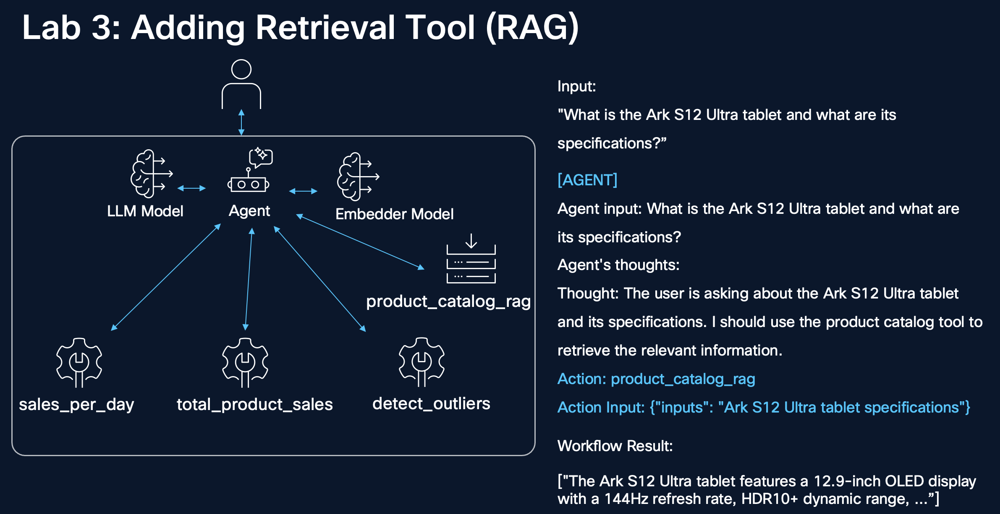

# 3. Adding a Retrieval Tool



After basic tool calling has been demonstrated, adding context retrieval tools to our agent is a reasonable next step.

In this section we will equip our agent with a tool that is capable of performing retrieval of additional context to answer questions about some new consumer products that the backbone model likely doesn't have pretrained knowledge of. It will use a vector store that stores details about products. We can create this agent using LlamaIndex to demonstrate the framework-agnostic capability of the library.

## 3.1 Product Catalog Knowledge Base

The following command writes the product catalog file: `data/rag/product_catalog.md`.

```bash
cd ~/nemo-agent-toolkit/
cat > data/rag/product_catalog.md <<'EOF'
# Product Catalog: Smartphones, Laptops, and Tablets

## Smartphones

The Veltrix Solis Z9 is a flagship device in the premium smartphone segment. It builds on a decade of design iterations that prioritize screen-to-body ratio, minimal bezels, and high refresh rate displays. The 6.7-inch AMOLED panel with 120Hz refresh rate delivers immersive visual experiences, whether in gaming, video streaming, or augmented reality applications. The display's GorillaGlass Fusion coating provides scratch resistance and durability, and the thin form factor is engineered using a titanium-aluminum alloy chassis to reduce weight without compromising rigidity.

Internally, the Solis Z9 is powered by the OrionEdge V14 chipset, a 4nm process SoC designed for high-efficiency workloads. Its AI accelerator module handles on-device tasks such as voice transcription, camera optimization, and intelligent background app management. The inclusion of 12GB LPDDR5 RAM and a 256GB UFS 3.1 storage system allows for seamless multitasking, instant app launching, and rapid data access. The device supports eSIM and dual physical SIM configurations, catering to global travelers and hybrid network users.

Photography and videography are central to the Solis Z9 experience. The triple-camera system incorporates a periscope-style 8MP telephoto lens with 5x optical zoom, a 12MP ultra-wide sensor with macro capabilities, and a 64MP main sensor featuring optical image stabilization (OIS) and phase detection autofocus (PDAF). Night mode and HDRX+ processing enable high-fidelity image capture in challenging lighting conditions.

Software-wise, the device ships with LunOS 15, a lightweight Android fork optimized for modular updates and privacy compliance. The system supports secure containers for work profiles and AI-powered notifications that summarize app alerts across channels. Facial unlock is augmented by a 3D IR depth sensor, providing reliable biometric security alongside the ultrasonic in-display fingerprint scanner.

The Solis Z9 is a culmination of over a decade of design experimentation in mobile form factors, ranging from curved-edge screens to under-display camera arrays. Its balance of performance, battery efficiency, and user-centric software makes it an ideal daily driver for content creators, mobile gamers, and enterprise users.

## Laptops

The Cryon Vanta 16X represents the latest evolution of portable computing power tailored for professional-grade workloads.

The Vanta 16X features a unibody chassis milled from aircraft-grade aluminum using CNC machining. The thermal design integrates vapor chamber cooling and dual-fan exhaust architecture to support sustained performance under high computational loads. The 16-inch 4K UHD display is color-calibrated at the factory and supports HDR10+, making it suitable for cinematic video editing and high-fidelity CAD modeling.

Powering the device is Intel's Core i9-13900H processor, which includes 14 cores with a hybrid architecture combining performance and efficiency cores. This allows the system to dynamically balance power consumption and raw speed based on active workloads. The dedicated Zephira RTX 4700G GPU features 8GB of GDDR6 VRAM and is optimized for CUDA and Tensor Core operations, enabling applications in real-time ray tracing, AI inference, and 3D rendering.

The Vanta 16X includes a 2TB PCIe Gen 4 NVMe SSD, delivering sequential read/write speeds above 7GB/s, and 32GB of high-bandwidth DDR5 RAM. The machine supports hardware-accelerated virtualization and dual-booting, and ships with VireoOS Pro pre-installed, with official drivers available for Fedora, Ubuntu LTS, and NebulaOS.

Input options are expansive. The keyboard features per-key RGB lighting and programmable macros, while the haptic touchpad supports multi-gesture navigation and palm rejection. Port variety includes dual Thunderbolt 4 ports, a full-size SD Express card reader, HDMI 2.1, 2.5G Ethernet, three USB-A 3.2 ports, and a 3.5mm TRRS audio jack. A fingerprint reader is embedded in the power button and supports biometric logins via Windows Hello.

The history of the Cryon laptop line dates back to the early 2010s, when the company launched its first ultrabook aimed at mobile developers. Since then, successive generations have introduced carbon fiber lids, modular SSD bays, and convertible form factors. The Vanta 16X continues this tradition by integrating a customizable BIOS, a modular fan assembly, and a trackpad optimized for creative software like Blender and Adobe Creative Suite.

Designed for software engineers, data scientists, film editors, and 3D artists, the Cryon Vanta 16X is a workstation-class laptop in a portable shell.

## Tablets

The Nebulyn Ark S12 Ultra reflects the current apex of tablet technology, combining high-end hardware with software environments tailored for productivity and creativity.

The Ark S12 Ultra is built around a 12.9-inch OLED display that supports 144Hz refresh rate and HDR10+ dynamic range. With a resolution of 2800 x 1752 pixels and a contrast ratio of 1,000,000:1, the screen delivers vibrant color reproduction ideal for design and media consumption. The display supports true tone adaptation and low blue-light filtering for prolonged use.

Internally, the tablet uses Qualcomm's Snapdragon 8 Gen 3 SoC, which includes an Adreno 750 GPU and an NPU for on-device AI tasks. The device ships with 16GB LPDDR5X RAM and 512GB of storage with support for NVMe expansion via a proprietary magnetic dock. The 11200mAh battery enables up to 15 hours of typical use and recharges to 80 percent in 45 minutes via 45W USB-C PD.

The Ark's history traces back to the original Nebulyn Tab, which launched in 2014 as an e-reader and video streaming device. Since then, the line has evolved through multiple iterations that introduced stylus support, high-refresh screens, and multi-window desktop modes. The current model supports NebulynVerse, a DeX-like environment that allows external display mirroring and full multitasking with overlapping windows and keyboard shortcuts.

Input capabilities are central to the Ark S12 Ultra’s appeal. The Pluma Stylus 3 features magnetic charging, 4096 pressure levels, and tilt detection. It integrates haptic feedback to simulate traditional pen strokes and brush textures. The device also supports a SnapCover keyboard that includes a trackpad and programmable shortcut keys. With the stylus and keyboard, users can effectively transform the tablet into a mobile workstation or digital sketchbook.

Camera hardware includes a 13MP main sensor and a 12MP ultra-wide front camera with center-stage tracking and biometric unlock. Microphone arrays with beamforming enable studio-quality call audio. Connectivity includes Wi-Fi 7, Bluetooth 5.3, and optional LTE/5G with eSIM.

Software support is robust. The device runs NebulynOS 6.0, based on Android 14L, and supports app sandboxing, multi-user profiles, and remote device management. Integration with cloud services, including SketchNimbus and ThoughtSpace, allows for real-time collaboration and syncing of content across devices.

This tablet is targeted at professionals who require a balance between media consumption, creativity, and light productivity. Typical users include architects, consultants, university students, and UX designers.

## Comparative Summary

Each of these devices—the Veltrix Solis Z9, Cryon Vanta 16X, and Nebulyn Ark S12 Ultra—represents a best-in-class interpretation of its category. The Solis Z9 excels in mobile photography and everyday communication. The Vanta 16X is tailored for high-performance applications such as video production and AI prototyping. The Ark S12 Ultra provides a canvas for creativity, note-taking, and hybrid productivity use cases.

## Historical Trends and Design Evolution

Design across all three categories is converging toward modularity, longevity, and environmental sustainability. Recycled materials, reparability scores, and software longevity are becoming integral to brand reputation and product longevity. Future iterations are expected to feature tighter integration with wearable devices, ambient AI experiences, and cross-device workflows.
EOF
```

## 3.2 Llama-index subpackage

As for the previous lab, NeMo Agent toolkit can be installed through the PyPI `nvidia-nat` package.

There are several optional subpackages available for NAT. For this example, we will rely on two subpackages:

* The `langchain` subpackage contains useful components for integrating and running within [LangChain](https://python.langchain.com/docs/introduction/).  
* The `llama-index` subpackage contains useful components for integrating and running within [LlamaIndex](https://developers.llamaindex.ai/python/framework/).  

As `langchain` subpackage is already installed, let's install `llama-index`:  

```bash
#uv pip install "nvidia-nat[llama-index]"
uv pip install -e packages/nvidia_nat_llama_index
cp ~/agent.py .venv/lib/python3.13/site-packages/nat/agent/react_agent/agent.py
```

## 3.3 Defining the Retrieval Tool

Just like with section 2 above, we will define our new tool by writing to a new source file for this agent: `llama_index_rag_tool.py`. This tool using Llama Index to chunk, embed, index, and retrieve ranked results from the source text when called.

**Note**: _In a real‑world scenario, it is not recommended to upsert records at query time due to latency. However, the simplistic approach below is adequate for this demo._

```bash
cd ~/nemo-agent-toolkit/
cat > retail_sales_agent/src/retail_sales_agent/llama_index_rag_tool.py <<'EOF'
import logging
import os

from pydantic import Field

from nat.builder.builder import Builder
from nat.builder.framework_enum import LLMFrameworkEnum
from nat.builder.function_info import FunctionInfo
from nat.cli.register_workflow import register_function
from nat.data_models.component_ref import EmbedderRef
from nat.data_models.component_ref import LLMRef
from nat.data_models.function import FunctionBaseConfig

logger = logging.getLogger(__name__)


class LlamaIndexRAGConfig(FunctionBaseConfig, name="llama_index_rag"):

    llm_name: LLMRef = Field(description="The name of the LLM to use for the RAG engine.")
    embedder_name: EmbedderRef = Field(description="The name of the embedder to use for the RAG engine.")
    data_dir: str = Field(description="The directory containing the data to use for the RAG engine.")
    description: str = Field(description="A description of the knowledge included in the RAG system.")
    collection_name: str = Field(default="context", description="The name of the collection to use for the RAG engine.")


def _walk_directory(root: str):
    for root, dirs, files in os.walk(root):
        for file_name in files:
            yield os.path.join(root, file_name)


@register_function(config_type=LlamaIndexRAGConfig, framework_wrappers=[LLMFrameworkEnum.LLAMA_INDEX])
async def llama_index_rag_tool(config: LlamaIndexRAGConfig, builder: Builder):
    from llama_index.core import Settings
    from llama_index.core import SimpleDirectoryReader
    from llama_index.core import StorageContext
    from llama_index.core import VectorStoreIndex
    from llama_index.core.node_parser import SentenceSplitter

    llm = await builder.get_llm(config.llm_name, wrapper_type=LLMFrameworkEnum.LLAMA_INDEX)
    embedder = await builder.get_embedder(config.embedder_name, wrapper_type=LLMFrameworkEnum.LLAMA_INDEX)

    Settings.embed_model = embedder
    Settings.llm = llm

    files = list(_walk_directory(config.data_dir))
    docs = SimpleDirectoryReader(input_files=files).load_data()
    logger.info("Loaded %s documents from %s", len(docs), config.data_dir)

    parser = SentenceSplitter(
        chunk_size=400,
        chunk_overlap=20,
        separator=" ",
    )
    nodes = parser.get_nodes_from_documents(docs)

    index = VectorStoreIndex(nodes)

    query_engine = index.as_query_engine(similarity_top_k=3, )

    async def _arun(inputs: str) -> str:
        """
        Search product catalog for information about tablets, laptops, and smartphones
        Args:
            inputs: user query about product specifications
        """
        try:
            response = query_engine.query(inputs)
            return str(response.response)

        except Exception as e:
            logger.error("RAG query failed: %s", e)
            return f"Sorry, I couldn't retrieve information about that product. Error: {str(e)}"

    yield FunctionInfo.from_fn(_arun, description=config.description)
EOF
```

Then we will register it...

```bash
cat >> retail_sales_agent/src/retail_sales_agent/register.py <<'EOF'

from . import llama_index_rag_tool
EOF
```

## 3.4 Retrieval Tool Workflow Configuration File

We need a new workflow configuration file which incorporates this new tool.

The key additions are:
* Introduction of an Embedder (`nvidia/nv-embedqa-e5-v5`)
* Addition of an instantiated `llama_index_rag` tool which processes files in the `data/rag` directory
* A custom RAG agent which interfaces with the RAG tool, providing a natural language frontend to the tool.
* Adding the custom RAG agent to the list of available tools to our original agent.

**Note:** _The only impactful change to the top-level agent was the addition of the new RAG agent. All other changes to the configuration were for enabling the RAG agent._

```bash
cd ~/nemo-agent-toolkit/
cat > retail_sales_agent/configs/config_rag.yml <<'EOF'
llms:
  azure_llm:
    _type: azure_openai
    azure_endpoint: ${AZURE_OPENAI_ENDPOINT}
    azure_deployment: ${AZURE_OPENAI_DEPLOYMENT}
    api_key: ${AZURE_OPENAI_API_KEY}
    api_version: ${AZURE_OPENAI_API_VERSION}
    temperature: 0.0

embedders:
  azure_embedder:
    _type: azure_openai
    azure_endpoint: ${AZURE_OPENAI_ENDPOINT}
    azure_deployment: ${AZURE_OPENAI_EMBEDDING_DEPLOYMENT}
    api_key: ${AZURE_OPENAI_API_KEY}
    api_version: ${AZURE_OPENAI_API_VERSION}
    truncate: END

functions:
  total_product_sales_data:
    _type: get_total_product_sales_data
    data_path: data/retail_sales_data.csv
  sales_per_day:
    _type: get_sales_per_day
    data_path: data/retail_sales_data.csv
  detect_outliers:
    _type: detect_outliers_iqr
    data_path: data/retail_sales_data.csv

  product_catalog_rag:
    _type: llama_index_rag
    llm_name: azure_llm
    embedder_name: azure_embedder
    collection_name: product_catalog_rag
    data_dir: data/rag/
    description: "Search product catalog for TabZen tablet, AeroBook laptop, NovaPhone specifications"

workflow:
  _type: react_agent
  tool_names:
    - total_product_sales_data
    - sales_per_day
    - detect_outliers
    - product_catalog_rag
  llm_name: azure_llm
  max_history: 10
  max_iterations: 15
  description: "A helpful assistant that can answer questions about the retail sales CSV data"
  verbose: true
EOF
```

## 3.5 Running the Workflow

We can now test the RAG-enabled workflow with the following command:

```bash
nat run --config_file=retail_sales_agent/configs/config_rag.yml \
    --input "What is the Ark S12 Ultra tablet and what are its specifications?"
```

You should have the following output:

```console
2026-01-04 18:32:04 - INFO     - nat.cli.commands.start:192 - Starting NAT from config file: 'retail_sales_agent/configs/config_rag.yml'
2026-01-04 18:32:06 - INFO     - retail_sales_agent.llama_index_rag_tool:48 - Loaded 1 documents from data/rag/

Configuration Summary:
--------------------
Workflow Type: react_agent
Number of Functions: 4
Number of Function Groups: 0
Number of LLMs: 1
Number of Embedders: 1
Number of Memory: 0
Number of Object Stores: 0
Number of Retrievers: 0
Number of TTC Strategies: 0
Number of Authentication Providers: 0

2026-01-04 18:32:09 - INFO     - nat.agent.react_agent.agent:183 - 
------------------------------
[AGENT]
Agent input: What is the Ark S12 Ultra tablet and what are its specifications?
Agent's thoughts: 
Thought: The user is asking about the Ark S12 Ultra tablet and its specifications. I should use the product catalog tool to retrieve the relevant information.

Action: product_catalog_rag
Action Input: {"inputs": "Ark S12 Ultra tablet specifications"}
------------------------------
2026-01-04 18:32:12 - INFO     - nat.agent.base:221 - 
------------------------------
[AGENT]
Calling tools: product_catalog_rag
Tool's input: {'inputs': 'Ark S12 Ultra tablet specifications'}
Tool's response: 
The Ark S12 Ultra tablet features a 12.9-inch OLED display with a 144Hz refresh rate, HDR10+ dynamic range, a resolution of 2800 x 1752 pixels, and a contrast ratio of 1,000,000:1. It supports true tone adaptation and low blue-light filtering for extended use. Internally, it is powered by Qualcomm's Snapdragon 8 Gen 3 SoC, which includes an Adreno 750 GPU and an NPU for on-device AI tasks. The device comes with 16GB LPDDR5X RAM and 512GB of storage, with support for NVMe expansion via a proprietary magnetic dock. The 11200mAh battery provides up to 15 hours of typical use and can recharge to 80% in 45 minutes using 45W USB-C PD.

The tablet supports NebulynVerse, a multitasking environment with external display mirroring, overlapping windows, and keyboard shortcuts. Input options include the Pluma Stylus 3, which offers 4096 pressure levels, tilt detection, magnetic charging, and haptic feedback, as well as a SnapCover keyboard with a trackpad and programmable shortcut keys. Camera har...(rest of response truncated)
------------------------------
2026-01-04 18:32:14 - INFO     - nat.agent.react_agent.agent:207 - 
------------------------------
[AGENT]
Agent input: What is the Ark S12 Ultra tablet and what are its specifications?
Agent's thoughts: 
Thought: I now know the specifications of the Ark S12 Ultra tablet.

Final Answer: The Ark S12 Ultra tablet features a 12.9-inch OLED display with a 144Hz refresh rate, HDR10+ dynamic range, and a resolution of 2800 x 1752 pixels. It is powered by Qualcomm's Snapdragon 8 Gen 3 SoC, includes 16GB LPDDR5X RAM, 512GB storage (expandable via NVMe dock), and a 11200mAh battery with fast charging. It supports NebulynVerse multitasking, Pluma Stylus 3, SnapCover keyboard, and advanced connectivity options like Wi-Fi 7 and optional LTE/5G. It runs on NebulynOS 6.0, based on Android 14L, and includes features like app sandboxing and multi-user profiles.
------------------------------
2026-01-04 18:32:14 - INFO     - nat.front_ends.console.console_front_end_plugin:102 - --------------------------------------------------
Workflow Result:
["The Ark S12 Ultra tablet features a 12.9-inch OLED display with a 144Hz refresh rate, HDR10+ dynamic range, and a resolution of 2800 x 1752 pixels. It is powered by Qualcomm's Snapdragon 8 Gen 3 SoC, includes 16GB LPDDR5X RAM, 512GB storage (expandable via NVMe dock), and a 11200mAh battery with fast charging. It supports NebulynVerse multitasking, Pluma Stylus 3, SnapCover keyboard, and advanced connectivity options like Wi-Fi 7 and optional LTE/5G. It runs on NebulynOS 6.0, based on Android 14L, and includes features like app sandboxing and multi-user profiles."]
--------------------------------------------------
```

**Note** _the significance of what we've achieved in just a few lines of code: a reasoning agent was brought up with tool calls that allow it the execute predefined python functions to achieve what an LLM alone cannot. Additionally, we've incorporated context retrieval RAG into the same workflow so that the agent can access domain-specific or real time data sources that it's backbone LLM has never seen during training._