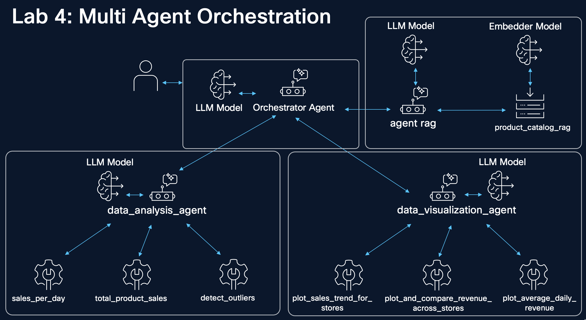

# 4. Multi Agent Orchestration



In this lab, we showcase how the NVIDIA NeMo Agent Toolkit (NAT) can be used to use a mixture of inbuilt tools and agents, as well as custom tools and workflows. Multi-agent orchestration is an important concept in many agentic AI facets: notably runtime and token efficiency. Here we aim to show how simple multi-agent orchestration is able to be implemented when using NAT. We show how an orchestration agent can call tools and sub-agents to facilitate complex tasks.

By the conclusion of this example, we will create a simple mixture-of-agents that serves as an assistant in retail sales.

**Note:** _This is just an example agent system that uses dummy data. The intention is to demonstrate some of the capabilities of this toolkit and how a new user can get familiar with it._

This agent system has:

1. A **supervisor** agent that routes incoming requests to the downstream agent expert
2. A **data insight agent** that is a tool-calling agent capable of answering questions about sales data
3. A **RAG agent** that is capable of answering questions about products using context from a product catalog
4. A **data visualization agent** that is capable of plotting graphs and trends

We demonstrate the following capabilities:
* RAG
* Multi-framework support
* Human-in-the-Loop
* Multi-agent support

## 4.1 Data Analysis/Plotting Tools

This is a new set of tools that will be registered to the data analysis and plotting agent. This set of tools allows the registered agent to plot the results of upstream data analysis tasks.

### 4.1.1 Define Analysis/Plotting Tools

```bash
cd ~/nemo-agent-toolkit/
cat > retail_sales_agent/src/retail_sales_agent/data_visualization_tools.py <<'EOF'
from pydantic import Field

from nat.builder.builder import Builder
from nat.builder.framework_enum import LLMFrameworkEnum
from nat.builder.function_info import FunctionInfo
from nat.cli.register_workflow import register_function
from nat.data_models.component_ref import LLMRef
from nat.data_models.function import FunctionBaseConfig


class PlotSalesTrendForStoresConfig(FunctionBaseConfig, name="plot_sales_trend_for_stores"):
    """Plot sales trend for a specific store."""
    data_path: str = Field(description="Path to the data file")


@register_function(config_type=PlotSalesTrendForStoresConfig, framework_wrappers=[LLMFrameworkEnum.LANGCHAIN])
async def plot_sales_trend_for_stores_function(config: PlotSalesTrendForStoresConfig, _builder: Builder):
    """Create a visualization of sales trends over time."""
    import matplotlib.pyplot as plt
    import pandas as pd

    df = pd.read_csv(config.data_path)

    async def _plot_sales_trend_for_stores(store_id: str) -> str:
        if store_id not in df["StoreID"].unique():
            data = df
            title = "Sales Trend for All Stores"
        else:
            data = df[df["StoreID"] == store_id]
            title = f"Sales Trend for Store {store_id}"

        plt.figure(figsize=(10, 5))
        trend = data.groupby("Date")["Revenue"].sum()
        trend.plot(title=title)
        plt.xlabel("Date")
        plt.ylabel("Revenue")
        plt.tight_layout()
        plt.savefig("sales_trend.png")

        return "Sales trend plot saved to sales_trend.png"

    yield FunctionInfo.from_fn(
        _plot_sales_trend_for_stores,
        description=(
            "This tool can be used to plot the sales trend for a specific store or all stores. "
            "It takes in a store ID creates and saves an image of a plot of the revenue trend for that store."))


class PlotAndCompareRevenueAcrossStoresConfig(FunctionBaseConfig, name="plot_and_compare_revenue_across_stores"):
    """Plot and compare revenue across stores."""
    data_path: str = Field(description="Path to the data file")


@register_function(config_type=PlotAndCompareRevenueAcrossStoresConfig, framework_wrappers=[LLMFrameworkEnum.LANGCHAIN])
async def plot_revenue_across_stores_function(config: PlotAndCompareRevenueAcrossStoresConfig, _builder: Builder):
    """Create a visualization comparing sales trends between stores."""
    import matplotlib.pyplot as plt
    import pandas as pd

    df = pd.read_csv(config.data_path)

    async def _plot_revenue_across_stores(arg: str) -> str:
        pivot = df.pivot_table(index="Date", columns="StoreID", values="Revenue", aggfunc="sum")
        pivot.plot(figsize=(12, 6), title="Revenue Trends Across Stores")
        plt.xlabel("Date")
        plt.ylabel("Revenue")
        plt.legend(title="StoreID")
        plt.tight_layout()
        plt.savefig("revenue_across_stores.png")

        return "Revenue trends across stores plot saved to revenue_across_stores.png"

    yield FunctionInfo.from_fn(
        _plot_revenue_across_stores,
        description=(
            "This tool can be used to plot and compare the revenue trends across stores. Use this tool only if the "
            "user asks for a comparison of revenue trends across stores."
            "It takes in a single string as input (which is ignored) and creates and saves an image of a plot of the revenue trends across stores."
        ))


class PlotAverageDailyRevenueConfig(FunctionBaseConfig, name="plot_average_daily_revenue"):
    """Plot average daily revenue for stores and products."""
    data_path: str = Field(description="Path to the data file")


@register_function(config_type=PlotAverageDailyRevenueConfig, framework_wrappers=[LLMFrameworkEnum.LANGCHAIN])
async def plot_average_daily_revenue_function(config: PlotAverageDailyRevenueConfig, _builder: Builder):
    """Create a bar chart showing average daily revenue by day of week."""
    import matplotlib.pyplot as plt
    import pandas as pd

    df = pd.read_csv(config.data_path)

    async def _plot_average_daily_revenue(arg: str) -> str:
        daily_revenue = df.groupby(["StoreID", "Product", "Date"])["Revenue"].sum().reset_index()

        avg_daily_revenue = daily_revenue.groupby(["StoreID", "Product"])["Revenue"].mean().unstack()

        avg_daily_revenue.plot(kind="bar", figsize=(12, 6), title="Average Daily Revenue per Store by Product")
        plt.ylabel("Average Revenue")
        plt.xlabel("Store ID")
        plt.xticks(rotation=0)
        plt.legend(title="Product", bbox_to_anchor=(1.05, 1), loc='upper left')
        plt.tight_layout()
        plt.savefig("average_daily_revenue.png")

        return "Average daily revenue plot saved to average_daily_revenue.png"

    yield FunctionInfo.from_fn(
        _plot_average_daily_revenue,
        description=("This tool can be used to plot the average daily revenue for stores and products "
                     "It takes in a single string as input and creates and saves an image of a grouped bar chart "
                     "of the average daily revenue"))
EOF
```

### 4.1.2 Install matplotlib

As `data_visualization_tools.py` uses `matplotlib` library, let's intall it:

```bash
uv pip install matplotlib
```

### 4.1.3 Register the tools

```bash
cd ~/nemo-agent-toolkit/
cat >> retail_sales_agent/src/retail_sales_agent/register.py <<'EOF'

from . import data_visualization_tools
EOF
```

## 4.2 Adding an Agent Orchestrator

### 4.2.1 Agent Orchestrator Workflow Configuration File

Next, we introduce a new workflow configuration file. Upon first glance, this configuration file may seem complex. However, when we classify the available tools and delegate them to an agent, it will begin to make intuitive sense how sub-tasks in a workflow can be divided amongst the best fit agent.

In this multi-agent orchestration system, we divide responsibilities among specialized agents, each equipped with tools that match their domain expertise:

**1. Data Analysis Agent**.  
- **Tools:** `total_product_sales_data`, `sales_per_day`, `detect_outliers`.  
- **Justification:** This agent handles raw data processing and statistical analysis. These tools extract, aggregate, and analyze sales data, making it the expert for answering questions about sales trends, patterns, and anomalies. By isolating data analysis tasks, we ensure consistent and reliable data interpretation.

**2. Visualization Agent**.  
- **Tools:** `plot_total_product_sales`, `plot_sales_per_day`, `plot_average_daily_revenue`.  
- **Justification:** This agent specializes in creating visual representations of data. Visualization requires different expertise than raw data analysis—it involves understanding chart types, formatting, and visual communication. Separating this from data analysis allows the agent to focus on producing clear, effective visualizations without mixing concerns.

**3. Knowledge Retrieval Agent (RAG)**.  
- **Tools:** `llama_index_rag_tool`.  
- **Justification:** This agent accesses external knowledge bases and documentation through retrieval-augmented generation. It handles questions that require contextual information beyond the sales data itself, such as business policies, product information, or historical context. This separation ensures that knowledge retrieval doesn't interfere with computational tasks.

**4. Orchestrator Agent (Top-Level)**.  
- **Tools:** None (delegates to sub-agents).  
- **Justification:** The orchestrator doesn't perform tasks directly but instead routes requests to the appropriate expert agent. This design pattern mirrors real-world organizational structures where a manager delegates to specialists. It enables complex workflows where multiple agents collaborate, each contributing their expertise to solve multi-faceted problems.  

This architecture provides several benefits:

- **Modularity:** Each agent can be updated or replaced independently. 
- **Clarity:** Tool responsibilities are clearly defined and scoped. 
- **Scalability:** New agents and tools can be added without disrupting existing ones. 
- **Efficiency:** Agents only load and reason about tools relevant to their domain. 

**Note:** _You will notice in the below configuration that no tools are directly called by the workflow-level agent. Instead, it delegates specifically to expert agents based on the request_

```bash
cd ~/nemo-agent-toolkit/
cat > retail_sales_agent/configs/config_multi_agent.yml <<'EOF'
llms:
  azure_llm:
    _type: azure_openai
    azure_endpoint: ${AZURE_OPENAI_ENDPOINT}
    azure_deployment: ${AZURE_OPENAI_DEPLOYMENT}
    api_key: ${AZURE_OPENAI_API_KEY}
    api_version: ${AZURE_OPENAI_API_VERSION}
    temperature: 0.0

embedders:
  azure_embedder:
    _type: azure_openai
    azure_endpoint: ${AZURE_OPENAI_ENDPOINT}
    azure_deployment: ${AZURE_OPENAI_EMBEDDING_DEPLOYMENT}
    api_key: ${AZURE_OPENAI_API_KEY}
    api_version: ${AZURE_OPENAI_API_VERSION}
    truncate: END

functions:
  total_product_sales_data:
    _type: get_total_product_sales_data
    data_path: data/retail_sales_data.csv
  sales_per_day:
    _type: get_sales_per_day
    data_path: data/retail_sales_data.csv
  detect_outliers:
    _type: detect_outliers_iqr
    data_path: data/retail_sales_data.csv

  data_analysis_agent:
    _type: tool_calling_agent
    tool_names:
      - total_product_sales_data
      - sales_per_day
      - detect_outliers
    llm_name: azure_llm
    max_history: 10
    max_iterations: 15
    description: |
      A helpful assistant that can answer questions about the retail sales CSV data.
      Use the tools to answer the questions.
      Input is a single string.
    verbose: false

  product_catalog_rag:
    _type: llama_index_rag
    llm_name: azure_llm
    embedder_name: azure_embedder
    collection_name: product_catalog_rag
    data_dir: data/rag/
    description: "Search product catalog for TabZen tablet, AeroBook laptop, NovaPhone specifications"

  rag_agent:
    _type: react_agent
    llm_name: azure_llm
    tool_names: [product_catalog_rag]
    max_history: 3
    max_iterations: 5
    max_retries: 2
    description: |
      An assistant that can only answer questions about products.
      Use the product_catalog_rag tool to answer questions about products.
      Do not make up any information.
    verbose: false

  plot_sales_trend_for_stores:
    _type: plot_sales_trend_for_stores
    data_path: data/retail_sales_data.csv
  plot_and_compare_revenue_across_stores:
    _type: plot_and_compare_revenue_across_stores
    data_path: data/retail_sales_data.csv
  plot_average_daily_revenue:
    _type: plot_average_daily_revenue
    data_path: data/retail_sales_data.csv

  data_visualization_agent:
    _type: react_agent
    llm_name: azure_llm
    tool_names:
      - plot_sales_trend_for_stores
      - plot_and_compare_revenue_across_stores
      - plot_average_daily_revenue
    max_history: 10
    max_iterations: 15
    description: |
      You are a data visualization expert.
      You can only create plots and visualizations based on user requests.
      Only use available tools to generate plots.
      You cannot analyze any data.
    verbose: false
    handle_parsing_errors: true
    max_retries: 2
    retry_parsing_errors: true

workflow:
  _type: react_agent
  tool_names: [data_analysis_agent, data_visualization_agent, rag_agent]
  llm_name: azure_llm
  verbose: true
  handle_parsing_errors: true
  max_retries: 2
  system_prompt: |
    Answer the following questions as best you can.
    You may communicate and collaborate with various experts to answer the questions.

    {tools}

    You may respond in one of two formats.
    Use the following format exactly to communicate with an expert:

    Question: the input question you must answer
    Thought: you should always think about what to do
    Action: the action to take, should be one of [{tool_names}]
    Action Input: the input to the action (if there is no required input, include "Action Input: None")
    Observation: wait for the expert to respond, do not assume the expert's response

    ... (this Thought/Action/Action Input/Observation can repeat N times.)
    Use the following format once you have the final answer:

    Thought: I now know the final answer
    Final Answer: the final answer to the original input question
EOF
```

### 4.2.2 Running the Workflow

Next we can run the workflow:

```bash
cd ~/nemo-agent-toolkit/
nat run --config_file retail_sales_agent/configs/config_multi_agent.yml \
  --input "What is the Ark S12 Ultra tablet and what are its specifications?" \
  --input "How do laptop sales compare to phone sales?" \
  --input "Plot average daily revenue"
cp average_daily_revenue.png /var/www/html/lab/images/average_daily_revenue.png
```

You should have the following output:

```console
2026-01-04 19:23:24 - INFO     - nat.cli.commands.start:192 - Starting NAT from config file: 'retail_sales_agent/configs/config_multi_agent.yml'
2026-01-04 19:23:27 - INFO     - matplotlib.font_manager:1639 - generated new fontManager
2026-01-04 19:23:30 - INFO     - retail_sales_agent.llama_index_rag_tool:48 - Loaded 1 documents from data/rag/

Configuration Summary:
--------------------
Workflow Type: react_agent
Number of Functions: 10
Number of Function Groups: 0
Number of LLMs: 1
Number of Embedders: 1
Number of Memory: 0
Number of Object Stores: 0
Number of Retrievers: 0
Number of TTC Strategies: 0
Number of Authentication Providers: 0

2026-01-04 19:23:32 - INFO     - nat.agent.react_agent.agent:183 - 
------------------------------
[AGENT]
Agent input: Plot average daily revenue
Agent's thoughts: 
Thought: I need to ask the data visualization expert to create a plot for the average daily revenue.
Action: data_visualization_agent
Action Input: {"input_message":"Plot average daily revenue"}
------------------------------
2026-01-04 19:23:32 - INFO     - nat.agent.react_agent.agent:183 - 
------------------------------
[AGENT]
Agent input: What is the Ark S12 Ultra tablet and what are its specifications?
Agent's thoughts: 
Question: What is the Ark S12 Ultra tablet and what are its specifications?
Thought: I should use the product catalog to find information about the Ark S12 Ultra tablet and its specifications.
Action: rag_agent
Action Input: {"input_message": "What is the Ark S12 Ultra tablet and what are its specifications?"}
------------------------------
2026-01-04 19:23:32 - INFO     - nat.agent.react_agent.agent:183 - 
------------------------------
[AGENT]
Agent input: How do laptop sales compare to phone sales?
Agent's thoughts: 
Thought: I need to analyze the sales data for laptops and phones to compare their sales. I will ask the data analysis agent to provide this comparison.

Action: data_analysis_agent
Action Input: {"input_message": "Compare laptop sales to phone sales in the dataset."}
------------------------------
2026-01-04 19:23:37 - INFO     - nat.agent.base:221 - 
------------------------------
[AGENT]
Calling tools: data_analysis_agent
Tool's input: {'input_message': 'Compare laptop sales to phone sales in the dataset.'}
Tool's response: 
Here is the comparison between laptop and phone sales:

- **Laptop Sales**: Total revenue is $512,000, with 512 units sold.
- **Phone Sales**: Total revenue is $561,000, with 1,122 units sold.

Phones have higher revenue and significantly more units sold compared to laptops.
------------------------------
2026-01-04 19:23:37 - INFO     - nat.agent.base:221 - 
------------------------------
[AGENT]
Calling tools: data_visualization_agent
Tool's input: {'input_message': 'Plot average daily revenue'}
Tool's response: 
The average daily revenue plot has been saved to "average_daily_revenue.png". You can view the file
------------------------------
2026-01-04 19:23:38 - INFO     - nat.agent.react_agent.agent:207 - 
------------------------------
[AGENT]
Agent input: How do laptop sales compare to phone sales?
Agent's thoughts: 
Thought: I now know the final answer.

Final Answer: Phones have higher revenue ($561,000) and significantly more units sold (1,122 units) compared to laptops, which have a total revenue of $512,000 and 512 units sold.
------------------------------
2026-01-04 19:23:38 - INFO     - nat.agent.react_agent.agent:207 - 
------------------------------
[AGENT]
Agent input: Plot average daily revenue
Agent's thoughts: 
Thought: I now know the final answer.
Final Answer: The average daily revenue plot has been saved as "average_daily_revenue.png". You can view the file to see the visualization.
------------------------------
2026-01-04 19:23:39 - INFO     - nat.agent.base:221 - 
------------------------------
[AGENT]
Calling tools: rag_agent
Tool's input: {'input_message': 'What is the Ark S12 Ultra tablet and what are its specifications?'}
Tool's response: 
The Ark S12 Ultra tablet features a 12.9-inch OLED display with a 144Hz refresh rate, HDR10+ dynamic range, and a resolution of 2800 x 1752 pixels. It is powered by Qualcomm's Snapdragon 8 Gen 3 SoC, includes 16GB LPDDR5X RAM, 512GB storage (expandable via NVMe), and a 11200mAh battery with fast charging. It supports NebulynVerse multitasking, the Pluma Stylus 3, and the SnapCover keyboard. The tablet has a 13MP main camera, a 12MP ultra-wide front camera, and connectivity options like Wi-Fi 7, Bluetooth 5.3, and optional LTE/5G. It runs on NebulynOS 6.0, based on Android 14L.
------------------------------
2026-01-04 19:23:41 - INFO     - nat.agent.react_agent.agent:207 - 
------------------------------
[AGENT]
Agent input: What is the Ark S12 Ultra tablet and what are its specifications?
Agent's thoughts: 
Thought: I now know the final answer.
Final Answer: The Ark S12 Ultra tablet features a 12.9-inch OLED display with a 144Hz refresh rate, HDR10+ dynamic range, and a resolution of 2800 x 1752 pixels. It is powered by Qualcomm's Snapdragon 8 Gen 3 SoC, includes 16GB LPDDR5X RAM, 512GB storage (expandable via NVMe), and a 11200mAh battery with fast charging. It supports NebulynVerse multitasking, the Pluma Stylus 3, and the SnapCover keyboard. The tablet has a 13MP main camera, a 12MP ultra-wide front camera, and connectivity options like Wi-Fi 7, Bluetooth 5.3, and optional LTE/5G. It runs on NebulynOS 6.0, based on Android 14L.
------------------------------
2026-01-04 19:23:41 - INFO     - nat.front_ends.console.console_front_end_plugin:102 - --------------------------------------------------
Workflow Result:
["The Ark S12 Ultra tablet features a 12.9-inch OLED display with a 144Hz refresh rate, HDR10+ dynamic range, and a resolution of 2800 x 1752 pixels. It is powered by Qualcomm's Snapdragon 8 Gen 3 SoC, includes 16GB LPDDR5X RAM, 512GB storage (expandable via NVMe), and a 11200mAh battery with fast charging. It supports NebulynVerse multitasking, the Pluma Stylus 3, and the SnapCover keyboard. The tablet has a 13MP main camera, a 12MP ultra-wide front camera, and connectivity options like Wi-Fi 7, Bluetooth 5.3, and optional LTE/5G. It runs on NebulynOS 6.0, based on Android 14L.", 'Phones have higher revenue ($561,000) and significantly more units sold (1,122 units) compared to laptops, which have a total revenue of $512,000 and 512 units sold.', 'The average daily revenue plot has been saved as "average_daily_revenue.png". You can view the file to see the visualization.']
--------------------------------------------------
```

### 4.2.3 Display the plot result

<a href="#" onclick="showImagePopup({ 
src: 'lab/images/average_daily_revenue.png'}); return false;">
Open image
</a>

