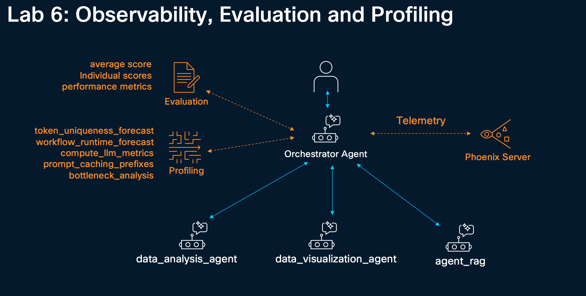
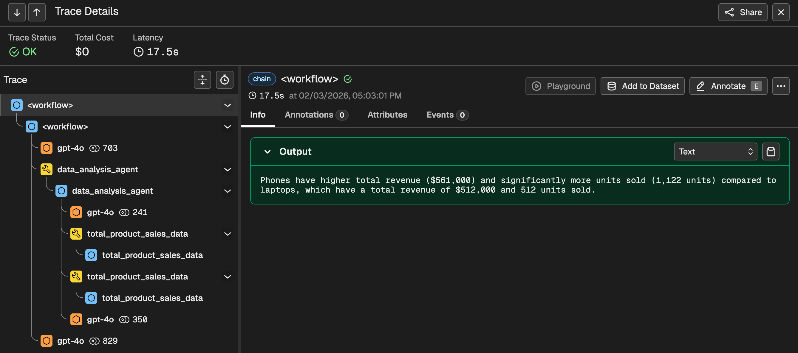
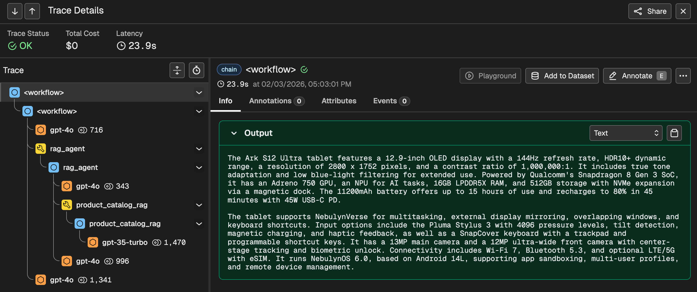
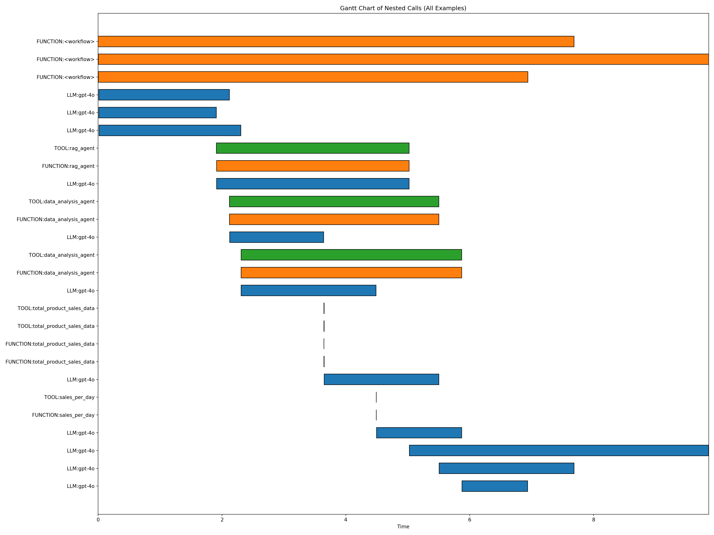

# 6. Tracing, Evaluating, and Profiling your Agent



In this lab, we will walk through the advanced capabilities of NVIDIA NeMo Agent toolkit (NAT) for <a href="https://docs.nvidia.com/nemo/agent-toolkit/latest/workflows/observe/index.html"> observability</a>, <a href="https://docs.nvidia.com/nemo/agent-toolkit/latest/workflows/evaluate.html">evaluation</a>, and <a href="https://docs.nvidia.com/nemo/agent-toolkit/latest/workflows/profiler.html">profiling</a>, from setting up Phoenix tracing to running comprehensive workflow assessments and performance analysis.

## 6.1 Register the required tools

```bash
cd ~/nemo-agent-toolkit/
cat > retail_sales_agent/src/retail_sales_agent/register.py <<'EOF'

from . import sales_per_day_tool
from . import detect_outliers_tool
from . import total_product_sales_data_tool
from . import llama_index_rag_tool
from . import data_visualization_tools
EOF
```

## 6.2 Workflow Configuration File

The following step creates a basic workflow configuration file:

```bash
cd ~/nemo-agent-toolkit/
cat > retail_sales_agent/configs/config_multi_agent.yml <<'EOF'
llms:
  azure_llm:
    _type: azure_openai
    azure_endpoint: ${AZURE_OPENAI_ENDPOINT}
    azure_deployment: ${AZURE_OPENAI_DEPLOYMENT}
    api_key: ${AZURE_OPENAI_API_KEY}
    api_version: ${AZURE_OPENAI_API_VERSION}
    temperature: 0.0

embedders:
  azure_embedder:
    _type: azure_openai
    azure_endpoint: ${AZURE_OPENAI_ENDPOINT}
    azure_deployment: ${AZURE_OPENAI_EMBEDDING_DEPLOYMENT}
    api_key: ${AZURE_OPENAI_API_KEY}
    api_version: ${AZURE_OPENAI_API_VERSION}
    truncate: END

functions:
  total_product_sales_data:
    _type: get_total_product_sales_data
    data_path: data/retail_sales_data.csv
  sales_per_day:
    _type: get_sales_per_day
    data_path: data/retail_sales_data.csv
  detect_outliers:
    _type: detect_outliers_iqr
    data_path: data/retail_sales_data.csv

  data_analysis_agent:
    _type: tool_calling_agent
    tool_names:
      - total_product_sales_data
      - sales_per_day
      - detect_outliers
    llm_name: azure_llm
    max_history: 10
    max_iterations: 15
    description: |
      A helpful assistant that can answer questions about the retail sales CSV data.
      Use the tools to answer the questions.
      Input is a single string.
    verbose: false

  product_catalog_rag:
    _type: llama_index_rag
    llm_name: azure_llm
    embedder_name: azure_embedder
    collection_name: product_catalog_rag
    data_dir: data/rag/
    description: "Search product catalog for Ark S12 Ultra tablet, TabZen tablet, AeroBook laptop and NovaPhone phone specifications"

  rag_agent:
    _type: react_agent
    llm_name: azure_llm
    tool_names: [product_catalog_rag]
    max_history: 3
    max_iterations: 5
    max_retries: 2
    description: |
      An assistant that can only answer questions about products.
      Use the product_catalog_rag tool to answer questions about products.
      Do not make up any information.
    verbose: false

  plot_sales_trend_for_stores:
    _type: plot_sales_trend_for_stores
    data_path: data/retail_sales_data.csv
  plot_and_compare_revenue_across_stores:
    _type: plot_and_compare_revenue_across_stores
    data_path: data/retail_sales_data.csv
  plot_average_daily_revenue:
    _type: plot_average_daily_revenue
    data_path: data/retail_sales_data.csv

  data_visualization_agent:
    _type: react_agent
    llm_name: azure_llm
    tool_names:
      - plot_sales_trend_for_stores
      - plot_and_compare_revenue_across_stores
      - plot_average_daily_revenue
    max_history: 10
    max_iterations: 15
    description: |
      You are a data visualization expert.
      You can only create plots and visualizations based on user requests.
      Only use available tools to generate plots.
      You cannot analyze any data.
    verbose: false
    handle_parsing_errors: true
    max_retries: 2
    retry_parsing_errors: true

workflow:
  _type: react_agent
  tool_names: [data_analysis_agent, data_visualization_agent, rag_agent]
  llm_name: azure_llm
  verbose: true
  handle_parsing_errors: true
  max_retries: 2
  system_prompt: |
    Answer the following questions as best you can.
    You may communicate and collaborate with various experts to answer the questions.

    {tools}

    You may respond in one of two formats.
    Use the following format exactly to communicate with an expert:

    Question: the input question you must answer
    Thought: you should always think about what to do
    Action: the action to take, should be one of [{tool_names}]
    Action Input: the input to the action (if there is no required input, include "Action Input: None")
    Observation: wait for the expert to respond, do not assume the expert's response

    ... (this Thought/Action/Action Input/Observation can repeat N times.)
    Use the following format once you have the final answer:

    Thought: I now know the final answer
    Final Answer: the final answer to the original input question
EOF
```

## 6.3 Run the workflow

```bash
cd ~/nemo-agent-toolkit/
nat run --config_file retail_sales_agent/configs/config_multi_agent.yml \
  --input "What is the Ark S12 Ultra tablet and what are its specifications?" \
  --input "How do laptop sales compare to phone sales?" \
  --input "Plot average daily revenue"
```


## 6.4 Observing a Workflow with Phoenix

Phoenix is an open-source observability platform designed for monitoring, debugging, and improving LLM applications and AI agents. It provides a web-based interface for visualizing and analyzing traces from LLM applications, agent workflows, and ML pipelines. Phoenix automatically captures key metrics such as latency, token usage, and costs, and displays the inputs and outputs at each step, making it invaluable for debugging complex agent behaviors and identifying performance bottlenecks in AI workflows.

### 6.4.1 Updating the Workflow Configuration For Telemetry

We will need to update the workflow configuration file to support telemetry tracing with Phoenix.

To do this, we will first copy the original configuration:

```bash
cd ~/nemo-agent-toolkit/
cp retail_sales_agent/configs/config_multi_agent.yml retail_sales_agent/configs/phoenix_config.yml
```

Then we will append necessary configuration components to the `phoenix_config.yml` file:

```bash
cd ~/nemo-agent-toolkit/
cat >> retail_sales_agent/configs/phoenix_config.yml <<'EOF'

general:
  telemetry:
    logging:
      console:
        _type: console
        level: WARN
    tracing:
      phoenix:
        _type: phoenix
        endpoint: http://localhost:6006/v1/traces
        project: retail_sales_agent
EOF
```

### 6.4.2 Install Phoenix telemetry plugin

```bash
#uv pip install "nvidia-nat[phoenix]"
uv pip install -e packages/nvidia_nat_phoenix
```

### 6.4.3 Start Phoenix Server

```bash
uv pip install arize-phoenix
export PHOENIX_HOST=0.0.0.0
phoenix serve &
```

### 6.4.4 Rerun the Workflow

Open a second terminal to rerun the workflow

<a href="#"  onclick="showLabPanel(1,1); return false;" style="font-size:1.25em; background:#007cba; color:#fff; padding:10px 20px; border-radius:6px; text-decoration:none;">
  Open New Terminal
</a>   

Instead of the original workflow configuration, we will run with the updated `phoenix_config.yml` file:

```bash
cd ~/nemo-agent-toolkit/
source .venv/bin/activate
nat run --config_file retail_sales_agent/configs/phoenix_config.yml \
  --input "What is the Ark S12 Ultra tablet and what are its specifications?" \
  --input "How do laptop sales compare to phone sales?" \
  --input "Plot average daily revenue"
```

### 6.4.5 Viewing the trace

You can access the Phoenix server at [Phoenix Server Access Link](https://%%LABURL%%:6100)

You should visualize the following traces for the three tools access:

- Data Visualization Agent:


- Data Analysis Agent:



- RAG Agent:



## 6.5 Evaluating a Workflow

After setting up observability, the next step is to evaluate your workflow's performance against a test dataset. NAT provides a powerful evaluation framework that can assess your agent's responses using various metrics and evaluators.

For detailed information on evaluation, please refer to the [Evaluating NVIDIA NeMo Agent Toolkit Workflows](https://docs.nvidia.com/nemo/agent-toolkit/latest/workflows/evaluate.html).

### 6.5.1 Create an Evaluation Dataset

For evaluating this workflow, we will created a sample dataset.

The dataset will contain three test cases covering different query types. Each entry contains a question and the expected answer that the agent should provide.

```bash
cd ~/nemo-agent-toolkit/
cat > retail_sales_agent/data/eval_data.json <<'EOF'
[
    {
        "id": "1",
        "question": "How do laptop sales compare to phone sales?",
        "answer": "Phone sales are higher than laptop sales in terms of both revenue and units sold. Phones generated a revenue of 561,000 with 1,122 units sold, whereas laptops generated a revenue of 512,000 with 512 units sold."
    },
    {
        "id": "2",
        "question": "What is the Ark S12 Ultra tablet and what are its specifications?",
        "answer": "The Ark S12 Ultra Ultra tablet features a 12.9-inch OLED display with a 144Hz refresh rate, HDR10+ dynamic range, and a resolution of 2800 x 1752 pixels. It has a contrast ratio of 1,000,000:1. The device is powered by Qualcomm's Snapdragon 8 Gen 3 SoC, which includes an Adreno 750 GPU and an NPU for on-device AI tasks. It comes with 16GB LPDDR5X RAM and 512GB of storage, with support for NVMe expansion via a proprietary magnetic dock. The tablet has a 11200mAh battery that enables up to 15 hours of typical use and recharges to 80 percent in 45 minutes via 45W USB-C PD. Additionally, it features a 13MP main sensor and a 12MP ultra-wide front camera, microphone arrays with beamforming, Wi-Fi 7, Bluetooth 5.3, and optional LTE/5G with eSIM. The device runs NebulynOS 6.0, based on Android 14L, and supports app sandboxing, multi-user profiles, and remote device management. It also includes the Pluma Stylus 3 with magnetic charging, 4096 pressure levels, and tilt detection, as well as a SnapCover keyboard with a trackpad and programmable shortcut keys."
    },
    {
        "id": "3",
        "question": "What were the laptop sales on Feb 16th 2024?",
        "answer": "On February 16th, 2024, the total laptop sales were 13 units, generating a total revenue of $13,000."
    }
]
EOF
```

### 6.5.2 Updating the Workflow Configuration

Workflow configuration files can contain extra settings relevant for evaluation and profiling.

To do this, we will first copy the original configuration:

```bash
cd ~/nemo-agent-toolkit/
cp retail_sales_agent/configs/config_multi_agent.yml retail_sales_agent/configs/config_eval.yml
```

Then, we will append necessary configuration components to the `config_eval.yml` file:

```bash
cd ~/nemo-agent-toolkit/
cat >> retail_sales_agent/configs/config_eval.yml <<'EOF'

eval:
  general:
    output_dir: ./eval_output
    verbose: true
    dataset:
        _type: json
        file_path: ./retail_sales_agent/data/eval_data.json

  evaluators:
    accuracy:
      _type: ragas
      metric: AnswerAccuracy
      llm_name: azure_llm
    groundedness:
      _type: ragas
      metric: ResponseGroundedness
      llm_name: azure_llm
    relevance:
      _type: ragas
      metric: ContextRelevance
      llm_name: azure_llm
    trajectory_accuracy:
      _type: trajectory
      llm_name: azure_llm
EOF
```

### 6.5.3 Running the Evaluation

The `nat eval` command executes the workflow against all entries in the dataset and evaluates the results using configured evaluators. Run the cell below to evaluate the retail sales agent workflow.

```bash
cd ~/nemo-agent-toolkit/
nat eval --config_file retail_sales_agent/configs/config_eval.yml
```

### 6.5.4 Understanding Evaluation Results

The `nat eval` command runs the workflow on all entries in the dataset and produces several output files:   

- **`workflow_output.json`**: Contains the raw outputs from the workflow for each input in the dataset.  
- **Evaluator-specific files**: Each configured evaluator generates its own output file with scores and reasoning.  

Each evaluator provides:   
- An **average score** across all dataset entries (0-1 scale, where 1 is perfect).  
- **Individual scores** for each entry with detailed reasoning.  
- **Performance metrics** to help identify areas for improvement.  

All evaluation results are stored in the `output_dir` specified in the configuration file.

## 6.6 Profiling a Workflow

Profiling provides deep insights into your workflow's performance characteristics, helping you identify bottlenecks, optimize resource usage, and improve overall efficiency.

For detailed information on profiling, please refer to the [Profiling and Performance Monitoring of NVIDIA NeMo Agent Toolkit Workflows](https://docs.nvidia.com/nemo/agent-toolkit/latest/workflows/profiler.html).

### 6.6.1 Updating the Workflow Configuration

Workflow configuration files can contain extra settings relevant for evaluation and profiling.

To do this, we will first copy the original configuration:

```bash
cd ~/nemo-agent-toolkit/
cp retail_sales_agent/configs/config_multi_agent.yml retail_sales_agent/configs/config_profile.yml
```

Then, we will append necessary configuration components to the `config_profile.yml` file:

```bash
cd ~/nemo-agent-toolkit/
cat >> retail_sales_agent/configs/config_profile.yml <<'EOF'

eval:
  general:
    output_dir: ./profile_output
    verbose: true
    dataset:
        _type: json
        file_path: ./retail_sales_agent/data/eval_data.json

    profiler:
        token_uniqueness_forecast: true
        workflow_runtime_forecast: true
        compute_llm_metrics: true
        csv_exclude_io_text: true
        prompt_caching_prefixes:
          enable: true
          min_frequency: 0.1
        bottleneck_analysis:
          enable_nested_stack: true
        concurrency_spike_analysis:
          enable: true
          spike_threshold: 7
EOF
```

### 6.6.2 Understanding the Profiler Configuration

We will reuse the same configuration as evaluation.

The profiler is configured through the `profiler` section of your workflow configuration file. It runs alongside the `nat eval` command and offers several analysis options:

- **`token_uniqueness_forecast`**: Computes the inter-query token uniqueness forecast, predicting the expected number of unique tokens in the next query based on tokens used in previous queries

- **`workflow_runtime_forecast`**: Calculates the expected workflow runtime based on historical query performance

- **`compute_llm_metrics`**: Computes inference optimization metrics including latency, throughput, and other performance indicators

- **`csv_exclude_io_text`**: Prevents large text from being dumped into output CSV files, preserving CSV structure and readability

- **`prompt_caching_prefixes`**: Identifies common prompt prefixes that can be pre-populated in KV caches for improved performance

- **`bottleneck_analysis`**: Analyzes workflow performance measures such as bottlenecks, latency, and concurrency spikes
  - `simple_stack`: Provides a high-level analysis
  - `nested_stack`: Offers detailed analysis of nested bottlenecks (e.g., tool calls inside other tool calls)

- **`concurrency_spike_analysis`**: Identifies concurrency spikes in your workflow. The `spike_threshold` parameter (e.g., 7) determines when to flag spikes based on the number of concurrent running functions

The `output_dir` parameter specifies where all profiler outputs will be stored for later analysis.

### 6.6.3 Running the Profiler

The profiler runs as part of the `nat eval` command. When properly configured, it will collect performance data across all evaluation runs and generate comprehensive profiling reports.

```bash
cd ~/nemo-agent-toolkit/
nat eval --config_file retail_sales_agent/configs/config_profile.yml
cp ./profile_output/gantt_chart.png /var/www/html/lab/images/gantt_chart.png
```

### 6.6.4 Understanding Profiler Output Files

Based on the profiler configuration, the following files will be generated in the `output_dir`:

**Core Output Files:**

1. **`all_requests_profiler_traces.json`**: Raw usage statistics collected by the profiler, including:
   - Raw traces of LLM interactions
   - Tool input and output data
   - Runtime measurements
   - Execution metadata

2. **`inference_optimization.json`**: Workflow-specific performance metrics with confidence intervals:
   - 90%, 95%, and 99% confidence intervals for latency
   - Throughput statistics
   - Workflow runtime predictions

3. **`standardized_data_all.csv`**: Standardized usage data in CSV format containing:
   - Prompt tokens and completion tokens
   - LLM input/output
   - Framework information
   - Additional metadata

**Advanced Analysis Files**

4. **Analysis Reports**: JSON files and text reports for any advanced techniques enabled:
   - Concurrency analysis results
   - Bottleneck analysis reports
   - PrefixSpan pattern mining results

These files provide comprehensive insights into your workflow's performance and can be used for optimization and debugging.

**Gantt Chart**

We can also view a Gantt chart of the profile run:

<a href="#" onclick="showImagePopup({ 
src: 'lab/images/gantt_chart.png'}); return false;">
Open Gantt Chart
</a>

You should have a similar chart:




## 6.7 Lab Summary

In this notebook, we covered the complete workflow for observability, evaluation, and profiling in NeMo Agent Toolkit:

**Observability with Phoenix**
- Configured tracing in the workflow configuration.  
- Started the Phoenix server for real-time monitoring.  
- Executed workflows with automatic trace capture.  
- Visualized agent execution flow and LLM interactions.  

**Evaluation with `nat eval`**
- Created a comprehensive evaluation dataset.  
- Ran automated evaluations across multiple test cases.  
- Reviewed evaluation metrics and scores.  
- Analyzed workflow performance against expected outputs.  

**Profiling for Performance Optimization**
- Configured advanced profiling options.  
- Collected performance metrics and usage statistics.  
- Generated detailed profiling reports.  
- Identified bottlenecks and optimization opportunities.  

These three pillars—observability, evaluation, and profiling—work together to provide a complete picture of your agent's behavior, accuracy, and performance, enabling you to build production-ready AI applications with confidence.   
