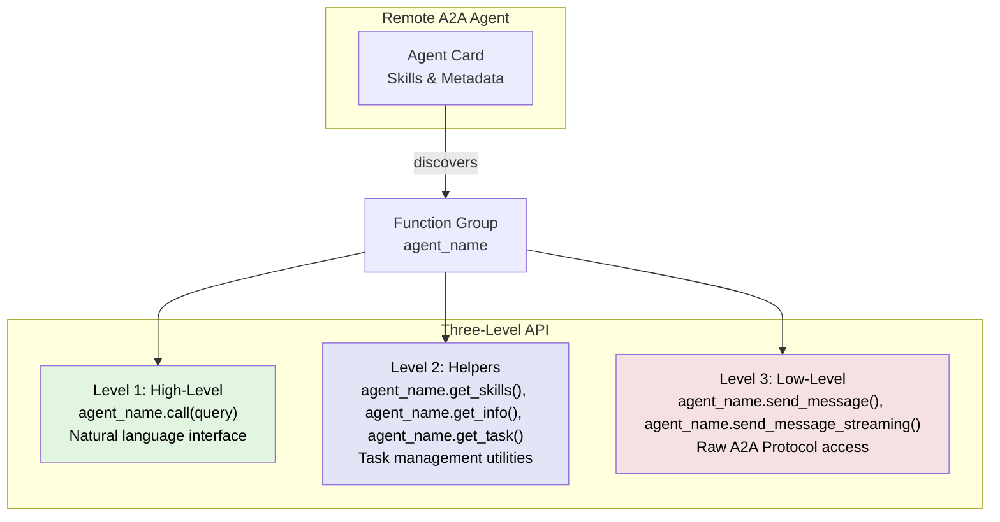
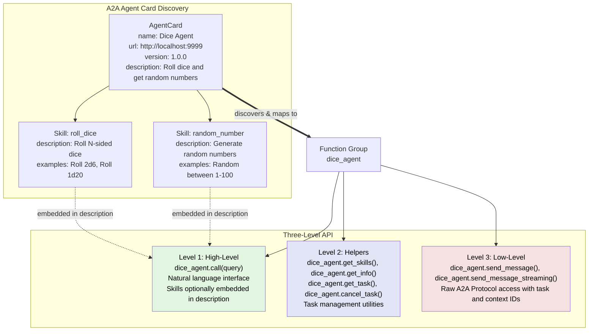

<!--
SPDX-FileCopyrightText: Copyright (c) 2025-2026, NVIDIA CORPORATION & AFFILIATES. All rights reserved.
SPDX-License-Identifier: Apache-2.0

Licensed under the Apache License, Version 2.0 (the "License");
you may not use this file except in compliance with the License.
You may obtain a copy of the License at

http://www.apache.org/licenses/LICENSE-2.0

Unless required by applicable law or agreed to in writing, software
distributed under the License is distributed on an "AS IS" BASIS,
WITHOUT WARRANTIES OR CONDITIONS OF ANY KIND, either express or implied.
See the License for the specific language governing permissions and
limitations under the License.
-->

# NVIDIA NeMo Agent Toolkit Workflow as an A2A Client

[Agent-to-Agent (A2A) Protocol](https://a2aproject.org/) is an open standard from the Linux Foundation that enables agent-to-agent communication and collaboration. The protocol standardizes how [agents](../components/agents/index.md) discover capabilities, delegate tasks, and exchange information.

You can create a [workflow](./about-building-workflows.md) that connects to remote A2A agents and provides a function interface for interacting with their capabilities.

This guide covers how to use NeMo Agent Toolkit as an A2A client. For information on publishing workflows as A2A servers, refer to [A2A Server](../run-workflows/a2a-server.md).

:::important
**Per-User A2A Clients**

A2A clients are per-user [function groups](./functions-and-function-groups/function-groups.md), which means:
- Each user gets their own isolated A2A client instance with separate connections, authentication, and session state
- Workflows using A2A clients **must** be registered as per-user using `@register_per_user_function` or use one of the builtin per-user workflows (such as `per_user_react_agent`)
- Shared workflows (such as `react_agent`) **cannot** use A2A client function groups directly

For multi-user deployments, this provides automatic isolation between users. See [Writing Per-User Functions](../extend/custom-components/custom-functions/per-user-functions.md) for details on creating per-user workflows.
:::

## Installation

A2A client functionality requires the `nvidia-nat-a2a` package. Install it with:

```bash
uv pip install "nvidia-nat[a2a]"
```

:::{note}
**Authentication**: For connecting to OAuth2-protected A2A agents, see [A2A Authentication](../components/auth/a2a-auth.md).
:::

## A2A Client Configuration

NeMo Agent Toolkit enables workflows to interact with remote A2A agents through [function groups](./functions-and-function-groups/function-groups.md).

### Basic Configuration

```yaml
function_groups:
  currency_agent:
    _type: a2a_client
    url: http://localhost:11000
    task_timeout: 60

workflow:
  _type: per_user_react_agent  # Per-user workflow required for A2A clients
  tool_names:
    - currency_agent
  llm_name: nim_llm
```

The `a2a_client` function group connects to a remote A2A agent, discovers its skills through the [Agent Card](https://a2a-protocol.org/latest/topics/agent-discovery/), and provides a function interface for invoking those skills.

**Note**: Since A2A clients are per-user, the workflow must also be per-user. The example above uses `per_user_react_agent`, which is the per-user version of the builtin [ReAct agent](../components/agents/react-agent/react-agent.md). See the [examples](#examples) section for complete implementations.

### Configuration Options

The `a2a_client` function group supports the following configuration options:

| Parameter | Type | Description | Default |
|-----------|------|-------------|---------|
| `url` | string | A2A agent URL | Required |
| `agent_card_path` | string | Path to agent card endpoint | `/.well-known/agent-card.json` |
| `task_timeout` | int | Task timeout in seconds | 300 |
| `include_skills_in_description` | boolean | Embed discovered skills in function description | `true` |
| `auth_provider` | string | Reference to [authentication provider](../components/auth/api-authentication.md) | None |

**Note**: You can get the complete list of configuration options and their schemas by running:
```bash
nat info components -t function_group -q a2a_client
```

### Multiple A2A Clients

You can connect to multiple A2A agents in the same per-user workflow:

```yaml
function_groups:
  calculator_agent:
    _type: a2a_client
    url: http://localhost:10000

  currency_agent:
    _type: a2a_client
    url: http://localhost:11000

workflow:
  _type: per_user_react_agent  # Per-user workflow required for A2A clients
  tool_names:
    - calculator_agent
    - currency_agent
```

**Note**: All A2A clients in a workflow will be per-user, providing isolated connections for each user.

## Three-Level API Architecture

The A2A client provides three levels of API access, allowing you to choose the right abstraction level for your use case.



### Level 1: High-Level API (Recommended)

**Function**: `agent_name.call(query: str) -> str`

The high-level API provides a natural language interface optimized for [LLM-based](./llms/index.md) agents. This is the recommended approach for most use cases.

**When to use:**
- Standard LLM-based agents (most common)
- Simple task delegation
- Agent-as-a-tool pattern

**Features:**
- Accepts natural language queries
- Skills automatically embedded in function description
- Agent handles skill selection and execution
- Returns string response

**Example:**
```yaml
workflow:
  _type: react_agent
  tool_names:
    - currency_agent  # Uses high-level .call() function
```

The LLM will see a function like:
```text
currency_agent(query: str) -> str
Description: Currency conversion agent with the following skills:
  - convert_currency: Convert between currencies
  - get_exchange_rate: Get current exchange rates
```

### Level 2: Helper Functions

**Functions:**
- `agent_name.get_skills()` - List available skills
- `agent_name.get_info()` - Get agent metadata
- `agent_name.get_task(task_id)` - Get task status
- `agent_name.cancel_task(task_id)` - Cancel a running task

**When to use:**
- Task management and monitoring
- Metadata queries
- Building custom orchestration logic

**Example:**
```python
# Get available skills
skills = await agent.get_skills()

# Get agent information
info = await agent.get_info()
```

### Level 3: Low-Level Protocol API

**Functions:**
- `agent_name.send_message(query, task_id, context_id)` - Send message and get events
- `agent_name.send_message_streaming(query, task_id, context_id)` - Stream events

**When to use:**
- Custom agents needing full protocol control
- Advanced task management
- Direct access to A2A events

**Example:**
```python
# Direct protocol access
events = await agent.send_message(
    query="Convert 100 USD to EUR",
    task_id=None,
    context_id=None
)
```

## Advanced: Understanding Agent Card Discovery

The A2A client discovers agent capabilities through the Agent Card and creates a function interface for interacting with them. The following diagram shows the complete discovery and mapping process:



**Discovery Process:**
1. Client fetches Agent Card from `{url}/.well-known/agent-card.json`
2. Parses agent metadata (name, version, description)
3. Extracts skills with their descriptions and examples
4. Maps skills to a [function group](./functions-and-function-groups/function-groups.md) with three API levels
5. Optionally embeds skill details in high-level function description

## Transport Support

The A2A client uses the transport protocol specified in the agent's Agent Card. The [A2A Python SDK](https://github.com/a2aproject/a2a-python) automatically selects the appropriate transport based on the agent's capabilities. Default transport is JSON-RPC over HTTP.

**Coming Soon:**
- Explicit transport configuration options
- Support for additional transport protocols (gRPC, HTTP/REST)

## Streaming Support

The A2A client automatically enables streaming support when connecting to agents. Streaming is handled at the protocol level through the low-level `send_message_streaming()` function, which yields events as they arrive from the remote agent.

For most use cases, the high-level `call()` function is sufficient. Use `send_message_streaming()` only when you need direct access to streaming events.

## Examples

The following examples demonstrate A2A client usage:

- Math Assistant A2A Example - A2A communication with hybrid tool composition. Refer to `examples/A2A/math_assistant_a2a/README.md`.
- Currency Agent A2A Example - Connecting to external third-party A2A services. See `examples/A2A/currency_agent_a2a/README.md`.

## CLI Utilities

The A2A client includes CLI utilities for testing and debugging.

**Quick reference:**

```bash
# Discover an A2A agent
nat a2a client discover --url http://localhost:10000

# call the agent
nat a2a client call --url http://localhost:10000 --message "Your query here"
```

### Discover Agent

The `discover` command connects to an A2A agent and displays its Agent Card, which contains information about capabilities, skills, and configuration.

**Basic usage:**
```bash
nat a2a client discover --url $A2A_SERVER_URL
```

**Output example:**


### Call Agent

Call an A2A agent with a message and get a response. This is useful for quick testing and one-off queries.

**Usage:**
```bash
nat a2a client call --url $A2A_SERVER_URL --message "What is 2 + 2?"
```

**Output example:**
```text
Query: What is 2 + 2?

The sum of 2 and 2 is 4.

(0.85s)
```


## Troubleshooting

### Connection Issues

**Agent Not Reachable**:
```bash
# Verify agent is running and accessible
curl http://localhost:10000/.well-known/agent-card.json | jq
```

### Performance Issues

**Timeouts**:
- Increase `task_timeout` in configuration
- Check network latency to remote agent

## Protocol Compliance

The A2A client is built on the official [A2A Python SDK](https://github.com/a2aproject/a2a-python) to ensure protocol compliance. For detailed protocol specifications, refer to the [A2A Protocol Documentation](https://a2a-protocol.org/latest/specification/).

## Related Documentation

- [A2A Server Guide](../run-workflows/a2a-server.md) - Publishing workflows as A2A agents
- [Function Groups](./functions-and-function-groups//function-groups.md) - Understanding function groups
