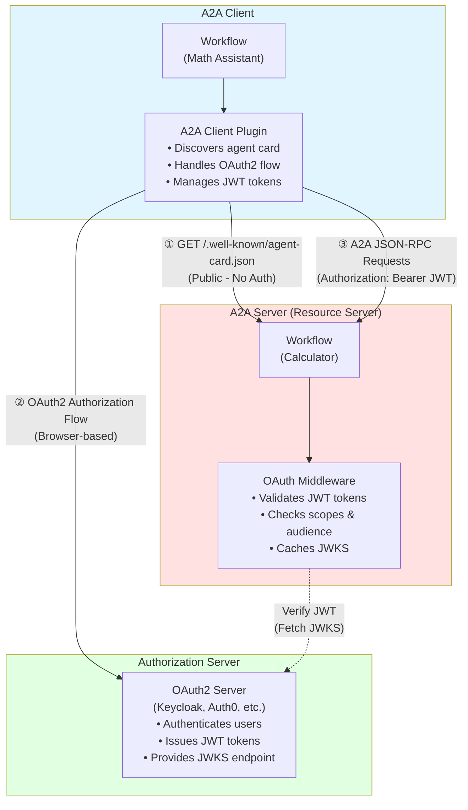
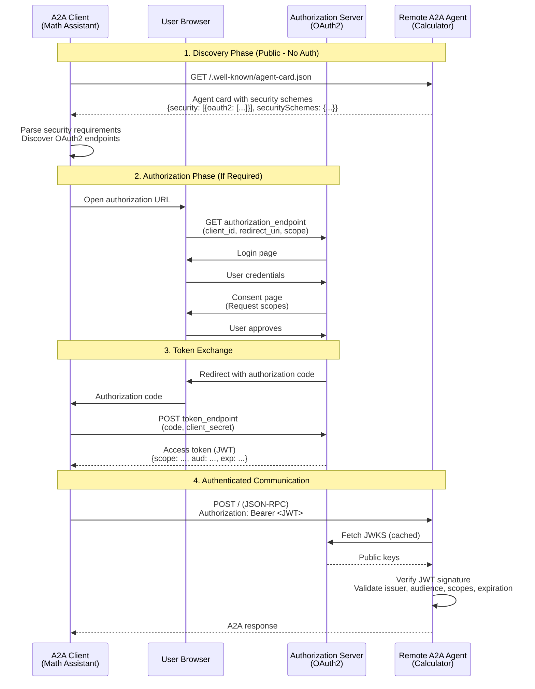

<!--
SPDX-FileCopyrightText: Copyright (c) 2025-2026, NVIDIA CORPORATION & AFFILIATES. All rights reserved.
SPDX-License-Identifier: Apache-2.0

Licensed under the Apache License, Version 2.0 (the "License");
you may not use this file except in compliance with the License.
You may obtain a copy of the License at

http://www.apache.org/licenses/LICENSE-2.0

Unless required by applicable law or agreed to in writing, software
distributed under the License is distributed on an "AS IS" BASIS,
WITHOUT WARRANTIES OR CONDITIONS OF ANY KIND, either express or implied.
See the License for the specific language governing permissions and
limitations under the License.
-->

# Agent-to-Agent (A2A) Authentication for NeMo Agent Toolkit

NVIDIA NeMo Agent Toolkit provides OAuth2 authentication capabilities for A2A protocol, enabling secure agent-to-agent communication. A2A authentication is built on OAuth 2.1 Authorization Code Flow with JWT token validation, providing a standards-based approach to protecting A2A servers.

A2A authentication is `agent card-driven`; clients discover security requirements by fetching the agent's public metadata (agent card) without authentication, then dynamically initiate the appropriate authentication flow. This allows agents to advertise their security requirements upfront, enabling clients to adapt their authentication strategy accordingly.

For a complete, hands-on guide to setting up OAuth2 authentication with Keycloak, see `examples/A2A/math_assistant_a2a_protected/README.md`.

## Supported Capabilities

NeMo Agent Toolkit A2A authentication provides the capabilities required for secure agent-to-agent communication:

- **Agent Card Discovery**: Public endpoint for discovering security requirements without authentication
- **OAuth 2.1 Authorization Code Flow**: Standard authorization flow conforming to [OAuth 2.1 draft specification](https://datatracker.ietf.org/doc/html/draft-ietf-oauth-v2-1-13)
- **JWT Token Validation**: Server-side token verification using JWKS (JSON Web Key Set)
- **Custom Scopes**: Resource-specific permissions (for example, `calculator_a2a_execute`)
- **Audience Validation**: Ensures tokens are intended for the specific A2A server

## Architecture Overview

A2A authentication involves three main components working together to secure agent-to-agent communication:



**Component Roles:**

1. **A2A Client**: workflow that connects to remote A2A agents using the `a2a_client` function group. Handles OAuth2 flow and includes JWT tokens in requests.

2. **A2A Server (Resource Server)**: workflow published via `nat a2a serve` with OAuth2 protection. Validates incoming JWT tokens and enforces access policies.

3. **Authorization Server**: OAuth2 server (such as Keycloak) that authenticates users, issues JWT tokens, and provides public keys for token verification.

## Authentication Flow

The A2A authentication flow demonstrates how agent card discovery drives the authentication process:



**Key Steps:**

1. **Agent Card Discovery**: Client fetches public metadata to discover authentication requirements. This step requires no authentication and is always the first interaction.

2. **Dynamic Authentication**: Client initiates OAuth2 flow based on agent card security schemes. The agent card specifies the authorization server, token endpoint, and required scopes.

3. **Token Acquisition**: User authenticates via browser, and client obtains JWT access token with appropriate scopes and audience.

4. **Authenticated Communication**: Client includes JWT token in A2A requests. Server validates token signature, issuer, audience, scopes, and expiration before processing requests.

## Configuring Authentication

A2A authentication requires configuration on both the client side (OAuth2 provider) and server side (JWT validation).

### Client Configuration (A2A Client with OAuth2)

Configure the A2A client to use an OAuth2 authentication provider:

```yaml
function_groups:
  calculator_a2a:
    _type: a2a_client
    url: http://localhost:10000
    auth_provider: calculator_oauth

authentication:
  calculator_oauth:
    _type: oauth2_auth_code_flow
    client_id: ${CALCULATOR_CLIENT_ID}
    client_secret: ${CALCULATOR_CLIENT_SECRET}
    redirect_uri: http://localhost:8000/auth/redirect
    authorization_url: http://localhost:8080/realms/master/protocol/openid-connect/auth
    token_url: http://localhost:8080/realms/master/protocol/openid-connect/token
    scopes:
      - calculator_a2a_execute
```

**Configuration Options:**

| Parameter | Description | Required |
|-----------|-------------|----------|
| `client_id` | OAuth2 client identifier registered with authorization server | Yes |
| `client_secret` | OAuth2 client secret | Yes |
| `redirect_uri` | Callback URI for OAuth2 flow (must match registration) | Yes |
| `authorization_url` | Authorization endpoint URL | Yes |
| `token_url` | Token endpoint URL | Yes |
| `scopes` | List of OAuth2 scopes to request | Yes |

**Endpoint Discovery**: The `authorization_url` and `token_url` can be discovered from your OAuth2 provider's discovery endpoint (typically `/.well-known/openid-configuration`). For example, Keycloak uses paths like `/protocol/openid-connect/auth` and `/protocol/openid-connect/token`.

**Note**: Get the complete list of OAuth2 provider options by running:
```bash
nat info components -t auth_provider -q oauth2_auth_code_flow
```

### Server Configuration (A2A Server with JWT Validation)

Configure the A2A server to validate JWT tokens:

```yaml
general:
  front_end:
    _type: a2a
    name: "Protected Calculator"
    description: "OAuth2-protected calculator agent"
    port: 10000
    server_auth:
      issuer_url: http://localhost:8080/realms/master
      scopes:
        - calculator_a2a_execute
      audience: http://localhost:10000
      jwks_uri: http://localhost:8080/realms/master/protocol/openid-connect/certs
```

**Server Authentication Options:**

| Parameter | Description | Required |
|-----------|-------------|----------|
| `issuer_url` | Expected token issuer (authorization server URL) | Yes |
| `jwks_uri` | JWKS endpoint for fetching public keys | Yes |
| `scopes` | Required scopes for access | Optional |
| `audience` | Expected audience value in token | Optional |

**Endpoint Discovery**: The `jwks_uri` can be discovered from your OAuth2 provider's discovery endpoint at `<issuer_url>/.well-known/openid-configuration`. For example, Keycloak typically uses `/protocol/openid-connect/certs`.

The server validates incoming JWT tokens by:
1. Verifying token signature using public keys from JWKS endpoint
2. Checking token issuer matches `issuer_url`
3. Validating token has not expired
4. Ensuring required scopes are present (if configured)
5. Verifying audience matches expected value (if configured)

## Security Considerations

When implementing A2A authentication, consider the following security best practices:

### Transport Security
- **Always use HTTPS** in production for all components (authorization server, A2A server, redirect URIs)
- **Secure redirect URIs**: Ensure redirect URIs use HTTPS and match registered URIs exactly
- **No HTTP in production**: HTTP is acceptable only for local development

### Token Management
- **Short-lived tokens**: Configure access tokens with short lifetimes (5-15 minutes recommended)
- **Scope minimization**: Request only the scopes required for specific operations
- **Audience validation**: Always validate the token audience to prevent token substitution attacks

### Credential Security
- **Secure client secrets**: Store client secrets in environment variables or secret management systems
- **Never commit secrets**: Do not commit OAuth2 credentials to version control
- **Rotate credentials**: Implement regular credential rotation policies

## Examples

The Math Assistant A2A example demonstrates end-to-end OAuth2-protected A2A communication:

- **Protected Calculator Server**: A2A server that validates JWT tokens and enforces scope requirements
- **Math Assistant Client**: A2A client that discovers security requirements and authenticates via OAuth2
- **OAuth2 Keycloak Setup Guide**: Complete guide for setting up Keycloak as authorization server

**Example Location**: `examples/A2A/math_assistant_a2a_protected/`

This example includes:
- Complete Keycloak configuration instructions
- Client and server configuration files
- Testing and verification steps

## Related Documentation

- [A2A Protocol Overview](../integrations/a2a.md) - Introduction to Agent-to-Agent protocol
- [A2A Client](../../build-workflows/a2a-client.md) - Connecting to remote A2A agents
- [A2A Server](../../run-workflows/a2a-server.md) - Publishing workflows as A2A agents
