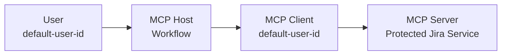
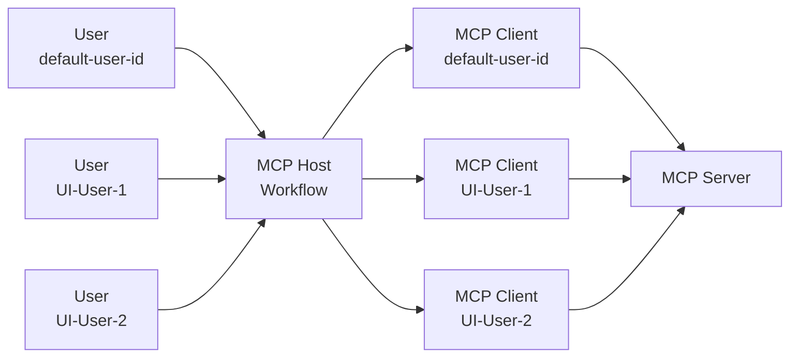
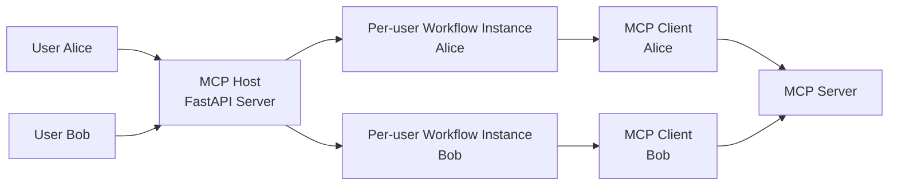

<!--
SPDX-FileCopyrightText: Copyright (c) 2025-2026, NVIDIA CORPORATION & AFFILIATES. All rights reserved.
SPDX-License-Identifier: Apache-2.0

Licensed under the Apache License, Version 2.0 (the "License");
you may not use this file except in compliance with the License.
You may obtain a copy of the License at

http://www.apache.org/licenses/LICENSE-2.0

Unless required by applicable law or agreed to in writing, software
distributed under the License is distributed on an "AS IS" BASIS,
WITHOUT WARRANTIES OR CONDITIONS OF ANY KIND, either express or implied.
See the License for the specific language governing permissions and
limitations under the License.
-->

# Model Context Protocol (MCP) Authentication for the NVIDIA NeMo Agent Toolkit
MCP provides authorization capabilities at the transport level, enabling MCP clients to make requests to restricted MCP servers on behalf of resource owners. The NVIDIA NeMo Agent Toolkit provides a set of built-in [authentication providers](../api-authentication.md) for accessing servers that require authentication.

This document covers **interactive OAuth2 authentication** (`mcp_oauth2`) for user-facing workflows. For automated, headless scenarios such as CI/CD pipelines or backend services, see [Service Account Authentication](./mcp-service-account-auth.md).

The `mcp_oauth2` provider is the default authentication provider in the NeMo Agent Toolkit for MCP servers that require user authorization. It conforms to the [MCP OAuth2](https://modelcontextprotocol.io/specification/draft/basic/authorization) specification.

## Supported Capabilities
NeMo Agent Toolkit MCP authentication provides the capabilities required to access protected MCP servers:
- Dynamic endpoint discovery using the procedures defined in [RFC 9728](https://www.rfc-editor.org/rfc/rfc9728), [RFC 8414](https://www.rfc-editor.org/rfc/rfc8414), and [OpenID Connect](https://openid.net/specs/openid-connect-core-1_0.html)
- Client registration using the procedures defined in [RFC 7591](https://www.rfc-editor.org/rfc/rfc7591)
- Authentication using the procedures defined in the [OAuth2 specification](https://datatracker.ietf.org/doc/html/draft-ietf-oauth-v2-1-13)

## Configuring an Auth Provider
`mcp_oauth2` is a built-in authentication provider in the NeMo Agent Toolkit that implements the MCP OAuth2 specification. It is used to authenticate with MCP servers that require authentication.
Sample configuration:
```yaml
authentication:
  mcp_oauth2_jira:
    _type: mcp_oauth2
    server_url: ${CORPORATE_MCP_JIRA_URL}
    redirect_uri: ${NAT_REDIRECT_URI:-http://localhost:8000/auth/redirect}
    default_user_id: ${NAT_USER_ID}
    allow_default_user_id_for_tool_calls: ${ALLOW_DEFAULT_USER_ID_FOR_TOOL_CALLS:-true}
```
Configuration options:
- `server_url`: The URL of the MCP server that requires authentication.
- `redirect_uri`: The redirect URI for the OAuth2 flow. This must match the address where your server is accessible from your browser.
- `default_user_id`: The user ID for discovering and adding tools to the workflow at startup. The `default_user_id` can be any string and is used as the key to cache the user's information. It defaults to the `server_url` if not provided.
- `allow_default_user_id_for_tool_calls`: Whether to allow the default user ID for tool calls. This is typically enabled for single-user workflows, for example, a workflow that is launched using the `nat run` CLI command. For multi-user workflows, this should be disabled to avoid accidental tool calls by unauthorized users.

To view all configuration options for the `mcp_oauth2` authentication provider, run the following command:
```bash
 nat info components -t auth_provider -q mcp_oauth2
```

### Environment Variables
Some configuration values are commonly provided through environment variables:
- `NAT_USER_ID`: Used as `default_user_id` to cache the authenticating user during setup and optionally for tool calls. Defaults to the `server_url` if not provided.
- `ALLOW_DEFAULT_USER_ID_FOR_TOOL_CALLS`: Controls whether the default user can invoke tools. Defaults to `true` if not provided.
- `NAT_REDIRECT_URI`: The full redirect URI for OAuth2 callbacks. Defaults to `http://localhost:8000/auth/redirect` if not provided. For remote servers or production deployments, set this to match the address where your server is accessible from your browser. **Note**: If no port is specified in the URI, the server will bind to port 8000 by default.

Set them for your current shell:
```bash
export NAT_USER_ID="dev-user"
export ALLOW_DEFAULT_USER_ID_FOR_TOOL_CALLS=true
export NAT_REDIRECT_URI="http://localhost:8000/auth/redirect"
```
## Referencing Auth Providers in Clients
The authentication provider is referenced by name through the `auth_provider` parameter in the MCP client configuration.
```yaml
function_groups:
  mcp_tools:
    _type: mcp_client
    server:
      transport: streamable-http
      url: "http://localhost:9901/mcp"
      auth_provider: auth_provider_mcp
```

## Limitations and Supported Transports

:::{warning}
**SSE Transport Security Limitations**: The SSE transport does not support authentication. MCP authentication is only available for `streamable-http` transport. If you need authentication, you must use `streamable-http` transport instead of SSE.
:::

### Supported Transports
- **streamable-http**: Supports authentication (recommended for production)
- **stdio**: Local process communication, no network authentication needed
- **SSE**: Does not support authentication, use only for local development


## Example Workflow
The MCP Authentication Example Workflow, `examples/MCP/simple_auth_mcp/README.md`, provides an example of how to use the `mcp_oauth2` authentication provider to authenticate with an MCP server.
### Example Configuration
```yaml
function_groups:
  mcp_jira:
    _type: mcp_client
    server:
      transport: streamable-http
      url: ${CORPORATE_MCP_JIRA_URL}
      auth_provider: mcp_oauth2_jira

authentication:
  mcp_oauth2_jira:
    _type: mcp_oauth2
    server_url: ${CORPORATE_MCP_JIRA_URL}
    redirect_uri: ${NAT_REDIRECT_URI:-http://localhost:8000/auth/redirect}
    default_user_id: ${NAT_USER_ID}
    allow_default_user_id_for_tool_calls: ${ALLOW_DEFAULT_USER_ID_FOR_TOOL_CALLS:-true}
```

:::{warning}
Set `CORPORATE_MCP_JIRA_URL` to your protected Jira MCP server URL, not the sample URL provided in the examples. The sample URL is for demonstration purposes only and will not work with your actual Jira instance.
:::

### Running the Workflow in Single-User Mode (CLI)
In this mode, the `default_user_id` is used for authentication during setup and for subsequent tool calls.



Set the environment variables to access the protected MCP server:
```bash
export CORPORATE_MCP_JIRA_URL="https://your-jira-server.com/mcp"
export NAT_USER_ID="dev-user"
export ALLOW_DEFAULT_USER_ID_FOR_TOOL_CALLS=true
```
Then run the workflow:
```bash
nat run --config_file examples/MCP/simple_auth_mcp/configs/config-mcp-auth-jira.yml --input "What is Jira ticket AIQ-1935 about"
```

### Running the Workflow in Multi-User Mode (FastAPI)
In this mode, the workflow is served through a FastAPI frontend. Multiple users can access the workflow concurrently using a UI with `WebSocket` mode enabled.



Follow the steps below to run the workflow in multi-user mode.
1. Set the environment variables to access the protected MCP server:
```bash
export CORPORATE_MCP_JIRA_URL="https://your-jira-server.com/mcp"
export NAT_USER_ID="dev-user"
export ALLOW_DEFAULT_USER_ID_FOR_TOOL_CALLS=false
```
2. Start the workflow:
```bash
nat serve --config_file examples/MCP/simple_auth_mcp/configs/config-mcp-auth-jira.yml
```
At this point, a consent window is displayed to the user. The user must authorize the workflow to access the MCP server. This user's information is cached as the default user ID. The `default_user_id` credentials are only used for the initial setup and for populating the tools in the workflow or agent prompt at startup.

Subsequent tool calls can be disabled for the default user ID by setting `allow_default_user_id_for_tool_calls` to `false` in the authentication configuration. This is recommended for multi-user workflows to avoid accidental tool calls by unauthorized users.

3. Launch the UI:
- Launch the UI by following the instructions in the [User Interface](../../../run-workflows/launching-ui.md) documentation.
- Connect to the UI at `http://localhost:3000`

:::important
Ensure that `WebSocket` mode is enabled by navigating to the top-right corner and selecting the `WebSocket` option in the arrow pop-out. WebSocket connections are required for OAuth authentication workflows.
:::

4. Send the input to the workflow using the UI:
```text
What is ticket AIQ-1935 about
```
At this point, a consent window is displayed again. The `UI` user must authorize the workflow to access the MCP server and call the tool. This user's information is cached separately using the `WebSocket` session cookie as the user ID.

### Running the Workflow on a Remote Server

When running the NeMo Agent Toolkit on a remote server accessible from your local browser, you must configure the `redirect_uri` to use the remote server's network address instead of `localhost`.

#### Why This Is Required

OAuth2 authentication redirects your browser to the `redirect_uri` after you approve access. If the `redirect_uri` uses `localhost`, your browser will try to connect to your local machine instead of the remote server, causing the authentication to fail.

#### Configuration

Set the `NAT_REDIRECT_URI` environment variable to match your remote server's address:
```bash
export NAT_REDIRECT_URI="http://192.168.1.100:8080/auth/redirect"
```
This is an example value for a remote server at `192.168.1.100` running on port `8080`. Replace this with the actual network address where your server is accessible from your browser.

For production environments using a reverse proxy, specify the public HTTPS URL:
```bash
export NAT_REDIRECT_URI="https://myapp.example.com/auth/redirect"
```

:::{important}
When `redirect_uri` does not include an explicit port, the server will bind to port **8000** by default (not port 80 or 443). For HTTPS redirect URIs, you must use a reverse proxy to handle TLS termination on port 443 and forward requests to the server on port 8000.
:::

Configure the authentication provider in the workflow configuration:
```yaml
authentication:
  mcp_oauth2_jira:
    _type: mcp_oauth2
    server_url: ${CORPORATE_MCP_JIRA_URL}
    redirect_uri: ${NAT_REDIRECT_URI}
    default_user_id: ${NAT_USER_ID}
    allow_default_user_id_for_tool_calls: false
```

The `redirect_uri` must match the address where your server is accessible from your browser. The `/auth/redirect` endpoint is automatically registered on the main server for handling OAuth callbacks.

Start the server using the `--host` and `--port` flags that match your `redirect_uri`:
```bash
# For the remote server example above
nat serve --host 192.168.1.100 --port 8080

# Or for production with a reverse proxy
nat serve --host 0.0.0.0 --port 8000
```

:::{note}
For production deployments with HTTPS, you typically run behind a reverse proxy (such as nginx) that handles TLS termination. In this case, set `NAT_REDIRECT_URI` to your public HTTPS address, and configure the reverse proxy to forward requests to your server's internal address and port.
:::

### Running Per-User Workflows with MCP Authentication

For workflows that require complete per-user isolation (including separate MCP client instances per user), use the `per_user_mcp_client` function group with a per-user workflow like `per_user_react_agent`. This ensures each user gets their own MCP client with independent authentication state.



Follow the steps below to run a per-user workflow with MCP authentication.

1. Set the environment variables to access the protected MCP server:
```bash
export CORPORATE_MCP_JIRA_URL="https://your-jira-mcp-url"
```

2. Start the server:
```bash
nat serve --config_file examples/MCP/simple_auth_mcp/configs/config-mcp-auth-jira-per-user.yml
```

3. Test requests with different users:

User Alice:
```bash
curl -X POST http://localhost:8000/generate \
  -H "Content-Type: application/json" \
  -H "Cookie: nat-session=user-alice" \
  -d '{"messages": [{"role": "user", "content": "What is status of AIQ-2342?"}]}'
```

User Bob (has a separate MCP client instance):
```bash
curl -X POST http://localhost:8000/generate \
  -H "Content-Type: application/json" \
  -H "Cookie: nat-session=user-bob" \
  -d '{"messages": [{"role": "user", "content": "What is status of AIQ-2507?"}]}'
```

Each user identified by their `nat-session` cookie gets their own workflow instance and MCP client. When a user makes their first request, they will be prompted to complete OAuth authentication. Their tokens are stored separately from other users.

## Displaying Protected MCP Tools through the CLI
MCP client CLI can be used to display and call MCP tools on a remote MCP server. To use a protected MCP server, you need to provide the `--auth` flag:
```bash
nat mcp client tool list --url http://example.com/mcp --auth
```
This will use the `mcp_oauth2` authentication provider to authenticate the user. For more information, refer to [MCP Client](../../../build-workflows/mcp-client.md).

## Security Considerations

### Transport Security
:::{important}
**Always use `streamable-http` transport for authenticated MCP servers.** The SSE transport does not support authentication and should never be used for production deployments requiring security.
:::

### Authentication Best Practices
When using MCP authentication, consider the following security recommendations:
- The `default_user_id` is used to cache the authenticating user during setup and optionally for tool calls. It is recommended to set `allow_default_user_id_for_tool_calls` to `false` in the authentication configuration for multi-user workflows to avoid accidental tool calls by unauthorized users.
- Use HTTPS redirect URIs in production environments.
- Scope OAuth2 tokens to the minimum required permissions.
- For production deployments, configure [secure token storage](./mcp-auth-token-storage.md) using an external [object store](../../../build-workflows/object-store.md) (S3, MySQL, or Redis) with encryption enabled.

### Deployment Recommendations
- **Production**: Use `streamable-http` transport with authentication and HTTPS
- **Development**: Use `streamable-http` on localhost for testing authentication flows
- **Never**: Use SSE transport for authenticated or production deployments

## Troubleshooting
Setup may fail if one of the following happens:
- The user identified by `default_user_id` did not complete the authentication flow through the pop-up UI, or
- The user did not authorize the workflow to access the MCP server

Tool calls may fail if one of the following happens:
- The workflow was not accessed in `WebSocket` mode, or
- The user did not complete the authentication flow through the `WebSocket` UI, or
- The user is not authorized to call the tool

## Related Documentation
- [Secure Token Storage](./mcp-auth-token-storage.md) - Learn about configuring secure token storage for MCP authentication
- [Service Account Authentication](./mcp-service-account-auth.md) - Learn about using service accounts for headless MCP authentication
- [MCP Client](../../../build-workflows/mcp-client.md) - Connect to and use tools from remote MCP servers
- [Object Store Documentation](../../../build-workflows/object-store.md) - Configure object stores for persistent token storage

```{toctree}
:hidden:
Service Account Authentication <./mcp-service-account-auth.md>
Secure Token Storage <./mcp-auth-token-storage.md>
```
