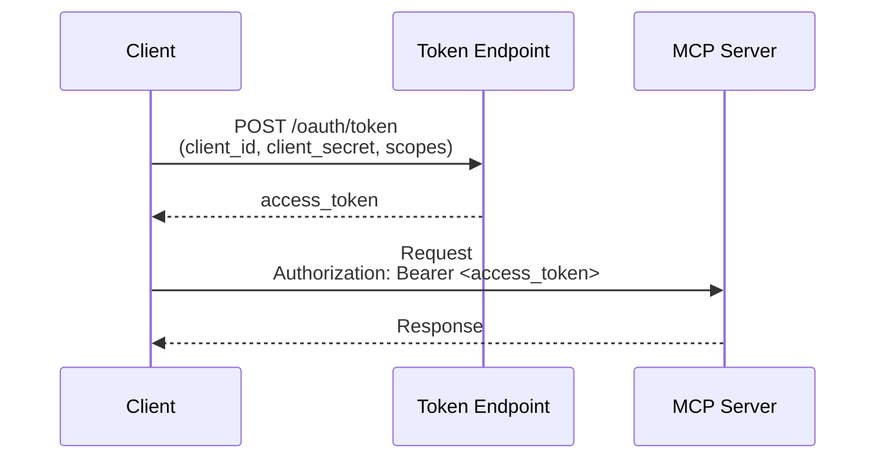
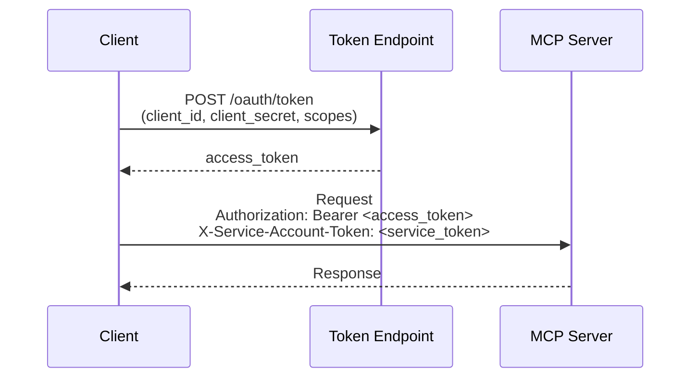

<!--
SPDX-FileCopyrightText: Copyright (c) 2025-2026, NVIDIA CORPORATION & AFFILIATES. All rights reserved.
SPDX-License-Identifier: Apache-2.0

Licensed under the Apache License, Version 2.0 (the "License");
you may not use this file except in compliance with the License.
You may obtain a copy of the License at

http://www.apache.org/licenses/LICENSE-2.0

Unless required by applicable law or agreed to in writing, software
distributed under the License is distributed on an "AS IS" BASIS,
WITHOUT WARRANTIES OR CONDITIONS OF ANY KIND, either express or implied.
See the License for the specific language governing permissions and
limitations under the License.
-->

# MCP Service Account Authentication

Service account authentication enables headless, automated access to MCP servers using OAuth2 client credentials flow. This authentication method is designed for scenarios where interactive user authentication is not possible or desirable, such as CI/CD pipelines, backend services, and automated workflows.

## When to Use Service Account Authentication

Service account authentication is ideal for:

- **CI/CD Pipelines**: Automated testing and deployment workflows that need to access MCP servers
- **Backend Services**: Server-to-server communication without user interaction
- **Batch Processing**: Scheduled jobs that process data from MCP servers
- **Automated Workflows**: Any scenario where a browser-based OAuth2 flow is not feasible
- **Container Deployments**: Containerized applications that need consistent, non-interactive authentication

Use interactive OAuth2 authentication (`mcp_oauth2`) instead when:
- Users need to authorize access to their personal data
- User-specific permissions are required
- The workflow is user-facing and can present a browser for authentication

## Supported Capabilities

The `mcp_service_account` [authentication provider](../api-authentication.md) implements:

- **OAuth2 Client Credentials Flow**: Standard [RFC 6749 Section 4.4](https://www.rfc-editor.org/rfc/rfc6749#section-4.4) client credentials grant
- **Token Caching**: Automatic token caching with configurable refresh buffer to minimize token endpoint requests
- **Multi-Header Authentication**: Ability to inject multiple authentication headers for services using backend system delegation patterns

## Authentication Token Types

Service account authentication uses two types of tokens depending on the MCP server requirements:

1. **OAuth2 Service Account Token**: Obtained via OAuth2 client credentials flow. Always required for authentication and authorization.

2. **Service Token**: Optional service-specific token (such as Jira service token or GitLab service token) required by some MCP servers for delegating access to backend systems.

## Configuring Service Account Auth Provider

The `mcp_service_account` provider is a built-in authentication provider in the NVIDIA NeMo Agent Toolkit. Configure it in your workflow YAML file:

```yaml
authentication:
  my_service_account:
    _type: mcp_service_account
    client_id: ${SERVICE_ACCOUNT_CLIENT_ID}
    client_secret: ${SERVICE_ACCOUNT_CLIENT_SECRET}
    token_url: https://auth.example.com/service_account/token
    scopes:
      - service-account-scope-1
      - service-account-scope-2
```

To view all configuration options for the `mcp_service_account` authentication provider, run the following command:

```bash
nat info components -t auth_provider -q mcp_service_account
```

### Required Configuration Fields

The following fields must be provided in your configuration:

| Field | Description | Example |
|-------|-------------|---------|
| `client_id` | OAuth2 client identifier for your service account | `my-service-client` |
| `client_secret` | OAuth2 client secret (keep secure, never commit to version control) | `${SERVICE_ACCOUNT_CLIENT_SECRET}` |
| `token_url` | OAuth2 token endpoint URL | `https://auth.example.com/oauth/token` |
| `scopes` | List of OAuth2 scopes required for access (can also be space-delimited string) | `[api.read, api.write]` |

### Optional Configuration Fields

Customize the authentication behavior with these optional fields:

| Field | Default | Description |
|-------|---------|-------------|
| `service_token` | None | Nested configuration for service-specific token in dual authentication patterns. Contains: `token` (static token value), `function` (Python function path for dynamic token), and `header` (HTTP header name, default: `X-Service-Account-Token`). Either `token` or `function` must be provided, not both. |
| `token_cache_buffer_seconds` | `300` | Seconds before token expiry to refresh the token (default: 5 minutes) |

## Environment Variables

Service account credentials are typically provided through environment variables to avoid committing secrets to version control. Reference them in your configuration using the `${VARIABLE_NAME}` syntax.

For `scopes`, you can use either a list (recommended for clarity) or a space-delimited string from an environment variable:

**List format (recommended):**
```yaml
authentication:
  my_service_account:
    _type: mcp_service_account
    client_id: ${SERVICE_ACCOUNT_CLIENT_ID}
    client_secret: ${SERVICE_ACCOUNT_CLIENT_SECRET}
    token_url: ${SERVICE_ACCOUNT_TOKEN_URL}
    scopes:
      - service-account-scope-1
      - service-account-scope-2
```

**String format (for environment variables):**
```yaml
authentication:
  my_service_account:
    _type: mcp_service_account
    client_id: ${SERVICE_ACCOUNT_CLIENT_ID}
    client_secret: ${SERVICE_ACCOUNT_CLIENT_SECRET}
    token_url: ${SERVICE_ACCOUNT_TOKEN_URL}
    scopes: ${SERVICE_ACCOUNT_SCOPES}  # Space-delimited string
```

Set the environment variables in your shell:

```bash
export SERVICE_ACCOUNT_CLIENT_ID="your-client-id"
export SERVICE_ACCOUNT_CLIENT_SECRET="your-client-secret"
export SERVICE_ACCOUNT_TOKEN_URL="https://auth.example.com/oauth/token"
export SERVICE_ACCOUNT_SCOPES="service-account-scope-1 service-account-scope-2"  # For string format
```

:::{warning}
**Security Best Practice**: Never commit credentials to version control. Always use environment variables or a secure secret management system for storing service account credentials.
:::

## Referencing Auth Providers in Clients

Reference the service account authentication provider in your MCP client configuration using the `auth_provider` parameter:

```yaml
function_groups:
  mcp_tools:
    _type: mcp_client
    server:
      transport: streamable-http
      url: https://api.example.com/mcp
      auth_provider: my_service_account

authentication:
  my_service_account:
    _type: mcp_service_account
    client_id: ${SERVICE_ACCOUNT_CLIENT_ID}
    client_secret: ${SERVICE_ACCOUNT_CLIENT_SECRET}
    token_url: ${SERVICE_ACCOUNT_TOKEN_URL}
    scopes:
      - api.read
      - api.write
```


## Authentication Patterns

The service account provider supports two authentication patterns depending on MCP server requirements.

### Single Authentication Pattern

Use for custom MCP servers that only require OAuth2 service account token validation. This pattern uses one authentication header.



```yaml
authentication:
  custom_auth:
    _type: mcp_service_account
    client_id: ${CLIENT_ID}
    client_secret: ${CLIENT_SECRET}
    token_url: https://auth.example.com/oauth/token
    scopes:
      - service.scope
```

Produces: `Authorization: Bearer <access_token>`

### Dual Authentication Pattern

Use for enterprise MCP servers (such as Jira, GitLab) that require both OAuth2 service account token and service token for backend system delegation. This pattern uses two authentication headers.




#### Option 1: Static Service Token

```yaml
authentication:
  dual_auth:
    _type: mcp_service_account
    client_id: ${CLIENT_ID}
    client_secret: ${CLIENT_SECRET}
    token_url: ${TOKEN_URL}
    scopes:
      - service.scope
    service_token:
      token: ${SERVICE_TOKEN}  # Static token from environment
      header: X-Service-Account-Token
```

#### Option 2: Dynamic Service Token (Advanced)

```yaml
authentication:
  dual_auth:
    _type: mcp_service_account
    client_id: ${CLIENT_ID}
    client_secret: ${CLIENT_SECRET}
    token_url: ${TOKEN_URL}
    scopes:
      - service.scope
    service_token:
      function: "my_module.get_service_token"  # Python function path
      header: X-Service-Account-Token
      kwargs:  # Optional: Pass additional arguments to the function
        vault_path: "secrets_jira"
        region: "us-west-2"
```

Both produce:
```text
Authorization: Bearer <access_token>
X-Service-Account-Token: <service_token>
```

:::{tip}
**Dynamic Function Approach**

The dynamic function approach is useful for enterprise environments where service tokens need to be fetched from secure token vaults or have complex retrieval logic. The function will be called on every request.

Function signature: `async def get_service_token(**kwargs) -> str | tuple[str, str]`

The function can:
- Return `str` for the token (uses `header` from config)
- Return `tuple[str, str]` for `(header_name, token)` to override the header
- Access runtime context via `AIQContext.get()` if needed
- Receive additional arguments via the `kwargs` field in configuration

Example:
```python
async def get_service_token(vault_path: str, **kwargs) -> str:
    from nat.builder.context import AIQContext
    context = AIQContext.get()
    # Fetch token from vault, use context metadata if needed
    return fetch_from_vault(vault_path)
```
:::

## Security Considerations

### Credential Management

- **Never commit credentials**: Store credentials in environment variables or secure secret management systems
- **Rotate credentials regularly**: Implement a credential rotation policy
- **Use minimal scopes**: Request only the OAuth2 scopes required for your use case
- **Monitor token usage**: Track token requests and usage patterns for anomalies

### Token Security

- **In-memory only**: Tokens are cached in memory and not persisted to disk
- **Automatic refresh**: Tokens are refreshed before expiration to minimize exposure window
- **HTTPS required**: Always use HTTPS for token endpoint communications
- **Protected logs**: Failed requests do not expose credentials in log messages


## Token Caching

The service account provider implements intelligent token caching to minimize requests to the OAuth2 token endpoint:

1. **First Request**: Client credentials are sent to the token endpoint, and the access token is cached
2. **Subsequent Requests**: Cached token is reused until it nears expiration
3. **Automatic Refresh**: Token is refreshed automatically when it reaches the buffer threshold (default: 5 minutes before expiration)
4. **Concurrent Requests**: Thread-safe operations prevent duplicate token requests during concurrent workflow execution

You can adjust the refresh buffer with the `token_cache_buffer_seconds` configuration option:

```yaml
authentication:
  my_service_account:
    _type: mcp_service_account
    # ... other configuration ...
    token_cache_buffer_seconds: 600  # Refresh 10 minutes before expiry
```

## Example Workflows

The Service Account Authentication Example demonstrates both authentication patterns:

- **Single Authentication**: `examples/MCP/service_account_auth_mcp/configs/config-mcp-service-account-jama.yml`
- **Dual Authentication**: `examples/MCP/service_account_auth_mcp/configs/config-mcp-service-account-jira.yml`
- **Dual Authentication with Dynamic Service Token**: `examples/MCP/service_account_auth_mcp/configs/config-mcp-service-account-jira-function.yml`

See `examples/MCP/service_account_auth_mcp/README.md` for complete instructions on running the example workflows.

## Troubleshooting
### Error: "`client_id` is required"

Ensure the `client_id` field is set in your configuration or the corresponding environment variable is defined.

### Error: "Invalid service account credentials"

Verify your client ID and client secret are correct, the token endpoint URL is reachable, and your service account has necessary permissions.

### Error: "Service account rate limit exceeded"

Wait before retrying.

### Error: "SSL: CERTIFICATE_VERIFY_FAILED"

The MCP server may use certificates from an internal Certificate Authority. Install your organization's CA certificates in your system's trust store.

### Authentication works locally but fails in CI/CD

Verify all environment variables are set in your CI/CD platform.

## See Also

- [MCP Authentication](./index.md) - OAuth2 interactive authentication for user-facing workflows
- [MCP Client](../../../build-workflows/mcp-client.md) - Connecting to MCP servers
- MCP Service Account Authentication Example: `examples/MCP/service_account_auth_mcp/README.md`
