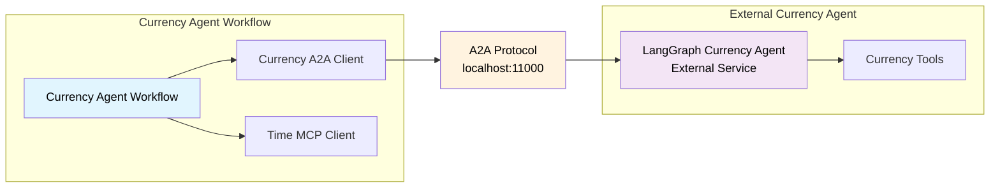

<!--
SPDX-FileCopyrightText: Copyright (c) 2025-2026, NVIDIA CORPORATION & AFFILIATES. All rights reserved.
SPDX-License-Identifier: Apache-2.0

Licensed under the Apache License, Version 2.0 (the "License");
you may not use this file except in compliance with the License.
You may obtain a copy of the License at

http://www.apache.org/licenses/LICENSE-2.0

Unless required by applicable law or agreed to in writing, software
distributed under the License is distributed on an "AS IS" BASIS,
WITHOUT WARRANTIES OR CONDITIONS OF ANY KIND, either express or implied.
See the License for the specific language governing permissions and
limitations under the License.
-->

# Currency Agent A2A Example

**Complexity:** 🟢 Beginner

This example demonstrates a NVIDIA NeMo Agent Toolkit workflow connecting to a third-party A2A server, the LangGraph-based currency agent. The workflow acts as an A2A client to perform currency conversions and financial queries with time-based context.

## Key Features

- **Per-User A2A Client**: Each user gets isolated A2A client connections to external services
- **External A2A Integration**: Connects to a third-party LangGraph currency agent
- **Hybrid Tool Architecture**: Combines A2A currency tools with MCP time services
- **Simple Real-world Use Case**: Currency conversion with historical date context
- **Multi-User Support**: Demonstrates user isolation with different session cookies

## Architecture Overview



## Installation and Setup


### Prerequisites

Follow the instructions in the [Install Guide](../../../docs/source/get-started/installation.md#install-from-source) to create the development environment and install NeMo Agent Toolkit.

### Set Up API Keys

Set your NVIDIA and OpenAI API keys as environment variables:

```bash
export NVIDIA_API_KEY=<YOUR_API_KEY>
export OPENAI_API_KEY=<YOUR_API_KEY>
```

### Set Up External A2A Server

The currency agent runs as an external service using the a2a-samples repository:

```bash
# Step 1: Clone the a2a-samples repository and checkout a tested tag
cd external
git clone https://github.com/a2aproject/a2a-samples.git
cd a2a-samples
git checkout eb3885f # tested on 12/2025 with NAT 1.4.0

# Step 2: Navigate to the LangGraph agent
cd samples/python/agents/langgraph

# Step 3: Set the environment variables for the currency agent
# For OpenAI models:
cat <<EOF > .env
API_KEY=$OPENAI_API_KEY
model_source=openai
TOOL_LLM_URL=https://api.openai.com/v1
TOOL_LLM_NAME=gpt-4o-mini
EOF

# Step 4: Run the currency agent on port 11000
uv run app --port 11000
```

### Install Currency Agent Client

From the root directory of the NeMo Agent Toolkit library, install this example:

```bash
uv pip install -e examples/A2A/currency_agent_a2a
```


## Usage

### Verify External Server

First, verify the external currency agent is running:

```bash
# Check the external agent discovery card
nat a2a client discover --url http://localhost:11000
```

### Run the Currency Agent Client

In a separate terminal, run the client workflow:

```bash
# Terminal 2: Run the currency agent client
nat run --config_file examples/A2A/currency_agent_a2a/configs/config.yml \
  --input "What was the USD to EUR exchange rate this day last year?"
```

### Additional Examples

For comprehensive examples, see [`data/sample_queries.json`](data/sample_queries.json).

## Per-User Workflow Architecture

This example uses a **per-user workflow** pattern because A2A clients are per-user function groups:

- Each user gets isolated connections to the external A2A service
- Independent session state and request tracking per user

## Configuration Details

### Workflow Configuration

The workflow is configured to use the core per-user ReAct agent:

```yaml
workflow:
  _type: per_user_react_agent  # Per-user ReAct agent
  tool_names:
    - mcp_date_time.get_current_time_mcp_tool
    - currency_agent  # Per-user A2A client to external service
  llm_name: nim_llm
```

### Tool Composition

The configuration demonstrates two types of tool integration:

1. **A2A Client Tools** (`currency_agent`) - **Per-User**:
   - Connects to external LangGraph currency agent
   - Each user gets isolated connection to the external service
   - Provides currency conversion and exchange rate queries

2. **MCP Client Tools** (`mcp_date_time`) - **Shared**:
   - Local MCP server for time operations
   - Provides: `get_current_time_mcp_tool` function

## Troubleshooting

### Connection Issues

**External Server Not Running**:
```bash
# Check if the LangGraph agent is running
curl http://localhost:11000/.well-known/agent-card.json | jq
```

**Port Conflicts**:
- Ensure port 11000 is available for the currency agent
- Check for other services using the port
- Modify the port in both the external agent startup and config.yml if needed

### Performance Issues

**Timeouts**:
- Increase `task_timeout` in config if queries take longer
- Check network connectivity to the external service


## Related Examples

- [Math Assistant A2A](../math_assistant_a2a/) - NeMo Agent Toolkit A2A with hybrid tools (unprotected)
- [OAuth2 Protected Math Assistant A2A](../math_assistant_a2a_protected/) - OAuth2-protected A2A example

## References

- [A2A Introduction](../../../docs/source/components/integrations/a2a.md)
