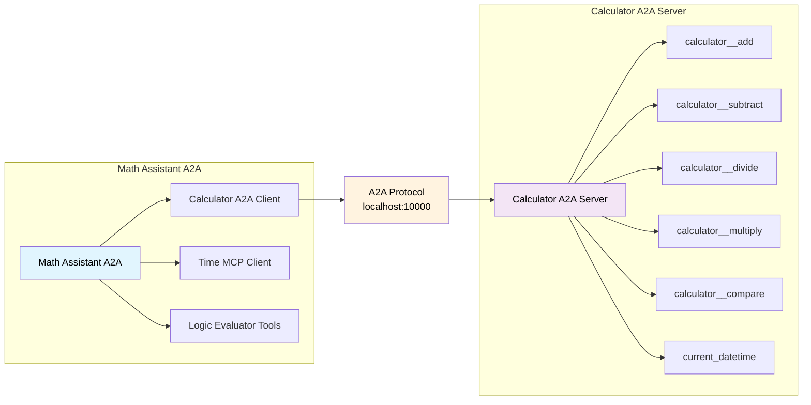

<!-- SPDX-FileCopyrightText: Copyright (c) 2025-2026, NVIDIA CORPORATION & AFFILIATES. All rights reserved.
SPDX-License-Identifier: Apache-2.0

Licensed under the Apache License, Version 2.0 (the "License");
you may not use this file except in compliance with the License.
You may obtain a copy of the License at

http://www.apache.org/licenses/LICENSE-2.0

Unless required by applicable law or agreed to in writing, software
distributed under the License is distributed on an "AS IS" BASIS,
WITHOUT WARRANTIES OR CONDITIONS OF ANY KIND, either express or implied.
See the License for the specific language governing permissions and
limitations under the License.
-->

# Math Assistant A2A Example

**Complexity:** 🟨 Intermediate

This example demonstrates an end-to-end A2A workflow with NVIDIA NeMo Agent Toolkit functioning as both A2A client and server. The workflow performs mathematical calculations integrated with time queries and logical reasoning, combining remote calculator operations with local time services and conditional evaluation tools.


## Key Features

- **Per-User A2A Client**: Each user gets isolated A2A client connections with separate authentication and session state
- **A2A Protocol Integration**: Connects to a remote calculator workflow using A2A protocol
- **Hybrid Tool Architecture**: Combines remote A2A tools with local MCP and custom functions
- **Multi-User Support**: Demonstrates user isolation with different session cookies

## Architecture Overview



## Installation and Setup

### Prerequisites

Follow the instructions in the [Install Guide](../../../docs/source/get-started/installation.md#install-from-source) to create the development environment and install NeMo Agent Toolkit.

### Install Dependencies

From the root directory of the NeMo Agent Toolkit library, install this example:

```bash
uv pip install -e examples/A2A/math_assistant_a2a
```

### Set Up API Keys

Set your NVIDIA API key as an environment variable:

```bash
export NVIDIA_API_KEY=<YOUR_API_KEY>
```

## Usage

### Start the Calculator A2A Server

First, start the calculator server that this client will connect to:

```bash
# Terminal 1: Start the A2A calculator server
nat a2a serve --config_file examples/getting_started/simple_calculator/configs/config.yml --port 10000
```

Verify the server is running:
```bash
# Terminal 2: Check discover card
nat a2a client discover --url http://localhost:10000
```

### Run the Calculator Client

In a separate terminal, run the client workflow:

```bash
# Terminal 2: Run the calculator client
nat run --config_file examples/A2A/math_assistant_a2a/configs/config.yml \
  --input "Is the product of 2 and 4 greater than the current hour of the day?"
```

### Additional Examples

For more query examples, see [`data/sample_queries.json`](data/sample_queries.json).

**Run a specific query by its ID:**

```bash
# Run query by ID (e.g., ID 4)
QUERY_ID=4
QUESTION=$(jq -r --arg id "$QUERY_ID" '.[] | select(.id == ($id | tonumber)) | .question' examples/A2A/math_assistant_a2a/data/sample_queries.json)
echo "Question: $QUESTION"
nat run --config_file examples/A2A/math_assistant_a2a/configs/config.yml --input "$QUESTION"
```

## Per-User Workflow Architecture

This example uses a **per-user workflow** pattern because A2A clients are per-user function groups:

### Why Per-User?
- Each user gets isolated A2A client connections
- Separate authentication credentials per user (important for OAuth2)
- Independent session state and task tracking
- No interference between users

### Implementation
The example uses `per_user_react_agent`, which is the per-user version of the ReAct agent:
- Each user gets their own isolated ReAct agent instance
- Gets per-user A2A client tools via the builder
- Provides the same interface as the shared `react_agent` but with per-user isolation
- Built-in support for per-user function groups like A2A clients

### Multi-User Testing
When using `nat serve`, different users are identified by the `nat-session` cookie:

Before testing multi-user support, ensure the Calculator A2A server is running:
```bash
# Terminal 1: Start the A2A calculator server (if not already running)
nat a2a serve --config_file examples/getting_started/simple_calculator/configs/config.yml --port 10000
```

Verify the server is running:
```bash
# Terminal 2: Check discover card
nat a2a client discover --url http://localhost:10000
```

```bash
# Start the math assistant as a FastAPI server on terminal 2
nat serve --config_file examples/A2A/math_assistant_a2a/configs/config.yml
```

```bash
# User "Alice" makes a request on terminal 3
curl -X POST http://localhost:8000/generate \
  -H "Content-Type: application/json" \
  -H "Cookie: nat-session=Alice" \
  -d '{"messages": [{"role": "user", "content": "Is the sum of 5 and 3 greater than the current hour of the day?"}]}' | jq

# User "Hatter" makes a request on terminal 3 (isolated from Alice)
curl -X POST http://localhost:8000/generate \
  -H "Content-Type: application/json" \
  -H "Cookie: nat-session=Hatter" \
  -d '{"messages": [{"role": "user", "content": "Is the product of 3 and 2 greater than the current hour of the day?"}]}' | jq
```
#### Testing with the UI

1. Start the UI by following the instructions in the [Launching the UI](../../../docs/source/run-workflows/launching-ui.md) documentation.

2. Connect to the UI at `http://localhost:3000`

3. Enable WebSocket mode in the UI by toggling the WebSocket button on the top right corner of the UI.

:::important
Per-user workflows are not supported in HTTP mode. You must use WebSocket mode to test multi-user support.
:::

4. Send a message to the agent by typing in the chat input:
```text
Is the sum of 5 and 3 greater than the current hour of the day?
```

5. The workflow will be instantiated for the user on the first message and agent will respond with the result.
```text
Yes, the sum of 5 and 3 is greater than the current hour of the day.
```

## Configuration Details

### Workflow Configuration

The workflow is configured to use the core per-user ReAct agent:

```yaml
workflow:
  _type: per_user_react_agent  # Per-user ReAct agent
  tool_names:
    - calculator_a2a  # Per-user A2A client
    - mcp_time.get_current_time_mcp
    - logic_evaluator.if_then_else
    - logic_evaluator.evaluate_condition
  llm_name: nim_llm
```

### Tool Composition

The configuration demonstrates three types of tool integration:

1. **A2A Client Tools** (`calculator_a2a`) - **Per-User**:
   - Connects to remote calculator server
   - Each user gets isolated connection and authentication
   - Provides: `add`, `subtract`, `multiply`, `divide`, `compare` functions

2. **MCP Client Tools** (`mcp_time`) - **Shared**:
   - Local MCP server for time operations
   - Provides: `get_current_time_mcp` function

3. **Logic Evaluator** (`logic_evaluator`) - **Shared**:
   - Simple local utility for logical operations
   - Provides: `if_then_else` and `evaluate_condition` functions

## Troubleshooting

### Connection Issues

**Server Not Running**:
```bash
# Check if the calculator server is running
curl http://localhost:10000/.well-known/agent-card.json | jq
```

**Port Conflicts**:
- Ensure port 10000 is available for the calculator server
- Check for other services using the port
- Modify the port in both the server startup and config.yml if needed

### Performance Issues

**Timeouts**:
- Increase `task_timeout` in config if calculations take longer
- Check network connectivity to remote services

## OAuth2 Protected Setup

For production scenarios requiring authentication, see the [OAuth2 Protected Math Assistant A2A](../math_assistant_a2a_protected/) example, which demonstrates:
- End-to-end OAuth2 authorization code flow
- Protected A2A server with JWT token validation
- Keycloak integration for testing secure A2A communication

## Related Examples

- [OAuth2 Protected Math Assistant A2A](../math_assistant_a2a_protected/) - OAuth2-protected A2A example
- [Currency Agent A2A](../currency_agent_a2a/) - External A2A service integration example

## References

- [A2A Introduction](../../../docs/source/components/integrations/a2a.md)
