<!-- SPDX-FileCopyrightText: Copyright (c) 2025-2026, NVIDIA CORPORATION & AFFILIATES. All rights reserved.
SPDX-License-Identifier: Apache-2.0

Licensed under the Apache License, Version 2.0 (the "License");
you may not use this file except in compliance with the License.
You may obtain a copy of the License at

http://www.apache.org/licenses/LICENSE-2.0

Unless required by applicable law or agreed to in writing, software
distributed under the License is distributed on an "AS IS" BASIS,
WITHOUT WARRANTIES OR CONDITIONS OF ANY KIND, either express or implied.
See the License for the specific language governing permissions and
limitations under the License.
-->

# OAuth2-Protected Math Assistant A2A Example

**Complexity:** 🟨 Intermediate

This example demonstrates an end-to-end OAuth2-protected A2A workflow with NVIDIA NeMo Agent Toolkit functioning as both A2A client and server. The workflow performs mathematical calculations integrated with time queries and logical reasoning, with added OAuth2 authentication for secure per-user agent-to-agent communication:
- **Protected A2A Server**: NeMo Agent Toolkit calculator service requiring OAuth2 authentication
- **OAuth2 A2A Client**: NeMo Agent Toolkit math assistant with per-user OAuth2 credentials that connects to the protected A2A server
- **Authorization Server**: Keycloak authorization server for testing OAuth2-protected A2A communication

## Key Features

### Protected Calculator A2A Server
- **Type**: A2A Server (Resource Server) hosted by NeMo Agent Toolkit
- **Authentication**: OAuth2 with JWT validation
- **Skills**: Basic arithmetic operations (add, subtract, multiply, divide, compare)

### Math Assistant A2A Client
- **Type**: Per-user A2A client workflow hosted by NeMo Agent Toolkit
- **Authentication**: OAuth2 authorization code flow to obtain JWT tokens for authentication
- **Functionality**: Connects to calculator server, local time operations, logic evaluator to answer math questions

This example is designed for **development and testing**. See [Production Considerations](#production-considerations) for deployment guidance.

## Architecture Overview

This example consists of three main components:

```mermaid
graph TB
    subgraph Client["A2A Client (Math Assistant)"]
        direction TB
        MathAssistant["Math Assistant Workflow"]
        A2AClientPlugin["A2A Client Plugin<br/>• Discovers agent card<br/>• Handles OAuth2 flow<br/>• Manages JWT tokens"]
        MathAssistant --> A2AClientPlugin
    end

    subgraph Server["A2A Server (Calculator)"]
        direction TB
        Calculator["Calculator Workflow"]
        OAuthMiddleware["OAuth Middleware<br/>• Validates JWT tokens<br/>• Checks scopes & audience<br/>• Caches JWKS"]
        Calculator --> OAuthMiddleware
    end

    subgraph Auth["Authorization Server (Keycloak)"]
        direction LR
        AuthCore["Keycloak OAuth2 Server<br/>• Authenticates users<br/>• Issues JWT tokens<br/>• Provides JWKS endpoint"]
    end

    A2AClientPlugin -->|"①  GET /.well-known/agent-card.json<br/>(Public - No Auth)"| Calculator
    A2AClientPlugin -->|"②  OAuth2 Authorization Flow<br/>(Browser-based)"| AuthCore
    A2AClientPlugin -->|"③  A2A JSON-RPC Requests<br/>(Authorization: Bearer JWT)"| Calculator
    OAuthMiddleware -.->|"Verify JWT<br/>(Fetch JWKS)"| AuthCore

    style Client fill:#e1f5ff
    style Server fill:#ffe1e1
    style Auth fill:#e1ffe1
```



**Components:**

1. **Math Assistant (Client)**
   - Per-user workflow using `per_user_react_agent`
   - Each user gets isolated A2A client instance with separate OAuth2 credentials
   - Uses A2A client plugin to connect to calculator
   - Handles user authentication flow through browser

2. **Calculator A2A Server (Resource Server)**
   - Protected A2A server requiring authentication
   - Publishes agent card with security requirements
   - Validates JWT tokens before processing requests

3. **Keycloak (Authorization Server)**
   - Example OAuth2 server for testing OAuth2-protected A2A servers in NeMo Agent Toolkit
   - Provides OAuth2 endpoints for token exchange by the A2A client
   - Provides JWKS endpoint for token verification by the A2A server

**Per-User Architecture:** Each user identified by `nat-session` cookie gets their own:
- A2A client connection with isolated state
- OAuth2 authentication flow and tokens
- Independent calculator session

## A2A OAuth2 Flow

This example demonstrates the A2A protocol with OAuth 2.1 Authorization Code Flow:


**Key Steps (Per User Session):**
1. **Agent card discovery** - Client fetches public metadata to discover authentication requirements
2. **Dynamic authentication** - Client initiates OAuth flow based on agent card security schemes
3. **Token acquisition** - User authenticates through browser, client obtains JWT token
4. **Authenticated communication** - Client includes token in A2A requests, server validates JWT

## Prerequisites

- Docker installed and running
- NeMo Agent Toolkit development environment set up
- No services running on ports 8080 or 10000
- NVIDIA API key

## Installation

From the root directory of the NeMo Agent Toolkit library, install this example:

```bash
uv pip install -e examples/A2A/math_assistant_a2a_protected
```

Set your NVIDIA API key:

```bash
export NVIDIA_API_KEY=<YOUR_API_KEY>
```

## Setup Instructions

### Step 1: Start Keycloak

```bash
# Start Keycloak
docker run -d --name keycloak \
  -p 127.0.0.1:8080:8080 \
  -e KC_BOOTSTRAP_ADMIN_USERNAME=admin \
  -e KC_BOOTSTRAP_ADMIN_PASSWORD=admin \
  quay.io/keycloak/keycloak:latest start-dev
```

**Wait for Keycloak to start** (about 30-60 seconds). Check logs:

```bash
docker logs -f keycloak
```

Look for: `Listening on: http://0.0.0.0:8080`

**Access Keycloak:** Open `http://localhost:8080` in your browser

### Step 2: Configure Keycloak Realm and Scopes

1. **Log in to Keycloak Admin Console:**
   - Username: `admin`
   - Password: `admin`

2. **Verify you're in the `master` realm** (top-left dropdown)

3. **Create the `calculator_a2a_execute` scope (for the calculator agent):**
   - Go to **Client scopes** (left sidebar)
   - Click **Create client scope**
   - Fill in:
     - **Name**: `calculator_a2a_execute`
     - **Description**: `Permission to execute calculator operations`
     - **Type**: `Optional`
     - **Protocol**: `openid-connect`
     - **Include in token scope**: `On` ✅
   - Click **Save**

4. **Add audience mapper to the scope:**

   You need to add an audience mapper to ensure the calculator URL is included in tokens.

   **Audience Mapper** (adds calculator URL to audience claim)

   - Click **Configure a new mapper**
   - Select **Audience** mapper type
   - Configure the mapper:
     - **Name**: `calculator-audience`
     - **Included Client Audience**: Leave blank
     - **Included Custom Audience**: `http://localhost:10000`
     - **Add to ID token**: `Off`
     - **Add to access token**: `On` ✅
     - **Add to token introspection**: `On` ✅ (if available in your Keycloak version)
   - Click **Save**

   This mapper ensures `http://localhost:10000` is included in the token's `aud` claim (required for JWT validation).

5. **Verify OpenID Discovery endpoint:**
   ```bash
   curl http://localhost:8080/realms/master/.well-known/openid-configuration | python3 -m json.tool
   ```

   You should see the OAuth2 and OpenID Connect endpoints:
   - `authorization_endpoint`: `http://localhost:8080/realms/master/protocol/openid-connect/auth`
   - `token_endpoint`: `http://localhost:8080/realms/master/protocol/openid-connect/token`
   - `jwks_uri`: `http://localhost:8080/realms/master/protocol/openid-connect/certs`
   - `introspection_endpoint`: `http://localhost:8080/realms/master/protocol/openid-connect/token/introspect`

   **Note:** These endpoints use Keycloak's standard paths (`/protocol/openid-connect/*`), not generic `/oauth/*` paths. The NeMo Agent Toolkit A2A client discovers these URLs automatically from the discovery endpoint.

### Step 3: Register Math Assistant Client

You can register the client manually or use the dynamic client registration (DCR) feature. For testing, manual registration is used.

1. In Keycloak Admin Console, go to **Clients** (left sidebar)
2. Click **Create client**
3. **General Settings:**
   - **Client ID**: `math-assistant-client`
   - **Client type**: `OpenID Connect`
   - Click **Next**

4. **Capability config:**
   - **Client authentication**: `On` (confidential client)
   - **Authorization**: `Off`
   - **Authentication flow:**
     - ✓ Standard flow (authorization code)
     - ✓ Direct access grants
   - Click **Next**

5. **Login settings:**
   - **Valid redirect URIs**: `http://localhost:8000/auth/redirect`
   - **Web origins**: `http://localhost:8000`
   - Click **Save**

6. **Add client scope if not added by default:**
   - Go to **Client scopes** tab
   - Click **Add client scope**
   - Select `calculator_a2a_execute`
   - Choose **Optional**
   - Click **Add**

7. **Set Consent required**:
   - Go to **Settings** tab
   - Toggle **Consent required** to `On` (scroll down to the bottom of the page to see the setting)
   - Click **Save**

8. **Get client credentials:**
   - Go to **Credentials** tab
   - Copy the **Client secret**
   - Note the **Client ID**: `math-assistant-client`


### Step 4: Start the Protected Calculator Server

```bash
# Terminal 1
nat a2a serve --config_file examples/A2A/math_assistant_a2a_protected/configs/config-server.yml
```

You should see:
```text
[INFO] OAuth2 token validation enabled for A2A server
[INFO] Starting A2A server 'Protected Calculator' at http://localhost:10000
```

### Step 5: Run the Math Assistant Client
Set the client id and client secret from `Step 3` in the environment variables:
```bash
# Terminal 2
# Make sure environment variables are set
export CALCULATOR_CLIENT_ID="math-assistant-client"
export CALCULATOR_CLIENT_SECRET="<your-client-secret>"

nat run --config_file examples/A2A/math_assistant_a2a_protected/configs/config-client.yml \
  --input "Is the product of 2 and 4 greater than the current hour of the day?"
```

**What should happen:**

1. **Browser opens** with Keycloak login page
2. **Log in** with any user (or create one)
3. **Consent page** appears requesting `calculator_a2a_execute` scope
4. **Browser redirects** back to `localhost:8000/auth/redirect`
5. **Workflow continues** and calls the calculator
6. **Response returned** successfully


Sample output:
```text
Workflow Result:
['No, the product of 2 and 4 is not greater than the current hour of the day.']
--------------------------------------------------
```

### Step 7: Test Multi-User OAuth2 (Optional)

The per-user architecture allows each user to have their own OAuth2 authentication. Test this with `nat serve`:

1. Start the math assistant as a server:
```bash
# Terminal 2: Start the math assistant as a server
# Make sure environment variables are set
export CALCULATOR_CLIENT_ID="math-assistant-client"
export CALCULATOR_CLIENT_SECRET="<your-client-secret>"

nat serve --config_file examples/A2A/math_assistant_a2a_protected/configs/config-client.yml
```

2. Start the UI by following the instructions in the [Launching the UI](../../../docs/source/run-workflows/launching-ui.md) documentation.

3. Connect to the UI at `http://localhost:3000`

4. Enable WebSocket mode in the UI by toggling the WebSocket button on the top right corner of the UI.

:::important
Per-user workflows are not supported in HTTP mode. You must use WebSocket mode to test multi-user support.
:::

5. Send a message to the agent by typing in the chat input:
```text
Is the sum of 5 and 3 greater than the current hour of the day?
```

6. The workflow will be instantiated for the user on the first message. The user will be authenticated and the workflow will be executed.

```text
Workflow Result:
['Yes, the sum of 5 and 3 is greater than the current hour of the day.']
--------------------------------------------------
```

**Expected behavior:**
- Each new user session triggers its own OAuth2 authorization flow
- Different users authenticate independently with their own Keycloak credentials
- Each user maintains separate JWT tokens and workflow instances

## Troubleshooting

### Ensure all services are reachable
Use the following checks to confirm each service is reachable. If you are running the services elsewhere, replace `localhost` with the appropriate host name and use `https` instead of `http` for public endpoints.

#### Verify Keycloak
```bash
curl -sS http://localhost:8080/realms/master/.well-known/openid-configuration | python3 -m json.tool
```

#### Verify the Protected Calculator A2A Server

```bash
curl -sS http://localhost:10000/.well-known/agent-card.json | python3 -m json.tool
```

#### Verify the Math Assistant Client FastAPI Service

If you started the math assistant with `nat serve`, verify the server is reachable:

```bash
curl -sS http://localhost:8000/openapi.json | python3 -m json.tool
```

If you prefer a quick HTTP status check, follow redirects:

```bash
curl -iL http://localhost:8000/
```

#### Verify the UI

If you started the UI, confirm it is serving content:

```bash
curl -i http://localhost:3000/
```

## Cleanup

To stop and remove Keycloak:

```bash
docker stop keycloak
docker rm keycloak
```

To restart with clean state:

```bash
docker rm -f keycloak
# Then run the start command again
```

## Production Considerations

This setup is for **development and testing only**. For production:

### Security

- **Use HTTPS everywhere**: Keycloak, redirect URIs, and A2A servers must all use TLS
- **Secure credentials**: Store client secrets in a secrets manager, rotate regularly, never commit to version control
- **Configure short-lived tokens**: Set short access token lifetime with refresh tokens for long sessions
- **Use dedicated realms**: Don't use `master` realm; create separate realms per environment (dev, staging, prod)

## Related Examples

- [Math Assistant A2A](../math_assistant_a2a/) - Unprotected A2A client example
- [Currency Agent A2A](../currency_agent_a2a/) - External A2A service integration

## References

- [A2A Introduction](../../../docs/source/components/integrations/a2a.md)
- [A2A Authentication Documentation](../../../docs/source/components/auth/a2a-auth.md)
- [A2A Client Documentation](../../../docs/source/build-workflows/a2a-client.md)
- [A2A Server Documentation](../../../docs/source/run-workflows/a2a-server.md)
- [Keycloak Documentation](https://www.keycloak.org/documentation)
