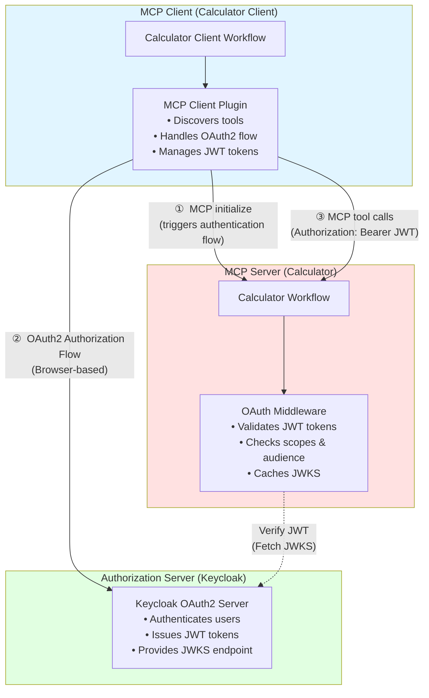

<!--
SPDX-FileCopyrightText: Copyright (c) 2025-2026, NVIDIA CORPORATION & AFFILIATES. All rights reserved.
SPDX-License-Identifier: Apache-2.0

Licensed under the Apache License, Version 2.0 (the "License");
you may not use this file except in compliance with the License.
You may obtain a copy of the License at

http://www.apache.org/licenses/LICENSE-2.0

Unless required by applicable law or agreed to in writing, software
distributed under the License is distributed on an "AS IS" BASIS,
WITHOUT WARRANTIES OR CONDITIONS OF ANY KIND, either express or implied.
See the License for the specific language governing permissions and
limitations under the License.
-->

# Simple Calculator MCP - Protected

This example demonstrates how to set up an OAuth2-protected NVIDIA NeMo Agent Toolkit MCP server. This complements the unprotected [Simple Calculator MCP](../simple_calculator_mcp/) example to demonstrate both authenticated and unauthenticated MCP server setups.

This example uses **per-user mode**, enabling complete per-user isolation while accessing the same protected MCP calculator tools.

## Architecture Overview

This example consists of three main components:



## Prerequisites

- NeMo Agent Toolkit installed (see [Installation Guide](../../../docs/source/get-started/installation.md))
- Keycloak server running locally (see setup instructions below)
- Basic understanding of OAuth2 and JWT tokens

## Setup Instructions

### Step 1: Start Keycloak

```bash
# Start Keycloak
docker run -d --name keycloak \
  -p 127.0.0.1:8080:8080 \
  -e KC_BOOTSTRAP_ADMIN_USERNAME=admin \
  -e KC_BOOTSTRAP_ADMIN_PASSWORD=admin \
  quay.io/keycloak/keycloak:latest start-dev
```

Wait for Keycloak to start (about 30-60 seconds). Check logs:

```bash
docker logs -f keycloak
```

Look for: `Listening on: http://0.0.0.0:8080`

**Access Keycloak:** Open `http://localhost:8080` in your browser

### Step 2: Configure Keycloak Realm and Scopes

1. **Log in to Keycloak Admin Console:**
   - Username: `admin`
   - Password: `admin`

2. **Verify you're in the `master` realm** (top-left dropdown)

3. **Create the `calculator_mcp_execute` scope (for the MCP calculator):**
   - Go to **Client scopes** (left sidebar)
   - Click **Create client scope**
   - Fill in:
     - **Name**: `calculator_mcp_execute`
     - **Description**: `Permission to execute calculator operations`
     - **Type**: `Optional`
     - **Protocol**: `openid-connect`
     - **Include in token scope**: `On` ✅
   - Click **Save**

4. **Add audience mapper to the scope:**

   You need to add an audience mapper to ensure the MCP server URL is included in tokens.

   **Audience Mapper** (adds MCP server URL to audience claim)

   - Click **Configure a new mapper**
   - Select **Audience** mapper type
   - Configure the mapper:
     - **Name**: `mcp-calculator-audience`
     - **Included Client Audience**: Leave blank
     - **Included Custom Audience**: `http://localhost:9902`
     - **Add to ID token**: `Off`
     - **Add to access token**: `On` ✅
     - **Add to token introspection**: `On` ✅ (if available in your Keycloak version)
   - Click **Save**

   This mapper ensures `http://localhost:9902` is included in the token's `aud` claim (required for JWT validation).

5. **Verify OpenID Discovery endpoint:**
   ```bash
   curl http://localhost:8080/realms/master/.well-known/openid-configuration | python3 -m json.tool
   ```

   You should see the OAuth2 and OpenID Connect endpoints:
   - `authorization_endpoint`: `http://localhost:8080/realms/master/protocol/openid-connect/auth`
   - `token_endpoint`: `http://localhost:8080/realms/master/protocol/openid-connect/token`
   - `jwks_uri`: `http://localhost:8080/realms/master/protocol/openid-connect/certs`
   - `introspection_endpoint`: `http://localhost:8080/realms/master/protocol/openid-connect/token/introspect`

   **Note:** These endpoints use Keycloak's standard paths (`/protocol/openid-connect/*`), not generic `/oauth/*` paths. The NeMo Agent Toolkit MCP client discovers these URLs automatically from the discovery endpoint.

### Step 3: Register MCP Client

You can register the client manually or use the dynamic client registration (DCR) feature. For testing, manual registration is used.

1. In Keycloak Admin Console, go to **Clients** (left sidebar)
2. Click **Create client**
3. **General Settings:**
   - **Client ID**: `nat-mcp-client`
   - **Client type**: `OpenID Connect`
   - Click **Next**

4. **Capability config:**
   - **Client authentication**: `On` (confidential client)
   - **Authorization**: `Off`
   - **Authentication flow:**
     - ✓ Standard flow (authorization code)
     - ✓ Direct access grants
   - Click **Next**

5. **Login settings:**
   - **Valid redirect URIs**: `http://localhost:8000/auth/redirect`
   - **Web origins**: `http://localhost:8000`
   - Click **Save**

6. **Add client scope if not already added:**
   - Go to **Client scopes** tab
   - Click **Add client scope**
   - Select `calculator_mcp_execute`
   - Choose **Optional**
   - Click **Add**

7. **Get client credentials:**
   - Go to **Credentials** tab
   - Copy the **Client secret**
   - Note the **Client ID**: `nat-mcp-client`


### Step 4: Start the Protected MCP Server

```bash
# Terminal 1
nat mcp serve --config_file examples/MCP/simple_calculator_mcp_protected/configs/config-server.yml
```

You should see:
```text
[INFO] OAuth2 token validation enabled for MCP server
[INFO] Starting MCP server 'Protected Calculator MCP' at http://localhost:9902
```

### Step 5: Run the MCP Calculator Client

Set the client id and client secret from `Step 3` in the environment variables:
```bash
# Terminal 2
# Make sure environment variables are set
export CALCULATOR_CLIENT_ID="nat-mcp-client"
export CALCULATOR_CLIENT_SECRET="<your-client-secret>"

nat run --config_file examples/MCP/simple_calculator_mcp_protected/configs/config-client.yml \
  --input "Is the product of 2 and 3 greater than the current hour of the day?"
```

**What should happen:**

1. **Browser opens** with Keycloak login page
2. **Log in** with any user (or create one)
3. **Consent page** appears requesting `calculator_mcp_execute` scope
4. **Browser redirects** back to `localhost:8000/auth/redirect`
5. **Workflow continues** and calls the calculator
6. **Response returned** successfully

Sample output:
```text
Workflow Result:
['No, the product of 2 and 3 is not greater than the current hour of the day.']
--------------------------------------------------
```

### Step 6: Test Multi-User OAuth2 (Optional)

The per-user architecture allows each user to have their own OAuth2 authentication. Test this with `nat serve`:

1. Start the MCP calculator client as a server:
```bash
# Terminal 2: Start the MCP calculator client as a server using the FastAPI frontend
nat serve --config_file examples/MCP/simple_calculator_mcp_protected/configs/config-client.yml
```

2. Start the UI by following the instructions in the [Launching the UI](../../../docs/source/run-workflows/launching-ui.md) documentation.

3. Connect to the UI at `http://localhost:3000`

4. Enable WebSocket mode in the UI by toggling the WebSocket button on the top right corner of the UI.

:::important
Per-user workflows are not supported in HTTP mode. You must use WebSocket mode to test multi-user support.
:::

5. Send a message to the agent by typing in the chat input:
```text
Is the sum of 5 and 3 greater than the current hour of the day?
```

6. The workflow will be instantiated for the user on the first message. The user will be authenticated and the workflow will be executed.

```text
Workflow Result:
['Yes, the sum of 5 and 3 is greater than the current hour of the day.']
--------------------------------------------------
```

**Expected behavior:**
- Each new user session triggers its own OAuth2 authorization flow
- Different users authenticate independently with their own Keycloak credentials
- Each user maintains separate JWT tokens and workflow instances

## Cleanup

To stop and remove Keycloak:

```bash
docker stop keycloak
docker rm keycloak
```

To restart with clean state:

```bash
docker rm -f keycloak
# Then run the start command again
```

## Configuration Files

### Server Configuration (`configs/config-server.yml`)

This configures the protected MCP server frontend with OAuth2 resource server authentication:

```yaml
general:
  front_end:
    _type: mcp
    name: "Protected Calculator MCP"
    port: 9902
    server_auth:
      issuer_url: http://localhost:8080/realms/master
      scopes: [calculator_mcp_execute]
      audience: http://localhost:9902
      jwks_uri: http://localhost:8080/realms/master/protocol/openid-connect/certs
```

### Client Configuration (`configs/config-client.yml`)

This configures an MCP client to connect to the protected server in per-user mode:

```yaml
function_groups:
  mcp_calculator_protected:
    _type: per_user_mcp_client # Per-user mode for multi-user support
    server:
      transport: streamable-http
      url: http://localhost:9902/mcp
      auth_provider: mcp_oauth2_calculator

authentication:
  mcp_oauth2_calculator:
    _type: mcp_oauth2
    server_url: http://localhost:9902/mcp
    redirect_uri: http://localhost:8000/auth/redirect
    client_id: ${CALCULATOR_CLIENT_ID:-"nat-mcp-client"}
    client_secret: ${CALCULATOR_CLIENT_SECRET}
    scopes: [calculator_mcp_execute]

workflow:
  _type: per_user_react_agent  # Per-user mode for multi-user support
  tool_names: [mcp_calculator_protected]
```

## Related Examples

- [Simple Calculator MCP](../simple_calculator_mcp/): Unprotected MCP calculator example

## References
- [MCP Authentication](../../../docs/source/components/auth/mcp-auth/index.md) - Learn about configuring MCP authentication
- [Per-User Workflows](../../../docs/source/extend/custom-components/custom-functions/per-user-functions.md) - Learn about using per-user workflows
