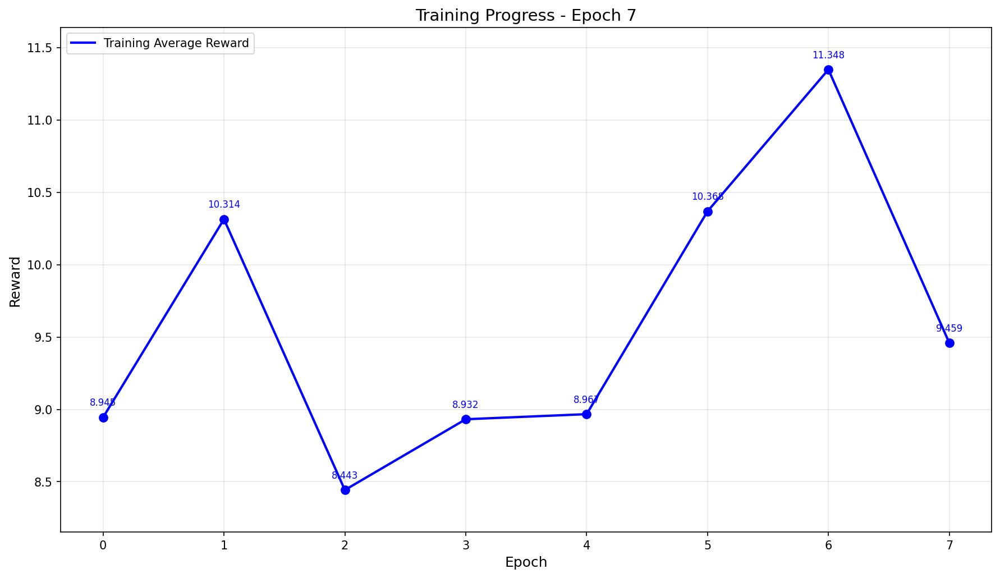

<!--
SPDX-FileCopyrightText: Copyright (c) 2025-2026, NVIDIA CORPORATION & AFFILIATES. All rights reserved.
SPDX-License-Identifier: Apache-2.0

Licensed under the Apache License, Version 2.0 (the "License");
you may not use this file except in compliance with the License.
You may obtain a copy of the License at

http://www.apache.org/licenses/LICENSE-2.0

Unless required by applicable law or agreed to in writing, software
distributed under the License is distributed on an "AS IS" BASIS,
WITHOUT WARRANTIES OR CONDITIONS OF ANY KIND, either express or implied.
See the License for the specific language governing permissions and
limitations under the License.
-->

<!-- path-check-skip-begin -->

# Reinforcement Learning with OpenPipe ART: Tic-Tac-Toe Example

**Complexity:** 🛑 Advanced

This example demonstrates how to use the NeMo Agent Toolkit finetuning harness with [OpenPipe ART](https://art.openpipe.ai/) (Agent Reinforcement Trainer) to improve an LLM's performance at playing Tic-Tac-Toe through reinforcement learning.

The model learns to play against a **random opponent**, receiving rewards based on game-theoretic position evaluation rather than simple win/loss outcomes. This continuous reward signal enables more effective learning than sparse binary rewards.

## Table of Contents

- [Prerequisites](#prerequisites)
- [How the Example Works](#how-the-example-works)
- [Step 1: Running Pre-Training Baseline Evaluation](#step-1-running-pre-training-baseline-evaluation)
- [Step 2: Starting the OpenPipe ART Training Server](#step-2-starting-the-openpipe-art-training-server)
- [Step 3: Running Finetuning](#step-3-running-finetuning)
- [Step 4: Understanding the Reward Function](#step-4-understanding-the-reward-function)
- [Step 5: Viewing Training Logs and Metrics](#step-5-viewing-training-logs-and-metrics)
- [Step 6: Running Post-Training Evaluation](#step-6-running-post-training-evaluation)
- [Best Practices and Troubleshooting](#best-practices-and-troubleshooting)

---

## Prerequisites

### Hardware Requirements

| Component | Minimum | Recommended |
|-----------|---------|-------------|
| GPU | 40GB VRAM (A100) | 80GB VRAM (H100) |
| RAM | 32GB | 64GB |
| Storage | 50GB free | 100GB free |

> **Note**: The Qwen2.5-3B-Instruct model requires approximately 20GB of VRAM for inference and additional memory for training gradients. An 80GB H100 provides comfortable headroom for larger batch sizes and sequence lengths.

### Software Requirements

1. **Python 3.11+**

2. **NeMo Agent Toolkit** with the OpenPipe ART plugin. This example is meant to be run using a NeMo Agent Toolkit
   installation from source. You can follow the [NeMo Agent Toolkit Installation Guide](../../../docs/source/get-started/installation.md) to set up your environment.


3. **OpenPipe ART** installed in a **separate virtual environment**:

   OpenPipe ART has specific dependency requirements that may conflict with NeMo Agent Toolkit. We recommend installing it in an isolated environment:

   ```bash
   # Create a separate virtual environment for ART
   uv venv art-env --python 3.13
   source art-env/bin/activate
   export HF_TOKEN=<your_huggingface_token>
   # Install OpenPipe ART
   uv pip install --no-cache 'openpipe-art[backend]==0.4.11'

   # Verify installation
   art --help
   ```

   For detailed installation instructions, see the [OpenPipe ART Getting Started Guide](https://art.openpipe.ai/getting-started/about).

4. **This example package in your NeMo Agent Toolkit environment**:
   ```bash
   uv pip install -e examples/finetuning/rl_with_openpipe_art
   ```
   
5. The rest of this example assumes you are in the root of the NeMo Agent Toolkit repository. Please execute
   all commands from there.

---

## How the Example Works

### The Task

The LLM plays Tic-Tac-Toe against a **random opponent**. In each game:

1. The LLM is assigned a role (`X` or `O`)
2. Players alternate turns, with `X` always going first
3. The LLM must output valid moves in XML format:
   ```xml
   <move>
     <row>2</row>
     <col>2</col>
   </move>
   ```
4. The game continues until someone wins or the board is full (draw)

### Why a Random Opponent?

Training against a random opponent provides several benefits:

- **Consistent difficulty**: The opponent doesn't improve, providing a stable training signal
- **Exploitable patterns**: The model can learn to capitalize on random mistakes
- **Clear improvement signal**: Win rate against random play is a meaningful metric
- **Faster iteration**: No need to manage self-play complexity

Against a random opponent, a perfect Tic-Tac-Toe player should win or draw almost every game (winning ~95% when going first as X).

### The Workflow

The workflow is defined in `src/rl_with_openpipe_art/rl_with_openpipe_art.py`:

```python
@register_function(config_type=RlWithOpenpipeArtFunctionConfig)
async def rl_with_openpipe_art_function(config, builder):
    player_model = await builder.get_llm(config.player_model)
    opponent_model = await builder.get_llm(config.opponent_model) if config.opponent_model else player_model

    async def _play_game(role: str) -> str:
        # Create players
        player_x = LLMTicTacToePlayer(...)  # X goes first
        player_o = LLMTicTacToePlayer(...)

        # Run the game
        game = TicTacToeGame(player_x, player_o, role)
        winner = game.play()

        # Return result
        if role == "X":
            return "Win!" if winner == 1 else "Lose!" if winner == -1 else "Draw!"
        else:
            return "Win!" if winner == -1 else "Lose!" if winner == 1 else "Draw!"

    yield FunctionInfo.from_fn(_play_game)
```

The workflow:
1. Creates two LLM players (or one LLM + one random player)
2. Runs a complete game, tracking intermediate steps
3. Records move quality scores at each step for reward shaping
4. Returns the game outcome

### Training Data

The training data (`data/data.json`) contains game scenarios:

```json
[
  {"id": 1, "question": "X", "answer": "Win!"},
  {"id": 2, "question": "O", "answer": "Win!"},
  ...
]
```

- `question`: The role the LLM plays (`X` or `O`)
- `answer`: The expected outcome (always `Win!` since the goal is to learn to win)

---

## Step 1: Running Pre-Training Baseline Evaluation

Before training, establish a baseline to measure improvement.

### 1.1 Start the vLLM Inference Server

In your **ART virtual environment**, start vLLM to serve the base model:

```bash
# Activate the ART environment
source art-env/bin/activate
export HF_TOKEN=<your_huggingface_token>
# Start vLLM server
python -m vllm.entrypoints.openai.api_server \
    --model Qwen/Qwen2.5-3B-Instruct
```

Wait for the server to fully load the model. You should see:
```
INFO:     Started server process
INFO:     Waiting for application startup.
INFO:     Application startup complete.
INFO:     Uvicorn running on http://0.0.0.0:8000
```

Verify the server is running:
```bash
curl http://localhost:8000/v1/models
```

### 1.2 Run Pre-Training Evaluation

In a **separate terminal** with your NeMo Agent Toolkit environment activated:

```bash
# This is a dummy key for local vLLM usage
export OPENAI_API_KEY=default
# Run the pre-training evaluation
nat eval --config_file examples/finetuning/rl_with_openpipe_art/configs/config_pre_train.yml --reps 3
```

This runs 72 games (12 as X, 12 as O, 3 times each) and reports the win percentage.

Record this baseline score for comparison after training.

### 1.3 Stop the vLLM Server

Once the evaluation completes, stop the vLLM server (`Ctrl+C`) to free GPU memory for training.

---

## Step 2: Starting the OpenPipe ART Training Server

The ART server handles both inference and training. It runs vLLM for serving the model and TorchTune for GRPO weight updates.

In your **ART virtual environment**:

```bash
# Activate the ART environment
source art-env/bin/activate
export HF_TOKEN=<your_huggingface_token>

# Start the ART server
art --host 0.0.0.0 --port 7623
```

> **Note**: The ART server listens on port `7623` for training commands and starts vLLM internally on port `8000` for inference.

Wait for the server to initialize. You should see output indicating:
- Training server ready
- API endpoints available

Sample output:
```bash
INFO:     Started server process [3671624]
INFO:     Waiting for application startup.
INFO:     Application startup complete.
INFO:     Uvicorn running on http://0.0.0.0:7623 (Press CTRL+C to quit)
```


## Step 3: Running Finetuning

With the ART server running, start the finetuning process.

### 3.1 Review the Training Configuration

The training configuration is in `src/rl_with_openpipe_art/configs/config.yml`:

```yaml
llms:
  openpipe_llm:
    _type: openai
    model_name: Qwen/Qwen2.5-3B-Instruct
    base_url: http://localhost:8000/v1
    api_key: default
    temperature: 0.4  # Some randomness for exploration

workflow:
  _type: rl_with_openpipe_art
  player_model: openpipe_llm
  max_parser_retries: 2  # Retry on malformed XML

eval:
  general:
    max_concurrency: 16  # Parallel game execution
    output_dir: .tmp/nat/examples/rl_openpipe/eval/finetune
    dataset:
      _type: json
      file_path: examples/finetuning/rl_with_openpipe_art/data/data.json

  evaluators:
    rl_accuracy:
      _type: step_value_computation  # Uses alpha-beta reward function

trajectory_builders:
  openpipe_traj_builder:
    _type: openpipe_art_traj_builder
    num_generations: 1  # Games per example per epoch

trainer_adapters:
  openpipe_trainer_adapter:
    _type: openpipe_art_trainer_adapter
    backend:
      ip: "0.0.0.0"
      port: 7623
      name: "tic_tac_toe_training"
      project: "tic_tac_toe_project"
      base_model: "Qwen/Qwen2.5-3B-Instruct"
      api_key: "default"
      init_args:
        max_seq_length: 8192
      engine_args:
        gpu_memory_utilization: 0.9
        tensor_parallel_size: 1
    training:
      learning_rate: 1e-6  # Conservative learning rate

finetuning:
  enabled: true
  trainer: openpipe_trainer
  trajectory_builder: openpipe_traj_builder
  trainer_adapter: openpipe_trainer_adapter
  reward_function:
    name: rl_accuracy
  num_epochs: 10
  output_dir: ./.tmp/nat/finetuning/tic_tac_toe
```

### 3.2 Start Training

In your **NeMo Agent Toolkit environment**:

```bash
# This is a dummy key for local vLLM usage
export OPENAI_API_KEY=default
nat finetune --config_file examples/finetuning/rl_with_openpipe_art/configs/config.yml
```

### 3.3 Monitor Training Progress

Training progress is logged to the console and saved to files:

```
INFO - Starting finetuning with config: src/rl_with_openpipe_art/configs/config.yml
INFO - Initializing OpenPipe ART Runner
INFO - Successfully registered with ART backend.
INFO - Starting finetuning run with 30 epochs

INFO - Starting epoch 1 for run art_run_a1b2c3d4
INFO - Starting 1 evaluation runs for run_id: art_run_a1b2c3d4
INFO - Built 48 trajectories across 48 examples
INFO - Epoch 1 progress logged - Avg Reward: 0.4523, Trajectories: 48
INFO - Training art_run_a1b2c3d4 completed successfully.
INFO - Completed epoch 1/30

INFO - Starting epoch 2 for run art_run_a1b2c3d4
...
```

Training typically takes upwards of 40 minutes for 10 epochs on an H100.

---

## Step 4: Understanding the Reward Function

The reward function is the key to effective RL training. This example uses a sophisticated **alpha-beta pruning based reward** instead of simple win/loss signals.

### 4.1 Why Not Use Simple Win/Loss Rewards?

Simple win/loss rewards have significant problems for training:

| Issue | Description |
|-------|-------------|
| **Sparsity** | Reward only at game end (after 5-9 moves) |
| **Credit assignment** | Which moves caused the win/loss? |
| **No gradient for draws** | Draws give 0 reward, no learning signal |
| **Binary signal** | No difference between "barely won" and "dominated" |

### 4.2 Alpha-Beta Pruning: A Primer

**Alpha-beta pruning** is a search algorithm that determines the optimal play in two-player games. It works by:

1. **Building a game tree**: All possible future moves and responses
2. **Minimax evaluation**: Assuming both players play optimally
3. **Pruning branches**: Skipping moves that can't affect the outcome

For Tic-Tac-Toe, alpha-beta can solve the entire game tree, determining:
- **Forced win**: A position where perfect play guarantees victory
- **Forced loss**: A position where the opponent can force a win
- **Drawn position**: Neither player can force a win

### 4.3 The Reward Function Implementation

The reward function is implemented in two files:

#### `core.py`: Position Evaluation (`evaluate_board_for_player`)

Located at: `src/rl_with_openpipe_art/core.py:110-285`

```python
def evaluate_board_for_player(board: np.ndarray, player_val: int) -> float:
    """
    Evaluate the position from the perspective of `player_val`.

    Output ranges:
      - Non-terminal positions: [0, 1] continuous
      - Forced future win: (1, 11] = base + 10
      - Immediate win: (1, 16] = base + 15
      - Forced loss or already lost: 0.0
    """
```

The function combines two components:

**1. Static Heuristic Evaluation** (continuous, no search):

```python
def static_eval(b: np.ndarray) -> float:
    """Heuristic position evaluation in [-1, 1]."""
    # Count threats, control, position quality
    score_raw = (
        4.0 * (my_two_open - opp_two_open)    # Strong threats
        + 1.5 * (my_one_open - opp_one_open)  # Influence
        + 1.5 * center                         # Center control
        + 0.75 * corners.sum()                 # Corner control
        + 0.25 * edges.sum()                   # Edge control
    )
    return float(np.tanh(score_raw / 5.0))  # Squash to [-1, 1]
```

**2. Game-Theoretic Solver** (alpha-beta search):

```python
def solve_outcome(b: np.ndarray, side_to_move: int, alpha=-1.0, beta=1.0) -> float:
    """
    Full-depth minimax with alpha-beta pruning.
    Returns: +1 (forced win), 0 (draw), -1 (forced loss)
    """
    # Recursively evaluate all possible continuations
    # Prune branches that can't improve the result
    if side_to_move == player_val:
        # Maximizing: find best move for us
        for move in available_moves(b):
            best = max(best, solve_outcome(child, -side_to_move, alpha, beta))
            alpha = max(alpha, best)
            if alpha >= beta:
                break  # Beta cut-off
    else:
        # Minimizing: opponent's best response
        for move in available_moves(b):
            best = min(best, solve_outcome(child, -side_to_move, alpha, beta))
            beta = min(beta, best)
            if alpha >= beta:
                break  # Alpha cut-off
    return best
```

**3. Combined Reward Mapping**:

| Position Type | Reward Range | Description |
|--------------|--------------|-------------|
| Already lost | `0.0` | Terminal loss state |
| Forced future loss | `0.0` | Opponent can force win |
| Game-theoretic draw | `[0, 1]` | Continuous heuristic |
| Non-terminal (no forced outcome) | `[0, 1]` | Continuous heuristic |
| Forced future win | `base + 10` | `(1, 11]` |
| Immediate win (on board) | `base + 15` | `(1, 16]` |

#### `accuracy_evaluator.py`: Episode Reward Aggregation

Located at: `src/rl_with_openpipe_art/accuracy_evaluator.py:39-72`

```python
@staticmethod
def episode_value_from_states(
    state_values: list[float],  # Rewards from each move
    gamma_base: float = 0.8,    # Temporal discount
    delta_bonus: float = 0.95,  # Bonus decay
) -> float:
    """Compute episode value with temporal discounting."""
    s = np.asarray(state_values, dtype=float)
    T = len(s) - 1

    # 1) Split into base [0,1] and bonus (>0 if forced/actual win)
    base = np.minimum(s, 1.0)
    bonus = np.maximum(s - 1.0, 0.0)

    # 2) Reverse-discounted base: earlier moves matter more
    exponents = np.arange(T, -1, -1)  # T, T-1, ..., 0
    w = gamma_base ** exponents
    w = w / w.sum()
    R_base = float(np.dot(w, base))  # Weighted average in [0, 1]

    # 3) Bonus: max spike, time-decayed (reward early wins)
    if np.any(bonus > 0):
        bonus_weights = delta_bonus ** exponents
        U_time = float(np.max(bonus * bonus_weights))
    else:
        U_time = 0.0

    # 4) Final episode score
    return R_base + U_time
```

### 4.4 Why This Reward Function Works

| Property | Benefit for RL |
|----------|----------------|
| **Continuous** | Smooth gradients, stable training |
| **Dense** | Reward at every move, not just game end |
| **Informative** | Distinguishes good moves from great moves |
| **Theoretically grounded** | Based on perfect play analysis |
| **Temporally weighted** | Earlier good moves are more valuable |
| **Bonus for winning** | Strong signal to learn winning patterns |

### 4.5 How Intermediate Steps Are Tracked

During each game, the workflow records move quality:

```python
# In rl_with_openpipe_art.py
if current_player.name == self.role:
    # Record intermediate step with position value
    self.step_manager.push_intermediate_step(
        IntermediateStepPayload(
            event_type=IntermediateStepType.CUSTOM_END,
            name="agent_move",
            metadata={
                "step": turn_index,
                "value": evaluate_board_for_player(self.board, current_player.value)
            }
        )
    )
```

The evaluator then aggregates these step-level values into an episode reward.

---

## Step 5: Viewing Training Logs and Metrics

### 5.1 Output Directory Structure

After training, check the output directory:

```
.tmp/nat/finetuning/tic_tac_toe/
├── training_metrics.jsonl      # Per-epoch metrics
├── reward_history.json         # Reward progression
├── reward_plot.png             # Visual reward chart
```

### 5.2 Training Metrics

The `training_metrics.jsonl` file contains detailed per-epoch data:

```json
{
  "epoch": 0,
  "timestamp": "2025-01-15T10:30:45.123456",
  "run_id": "art_run_a1b2c3d4",
  "avg_reward": 0.4523,
  "min_reward": 0.0,
  "max_reward": 1.2341,
  "num_trajectories": 48,
  "num_groups": 48
}
```

### 5.3 Example Reward Plot
When training is complete, view the reward progression plot. The Y-axis shows average episode reward, and the 
X-axis shows epochs. Your plot should look similar to this, but results may vary:



---

## Step 6: Running Post-Training Evaluation

After training completes, evaluate the improved model.

### 6.1 Keep the ART Server Running

The ART server continues serving the finetuned model weights. Do not restart it, as the updated weights are in memory.

### 6.2 Run Post-Training Evaluation

```bash
# This is a dummy key for local vLLM usage
export OPENAI_API_KEY=default
nat eval --config_file examples/finetuning/rl_with_openpipe_art/configs/config_post_train.yml --reps 3
```

Compare the post-training win percentage against the pre-training baseline. You should see a notable improvement.

> [!NOTE]
> Due to the stochastic nature of reinforcement learning, you may notice a decrease in performance in some training attempts. Please try running the training again or follow the troubleshooting guide below.

---

## Best Practices and Troubleshooting

### Training Parameter Suggestions

#### Learning Rate

| Value | Effect |
|-------|--------|
| `1e-7` | Very stable, slow learning |
| `1e-6` | **Recommended starting point** |
| `5e-6` | Faster learning, may be unstable |
| `1e-5` | Aggressive, risk of divergence |

#### Number of Generations (`num_generations`)

```yaml
trajectory_builders:
  openpipe_traj_builder:
    num_generations: 4  # Try 4-8 for better GRPO signal
```

More generations per example provide better comparison signal for GRPO but increase training time. 

When setting`num_generations` to 1, the trajectory builder uses all examples in the dataset in one large group.
Conversely, increasing `num_generations` causes each input data point to be evaluated multiple times per epoch, generating 
more trajectories and finer reward comparisons. Each example then gets its own group.

#### Temperature

```yaml
llms:
  openpipe_llm:
    temperature: 0.4  # Balance exploration/exploitation
```

| Value | Effect |
|-------|--------|
| `0.0` | Deterministic, no exploration |
| `0.2-0.4` | **Recommended for training** |
| `0.6+` | High exploration, noisier gradients |
| `0.1` | Use for final evaluation (near-deterministic) |

#### Number of Epochs

Start with 20-30 epochs and monitor the reward plot. Stop if:
- Rewards plateau for 5+ epochs
- Validation performance decreases (overfitting)

### Curriculum Learning (Optional)

Enable curriculum learning for more stable training:

```yaml
finetuning:
  curriculum_learning:
    enabled: true
    initial_percentile: 0.3      # Start with easiest 30%
    increment_percentile: 0.2     # Add 20% each expansion
    expansion_interval: 5         # Expand every 5 epochs
```

### Common Issues

#### "Failed to connect to ART backend"

**Cause**: ART server not running or wrong port.

**Solution**:
```bash
# Check if ART server is running
curl http://localhost:7623/health
```

#### "CUDA out of memory"

**Cause**: Insufficient GPU memory.

**Solutions**:
1. Reduce `gpu_memory_utilization`:
   ```yaml
   engine_args:
     gpu_memory_utilization: 0.7
   ```
2. Reduce `max_seq_length`:
   ```yaml
   init_args:
     max_seq_length: 4096
   ```
3. Reduce `max_concurrency`:
   ```yaml
   eval:
     general:
       max_concurrency: 8
   ```

#### "No trajectories collected"

**Cause**: Workflow not producing intermediate steps or evaluator errors.

**Solutions**:
1. Check workflow registration:
   ```bash
   nat info --components
   ```
2. Verify evaluator is registered:
   ```bash
   nat info --evaluators
   ```
3. Run a single game manually to debug:
   ```bash
   nat eval --config_file=... --max_examples=1
   ```

#### "Model outputs invalid XML"

**Cause**: Model not following the prompt format.

**Solutions**:
1. Increase `max_parser_retries`:
   ```yaml
   workflow:
     max_parser_retries: 3
   ```
2. Lower temperature for more deterministic outputs
3. Check if base model supports the task (try a larger model)

#### "Rewards not improving"

**Possible causes**:
1. **Learning rate too low**: Try `5e-6`
2. **Not enough generations**: Increase `num_generations` to 2-4
3. **Model already optimal**: Check if baseline is already high
4. **Reward function issue**: Verify evaluator is computing rewards correctly

### Performance Optimization

1. **Increase batch parallelism**:
   ```yaml
   eval:
     general:
       max_concurrency: 32  # If GPU memory allows
   ```

2. **Use multiple generations**:
   ```yaml
   trajectory_builders:
     openpipe_traj_builder:
       num_generations: 4  # Better GRPO signal
   ```

3. **Enable prefix caching** (vLLM):
   ```bash
   python -m vllm.entrypoints.openai.api_server \
       --model Qwen/Qwen2.5-3B-Instruct \
       --enable-prefix-caching
   ```

---

## File Reference

| File | Description |
|------|-------------|
| `src/rl_with_openpipe_art/rl_with_openpipe_art.py` | Main workflow: game loop, player management |
| `src/rl_with_openpipe_art/core.py` | Game logic, board evaluation, alpha-beta solver |
| `src/rl_with_openpipe_art/llm_agents.py` | LLM player wrapper, move parsing, prompts |
| `src/rl_with_openpipe_art/accuracy_evaluator.py` | Reward computation, episode aggregation |
| `src/rl_with_openpipe_art/evaluator_register.py` | Evaluator registration |
| `src/rl_with_openpipe_art/register.py` | Workflow component registration |
| `configs/config.yml` | Training configuration |
| `configs/config_pre_train.yml` | Pre-training evaluation configuration |
| `configs/config_post_train.yml` | Post-training evaluation configuration |
| `data/data.json` | Training dataset |
| `data/eval_data.json` | Evaluation dataset |

---

<!-- path-check-skip-end -->

## Further Reading

- [NeMo Agent Toolkit Finetuning Concepts](../../../docs/source/improve-workflows/finetuning/concepts.md)
- [NeMo Agent Toolkit Finetuning Extension Guide](../../../docs/source/extend/custom-components/finetuning.md)
- [OpenPipe ART Integration](../../../docs/source/improve-workflows/finetuning/rl_with_openpipe.md)
- [OpenPipe ART Documentation](https://art.openpipe.ai/)
